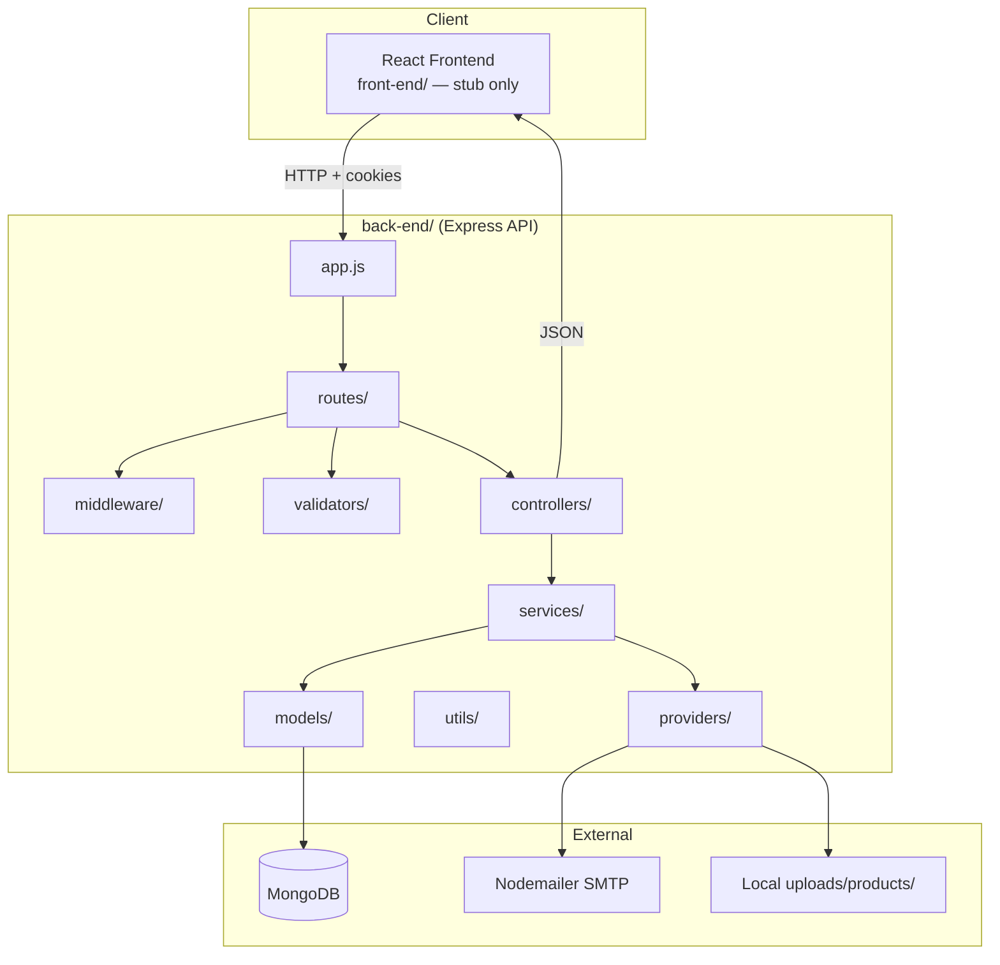
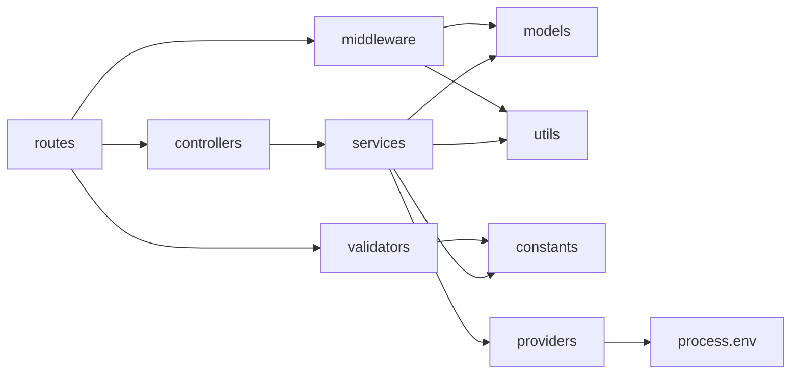
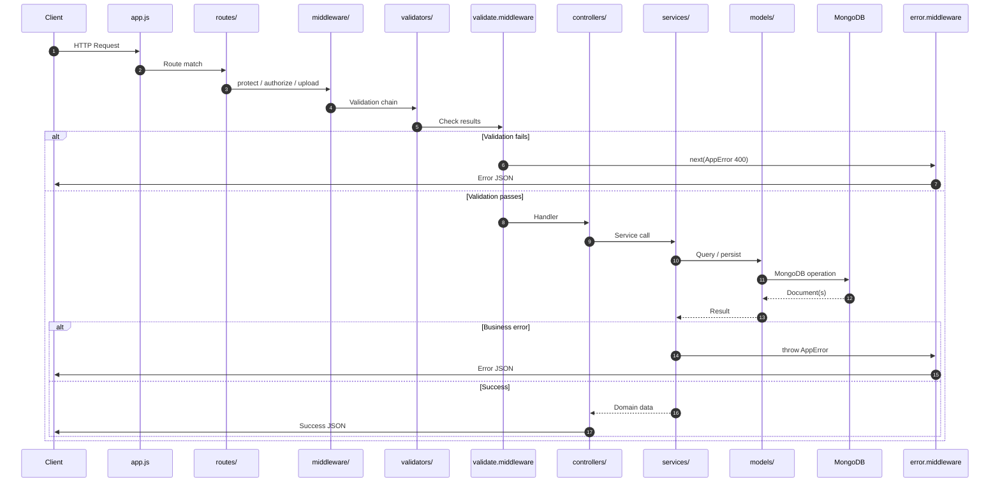
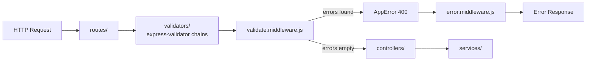
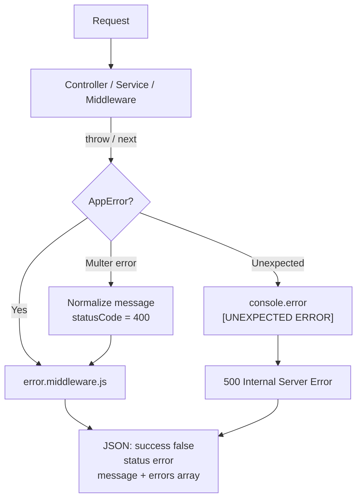
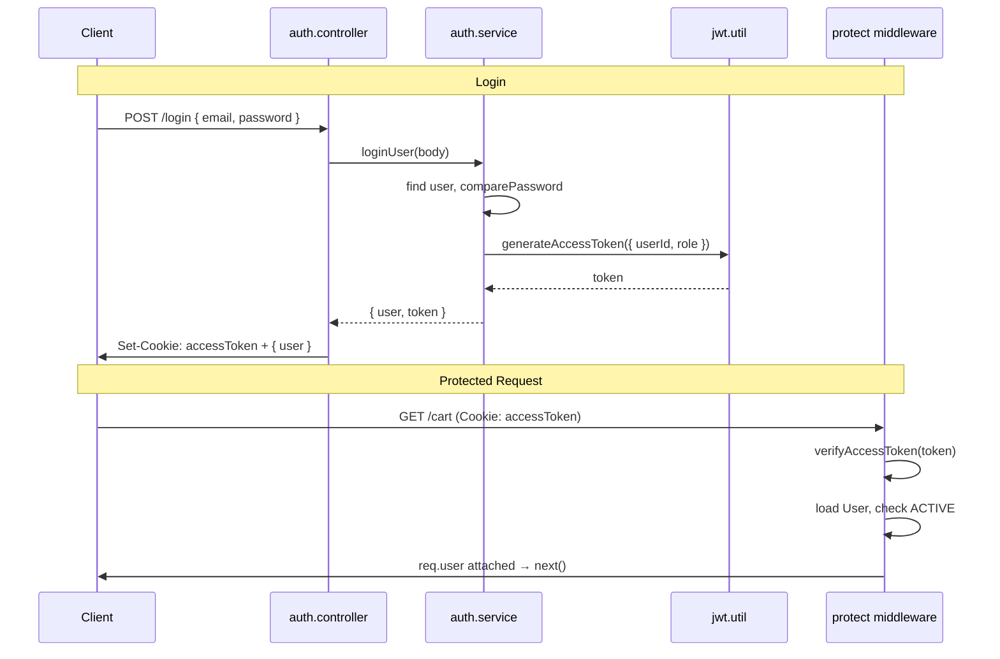
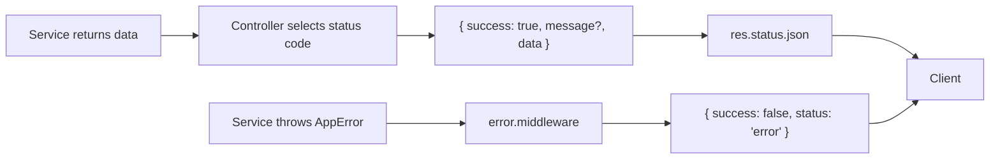
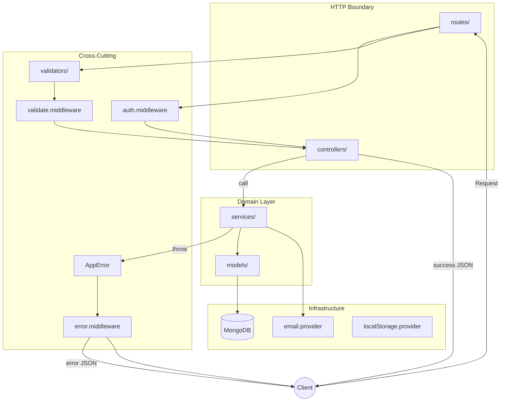

# Architecture

This document describes the **actual architecture** implemented in `back-end/` of the MERN Sports E-commerce Platform. All patterns, flows, and examples reference code that exists today.

---

# High Level Architecture

The backend is a **layered REST API** built on Express 5 and MongoDB (Mongoose). Every domain feature follows the same vertical slice:

```
Route → Controller → Service → Model → Response
```

Supporting cross-cutting concerns — validation, authentication, errors, file upload, email — plug into the pipeline via middleware, validators, utilities, constants, and providers without breaking the core flow.

## System Context



## Layer Dependency Graph

Dependencies flow **in one direction**. Inner layers never import outer layers.



## Application Bootstrap

| File | Role |
|------|------|
| `server.js` | Loads env, connects MongoDB, verifies email provider, starts HTTP listener |
| `app.js` | Configures global middleware, mounts `/api/v1/*` routes, 404 handler, error handler |
| `config/db.js` | Mongoose connection via `MONGO_URI` |

Eight API domains are mounted under `/api/v1/`:

| Mount Path | Router |
|------------|--------|
| `/api/v1/auth` | `auth.routes.js` |
| `/api/v1/users` | `user.routes.js` |
| `/api/v1/products` | `product.routes.js` |
| `/api/v1/categories` | `category.routes.js` |
| `/api/v1/inventory` | `inventory.routes.js` |
| `/api/v1/cart` | `cart.routes.js` |
| `/api/v1/wishlist` | `wishlist.routes.js` |

Global middleware registered in `app.js` before routes: **Helmet**, **CORS** (with credentials), **JSON body parser** (100kb limit), **cookie-parser**, **urlencoded**. Static files served at `/uploads`.

---

# Request Lifecycle

A typical authenticated, validated request traverses the full stack:



## End-to-End Example: Add Item to Cart

**Request:** `POST /api/v1/cart/items`  
**Body:** `{ "productId": "...", "quantity": 2 }`  
**Cookie:** `accessToken`

| Step | Layer | Implementation |
|------|-------|----------------|
| 1 | Route | `cart.routes.js` — `POST /items` chain |
| 2 | Auth | `auth.middleware.js` — `protect` reads cookie, sets `req.user` |
| 3 | Validator | `cart.validator.js` — `addCartItemValidation` |
| 4 | Validate MW | `validate.middleware.js` — aggregates errors |
| 5 | Controller | `cart.controller.js` — `addItemToCart` |
| 6 | Service | `cart.service.js` — product lookup, inventory reserve, cart save |
| 7 | Service (cross) | `inventory.service.js` — `reserveStock` |
| 8 | Model | `product.model.js`, `cart.model.js` |
| 9 | Response | `{ success: true, message, data: cart }` |

Route definition:

```javascript
// routes/cart.routes.js
router.post('/items', protect, addCartItemValidation, validate, addItemToCart);
```

---

# Controller Layer

## Responsibilities

Controllers are **thin HTTP adapters**. They:

1. Extract inputs from `req.body`, `req.params`, `req.query`, `req.user`, `req.files`
2. Call exactly one service function (in the common case)
3. Map service results to HTTP status codes and JSON envelopes
4. Forward errors via `next(error)`
5. Handle HTTP-specific side effects (cookies on login/logout)

Controllers **do not** query Mongoose models, enforce business rules, or format validation errors.

## Rules

| Rule | Rationale |
|------|-----------|
| Always wrap async handlers in `try/catch` with `next(error)` | Ensures errors reach global handler |
| Never import `models/` | Keeps persistence in services |
| Return consistent `{ success, message?, data? }` shape | Predictable API contract |
| Set cookies only for auth concerns | HTTP transport detail stays at boundary |
| Coerce types at boundary (`Number(req.body.quantity)`) | Services receive clean primitives |

## Examples

**Standard success path** — delegate to service, return envelope:

```javascript
// controllers/cart.controller.js
const addItemToCart = async (req, res, next) => {
  try {
    const cart = await cartService.addItemToCart(
      req.user.id,
      req.body.productId,
      Number(req.body.quantity),
    );
    res.status(200).json({
      success: true,
      message: 'Item added to cart successfully',
      data: cart,
    });
  } catch (error) {
    next(error);
  }
};
```

**HTTP-specific side effect** — JWT stored in cookie, not returned in body:

```javascript
// controllers/auth.controller.js
const { user, token } = await authService.loginUser(req.body);

res.cookie('accessToken', token, {
  httpOnly: true,
  secure: process.env.NODE_ENV === 'production',
  sameSite: 'strict',
  maxAge: 24 * 60 * 60 * 1000,
});

res.status(200).json({ success: true, message: 'Login successfully', data: { user } });
```

**Protected read using middleware-attached user** — no service call needed for simple projection:

```javascript
// controllers/auth.controller.js — getMe
const user = {
  id: req.user._id,
  firstName: req.user.firstName,
  fullName: req.user.fullName,
  email: req.user.email,
  role: req.user.role,
};
res.status(200).json({ success: true, data: user });
```

---

# Service Layer

## Responsibilities

Services are the **business logic layer**. They:

1. Enforce domain rules and invariants
2. Orchestrate one or more models
3. Call other services for cross-domain workflows
4. Throw `AppError` for expected failures (404, 409, 400, 401, 403)
5. Return domain objects or shaped DTOs — never touch `req`/`res`
6. Whitelist updatable fields on PATCH operations
7. Invoke providers for email and (indirectly) storage

## Business Logic Patterns in This Codebase

| Pattern | Example Location | Description |
|---------|------------------|-------------|
| Uniqueness guard | `auth.service.js` | Reject duplicate email before save |
| Existence validation | `cart.service.js` | Product must be active and not deleted |
| Field whitelist | `product.service.js` | Only allowed keys applied on update |
| Cross-service orchestration | `cart.service.js` → `inventory.service.js` | Reserve/release stock with cart mutations |
| Soft delete | `product.service.js` | `isDeleted = true`, `status = 'archived'` |
| Query composition | `product.service.js`, `category.service.js` | `ApiQuery` for search, filter, pagination |
| Side-effect with graceful degradation | `auth.service.js` | Email send failure logged, registration still succeeds |
| Audit trail | `inventory.service.js` | `InventoryHistory.create` on every adjustment |
| Price immutability in cart | `cart.model.js` | `priceSnapshot` captured at add time |

## Examples

**Throwing operational errors:**

```javascript
// services/auth.service.js
if (existingUser) {
  throw new AppError('Email already exists', 409);
}
```

**Cross-service orchestration:**

```javascript
// services/cart.service.js
await inventoryService.reserveStock(productId, quantity);
cart.items.push({ product: product._id, quantity, priceSnapshot: product.price });
await cart.save();
```

**Reusable list query building:**

```javascript
// services/product.service.js
const queryBuilder = new ApiQuery(queryParams)
  .filter(['brand', 'status', 'featured', 'category'])
  .search(['name', 'brand']);

const filters = { isDeleted: false, status: 'active', ...queryBuilder.getFilters() };
const { page, limit, skip } = queryBuilder.getPagination();
const sort = queryBuilder.getSort();

const [products, total] = await Promise.all([
  Product.find(filters).populate('category', 'name slug').sort(sort).skip(skip).limit(limit),
  Product.countDocuments(filters),
]);
```

**Internal-only service functions** (not exposed via routes, ready for future orders):

```javascript
// services/inventory.service.js — exported but consumed only internally today
reserveStock(productId, quantity)
releaseStock(productId, quantity)
commitStock(productId, quantity)   // no route consumer yet
```

---

# Model Layer

## Responsibilities

Models define the **persistence contract** for MongoDB via Mongoose:

1. Schema shape, types, defaults, constraints
2. Indexes for query performance
3. Virtual computed properties
4. Lifecycle hooks (`pre`/`post`)
5. Instance methods for entity-specific behavior
6. References (`ref`) to other collections

Models are accessed from **services** and **auth middleware** (user lookup). Controllers never import models directly.

## Schema Design

The codebase uses consistent schema patterns:

| Pattern | Example | Purpose |
|---------|---------|---------|
| Soft delete | `isDeleted` on Product, Category | Archive without hard delete |
| Status enums from constants | `role`, `status`, `PRODUCT_STATUS` | Validated enum values |
| Embedded subdocuments | `cart.items[]`, `product.images[]` | Aggregate-bound data, no separate collection |
| `select: false` | `User.password` | Exclude sensitive fields by default |
| `timestamps: true` | All main schemas | Auto `createdAt` / `updatedAt` |
| `ref` population | Cart → Product, Product → Category | Join at read time in services |
| Unique constraints | `User.email`, `Product.sku`, `Cart.user` | Data integrity at DB level |

**Embedded image schema** (no separate collection):

```javascript
// models/product.model.js
const imageSchema = new mongoose.Schema({
  url: { type: String, required: true },
  filename: { type: String, required: true },
  alt: { type: String, default: '' },
  isPrimary: { type: Boolean, default: false },
  sortOrder: { type: Number, default: 0 },
}, { _id: false });
```

**Embedded cart line item with price snapshot:**

```javascript
// models/cart.model.js
const cartItemSchema = new mongoose.Schema({
  product: { type: ObjectId, ref: 'Product', required: true },
  quantity: { type: Number, required: true, min: 1 },
  priceSnapshot: { type: Number, required: true },
}, { _id: false });
```

## Virtuals

Virtuals compute derived values without storing them in MongoDB:

| Model | Virtual | Logic |
|-------|---------|-------|
| `User` |  | `fullName` | `` `${firstName} ${lastName}` `` |
| `Product` | `primaryImage` | First `isPrimary` image, or first image, or null |
| `Product` | `availableStock` | `stockQuantity - reservedQuantity` |
| `Product` | `inStock` | `availableStock > 0` |
| `Product` | `lowStock` | `availableStock <= lowStockThreshold` |
| `Product` | `inventoryStatus` | Maps to `INVENTORY_STATUS` constants |
| `Cart` | `totalItems` | Sum of item quantities |
| `Cart` | `subtotal` | Sum of `priceSnapshot × quantity` |
| `Wishlist` | `totalItems` | Length of products array |

Product schema enables virtuals in JSON output:

```javascript
// models/product.model.js
{ toJSON: { virtuals: true }, toObject: { virtuals: true } }
```

Inventory summary service reads virtuals directly:

```javascript
// services/inventory.service.js
return {
  availableStock: product.availableStock,
  inStock: product.inStock,
  lowStock: product.lowStock,
  inventoryStatus: product.inventoryStatus,
};
```

## Hooks

Hooks run automatically during Mongoose lifecycle events:

| Model | Hook | Behavior |
|-------|------|----------|
| `User` | `pre('save')` | Hash password via `hashPassword` when modified |
| `User` | `pre('findOneAndUpdate')` | Hash password on update; reject pre-hashed values |
| `Product` | `pre('validate')` | Auto-generate slug from name via `slugify` |
| `Product` | `pre('validate')` | Enforce single primary image |
| `Category` | `pre('validate')` | Auto-generate slug from name |

**Password hashing hook:**

```javascript
// models/user.model.js
userSchema.pre('save', async function () {
  if (!this.isModified('password')) return;
  this.password = await hashPassword(this.password);
});
```

**Token generation instance methods** (used by auth service):

```javascript
// models/user.model.js
userSchema.methods.generateEmailVerificationToken = function () {
  const { rawToken, hashedToken } = generateToken();
  this.emailVerificationToken = hashedToken;
  this.emailVerificationTokenExpires = Date.now() + TOKEN_EXPIRY_MINUTES * 60 * 1000;
  return rawToken;  // sent to user; hashed version stored in DB
};
```

## Indexes

Product model defines explicit indexes for catalog queries:

```javascript
// models/product.model.js
productSchema.index({ slug: 1 });
productSchema.index({ category: 1 });
productSchema.index({ status: 1 });
productSchema.index({ featured: 1 });
productSchema.index({ category: 1, status: 1 });
```

---

# Validation Flow

Input validation is a **two-stage pipeline**: declarative rules in validators, centralized aggregation in middleware.



## Stage 1: Validator Rules (`validators/`)

Rule chains are arrays of `express-validator` middleware attached in routes **before** the controller.

```javascript
// validators/cart.validator.js
const addCartItemValidation = [
  body('productId').isMongoId().withMessage('Valid product ID is required'),
  body('quantity').isInt({ min: 1 }).withMessage('Quantity must be at least 1'),
];
```

Validators check **shape and format** — not business state:

- Email format, password strength, MongoId format, int ranges
- Enum membership via constants: `Object.values(INVENTORY_REASONS)` in `inventory.validator.js`
- Custom cross-field rules: password confirmation match in `auth.validator.js`

## Stage 2: Validation Middleware (`validate.middleware.js`)

After rule chains run, `validate` collects results:

```javascript
// middleware/validate.middleware.js
const errors = validationResult(req);

if (errors.isEmpty()) {
  return next();
}

const formattedErrors = errors.array().map((error) => ({
  field: error.path,
  message: error.msg,
}));

return next(new AppError('Validation failed', 400, formattedErrors));
```

## Stage 3: Controller Receives Clean Input

Only after validation passes does the controller execute. **Database-level validation** (e.g., "product exists", "SKU unique") happens in services — not in validators.

## Route Wiring

```javascript
// routes/cart.routes.js
router.post('/items', protect, addCartItemValidation, validate, addItemToCart);
//                      ^auth    ^validator chains      ^aggregate  ^controller
```

```javascript
// routes/product.routes.js — admin + validation
router.post('/', protect, authorize(USER_ROLES.ADMIN), createProductValidation, validate, createProduct);
```

## Validation vs Business Rules

| Concern | Layer | Example |
|---------|-------|---------|
| `productId` is valid MongoId | Validator | `cart.validator.js` |
| Product exists and is active | Service | `cart.service.js` |
| Sufficient available stock | Service | `inventory.service.js` |
| Password meets strength rules | Validator | `auth.validator.js` |
| Email not already registered | Service | `auth.service.js` |

---

# Error Handling Flow

All operational errors converge on a single global handler via Express error middleware.



## AppError

Custom operational error class used throughout services and middleware:

```javascript
// utils/app-error.util.js
class AppError extends Error {
  constructor(message, statusCode, errors = null) {
    super(message);
    this.statusCode = statusCode;
    this.errors = errors;
    this.isOperational = true;
  }
}
```

Services throw with HTTP-semantic status codes:

```javascript
throw new AppError('Product not found', 404);
throw new AppError('Email already exists', 409);
throw new AppError('Validation failed', 400, formattedErrors);
throw new AppError('Forbidden', 403);
```

## Propagation

Controllers never catch and reformat — they forward:

```javascript
// controllers/cart.controller.js
} catch (error) {
  next(error);
}
```

Middleware uses `next(error)` identically:

```javascript
// middleware/auth.middleware.js — protect
} catch (error) {
  next(error);
}
```

## Global Error Middleware

Registered **last** in `app.js` after all routes:

```javascript
// app.js
app.use(errorHandler);
```

Handler logic:

```javascript
// middleware/error.middleware.js
if (err instanceof AppError) {
  return res.status(err.statusCode).json({
    success: false,
    status: 'error',
    message: err.message || 'Something went wrong',
    errors: err.errors || [],
  });
}

return res.status(500).json({
  success: false,
  status: 'error',
  message: 'Internal Server Error',
  errors: [],
});
```

## 404 Handling

Unmatched routes produce `AppError` before reaching the error handler:

```javascript
// app.js
app.use((req, res, next) => {
  next(new AppError(`Route ${req.originalUrl} not found`, 404));
});
```

## Error Response Shapes

**Validation error (400):**

```json
{
  "success": false,
  "status": "error",
  "message": "Validation failed",
  "errors": [
    { "field": "quantity", "message": "Quantity must be at least 1" }
  ]
}
```

**Business error (404):**

```json
{
  "success": false,
  "status": "error",
  "message": "Product not found",
  "errors": []
}
```

**Unexpected error (500):**

```json
{
  "success": false,
  "status": "error",
  "message": "Internal Server Error",
  "errors": []
}
```

Non-operational errors (Mongoose validation failures not wrapped in `AppError`) currently fall through to the 500 handler unless caught in a service.

---

# Authentication Flow

Authentication uses **JWT access tokens** delivered via **HTTP-only cookies**, verified on every protected request by `protect` middleware.

```mermaid
flowchart TD
    subgraph Login Flow
        L1[POST /api/v1/auth/login] --> L2[auth.controller.js]
        L2 --> L3[auth.service.js loginUser]
        L3 --> L4[User.findOne + comparePassword]
        L4 --> L5[jwt.util generateAccessToken]
        L5 --> L6["Set cookie: accessToken<br/>httpOnly, sameSite strict"]
        L6 --> L7[Return user JSON without token in body]
    end

    subgraph Protected Request
        P1[Request with cookie] --> P2[protect middleware]
        P2 --> P3[Read req.cookies.accessToken]
        P3 --> P4[jwt.util verifyAccessToken]
        P4 --> P5[User.findById decoded.userId]
        P5 --> P6[Check USER_STATUS.ACTIVE]
        P6 --> P7[Attach req.user]
        P7 --> P8[Controller / Service]
    end
```



## JWT Generation

On successful login, `auth.service.js` creates a signed token:

```javascript
// services/auth.service.js
const token = generateAccessToken({ userId: user._id, role: user.role });
```

```javascript
// utils/jwt.util.js
return jwt.sign(payload, process.env.JWT_SECRET, {
  expiresIn: process.env.JWT_EXPIRES_IN || '1h',
});
```

JWT payload contains `userId` and `role` — no sensitive user data in the token.

## Cookie Storage

The controller sets the token in an HTTP-only cookie — **not** in the response body:

```javascript
// controllers/auth.controller.js
res.cookie('accessToken', token, {
  httpOnly: true,
  secure: process.env.NODE_ENV === 'production',
  sameSite: 'strict',
  maxAge: 24 * 60 * 60 * 1000,  // 24 hours
});
```

Logout clears the cookie:

```javascript
res.clearCookie('accessToken');
```

## Protect Middleware

Every protected route runs `protect` before the controller:

```javascript
// middleware/auth.middleware.js
const protect = async (req, res, next) => {
  const token = req.cookies.accessToken;

  if (!token) {
    throw new AppError('Authentication required', 401);
  }

  const decoded = verifyAccessToken(token);
  const user = await User.findById(decoded.userId);

  if (!user) {
    throw new AppError('User no longer exists', 401);
  }

  if (user.status !== USER_STATUS.ACTIVE) {
    throw new AppError('Account is not active', 403);
  }

  req.user = user;
  next();
};
```

## Authorize Middleware

Admin-only routes add role checking after `protect`:

```javascript
// middleware/auth.middleware.js
const authorize = (...allowedRoles) => {
  return (req, res, next) => {
    if (!allowedRoles.includes(req.user.role)) {
      return next(new AppError('Forbidden', 403));
    }
    next();
  };
};
```

Used in product routes:

```javascript
// routes/product.routes.js
router.post('/', protect, authorize(USER_ROLES.ADMIN), createProductValidation, validate, createProduct);
```

## Authentication Sequence Diagram



## Token Verification Failures

`verifyAccessToken` wraps JWT errors as operational 401:

```javascript
// utils/jwt.util.js
} catch (error) {
  throw new AppError('Invalid or expired token', 401);
}
```

## Auth Domain Endpoints

| Endpoint | Middleware | Notes |
|----------|------------|-------|
| `POST /auth/register` | None | Creates user, sends verification email |
| `POST /auth/login` | None | Sets cookie |
| `GET /auth/me` | `protect` | Returns current user from `req.user` |
| `POST /auth/logout` | None | Clears cookie |
| `POST /auth/verify-email` | None | Token in body |
| `POST /auth/forgot-password` | None | Sends reset email |
| `POST /auth/reset-password` | None | Token + new password |

Email verification and password reset tokens are **hashed before storage** (SHA-256) via `crypto` in `auth.service.js`; raw tokens are sent only in email links.

---

# Response Layer

The response layer is not a separate folder — it is the **contract enforced by controllers** and the **error handler**.

## Success Envelope

```json
{
  "success": true,
  "message": "Optional human-readable message",
  "data": { }
}
```

| Status | When | Example |
|--------|------|---------|
| `201` | Resource created | Register, create product/category |
| `200` | Read, update, delete success | Get cart, login, archive |

Paginated lists nest pagination inside `data`:

```json
{
  "success": true,
  "data": {
    "products": [],
    "pagination": {
      "page": 1,
      "limit": 10,
      "total": 42,
      "totalPages": 5
    }
  }
}
```

## Error Envelope

Handled uniformly by `error.middleware.js` (see Error Handling Flow above).

## Full Stack Response Path



---

# Architectural Decisions

## Why Thin Controllers

Controllers in this codebase average 10–20 lines. They exist because Express requires `req`/`res`/`next`, but **HTTP is not the domain**.

**Evidence:** `cart.controller.js` only extracts `req.user.id`, `req.body.productId`, and `req.body.quantity`, then calls `cartService.addItemToCart`. All rules about product availability and inventory live in the service.

**Benefit:** Changing business logic never requires touching HTTP wiring. The same service could back a CLI, queue worker, or GraphQL resolver without duplication.

## Why Service Layer

Business rules span multiple models and external systems. Services centralize that complexity.

**Evidence:** `cart.service.js` coordinates `Product`, `Cart`, and `inventory.service.js` in a single transaction of intent (reserve → mutate → save). `auth.service.js` coordinates `User`, `email.service.js`, and token generation.

**Benefit:** One place to read "what happens when a user adds to cart." Testable without Express. Cross-domain calls (`cart` → `inventory`) are explicit imports, not hidden in model hooks.

## Why Constants

Domain vocabulary (`USER_ROLES`, `PRODUCT_STATUS`, `INVENTORY_REASONS`) is defined once in `constants/` and imported by models, validators, routes, and services.

**Evidence:**

```javascript
// constants/user.constants.js
const USER_ROLES = { CUSTOMER: 'customer', ADMIN: 'admin' };

// routes/product.routes.js
authorize(USER_ROLES.ADMIN)

// validators/inventory.validator.js
body('reason').isIn(Object.values(INVENTORY_REASONS))
```

**Benefit:** Prevents string drift (`'admin'` vs `'Admin'`). Validators and Mongoose enums stay synchronized. Role checks and status filters remain grep-able.

## Why Utilities

Pure, stateless helpers (`AppError`, `ApiQuery`, `jwt.util`, `password.util`, `token.util`) sit below services in the dependency graph.

**Evidence:** `ApiQuery` is shared by `product.service.js` and `category.service.js` for search/filter/pagination. `password.util` is used by model hooks and never duplicated.

**Benefit:** DRY without coupling domains. Utils have no business opinions — they encode reusable mechanics.

## Why Providers

External I/O (SMTP, filesystem paths) is isolated from business rules.

**Evidence:** `email.provider.js` wraps Nodemailer; `email.service.js` handles template rendering and decides *when* to send. `localStorage.provider.js` supplies upload paths to Multer middleware.

**Benefit:** Swapping SMTP for SendGrid or local disk for Cloudinary requires changing one file, not every service that sends email or stores files.

## Why Cookie-Based JWT (Not Authorization Header)

**Evidence:** Login sets `httpOnly` cookie; `protect` reads `req.cookies.accessToken`. CORS configured with `credentials: true` in `app.js`.

**Benefit:** Token not accessible to JavaScript (XSS mitigation). Natural fit for a browser-based SPA on `FRONTEND_URL`.

## Why express-validator + Central validate Middleware

**Evidence:** Validation chains live in `validators/`, aggregated by `validate.middleware.js` into `AppError(400)` with field-level `errors` array.

**Benefit:** Routes read as declarative pipelines. Validation response shape is identical across all endpoints.

## Why AppError + Global Error Handler

**Evidence:** Single error formatter in `error.middleware.js`. Services throw; controllers forward.

**Benefit:** Clients always receive `{ success: false, status: 'error', message, errors }`. No per-controller error JSON branching.

---

# Tradeoffs

## Benefits

| Benefit | How the architecture delivers it |
|---------|----------------------------------|
| **Predictability** | Every domain follows Route → Controller → Service → Model |
| **Separation of concerns** | HTTP, business, persistence, and I/O are in distinct files |
| **Security baseline** | Helmet, CORS, httpOnly cookies, bcrypt passwords, JWT verification |
| **Operational errors** | `AppError` + global handler = consistent client experience |
| **Extensibility** | New domain = new route/controller/service/model files + one line in `app.js` |
| **Cross-domain composition** | Services call services (`cart` → `inventory`) without controller involvement |
| **Input defense in depth** | Validator → service existence checks → Mongoose schema constraints |
| **Auditability** | Inventory adjustments write to `InventoryHistory` collection |

## Limitations

| Limitation | Current State | Impact |
|------------|---------------|--------|
| **No MongoDB transactions** | Cart reserve + save are separate operations | Possible inconsistent state on partial failure |
| **JWT/cookie expiry mismatch** | Cookie `maxAge` 24h, JWT default 1h | Users may have valid cookie but expired JWT |
| **No refresh tokens** | Single access token only | Re-login required after JWT expiry |
| **Local file storage** | `uploads/products/` on disk | Not multi-instance safe without shared storage |
| **No rate limiting** | Auth endpoints unthrottled | Brute-force exposure |
| **Inconsistent error wrapping** | Raw Mongoose errors may hit 500 handler | Unexpected error shape for schema failures |
| **Email verification not enforced** | `loginUser` checks status, not `isEmailVerified` | Unverified users can authenticate |
| **No automated tests** | Architecture testable but untested | Regressions undetected |
| **Product image route bugs** | `/:Id` vs `req.params.id` mismatches | Some admin image endpoints non-functional |

## Future Improvements

| Improvement | Architectural Fit |
|-------------|-------------------|
| **MongoDB transactions** | Wrap cart + inventory in `cart.service.js` session |
| **Refresh token rotation** | New `auth.service.js` methods; cookie pair in controller |
| **Cloudinary provider** | Replace `localStorage.provider.js`; services unchanged |
| **Rate limit middleware** | New `middleware/rate-limit.middleware.js` before auth routes |
| **DTO layer** | Map Mongoose documents to plain objects in services before controller |
| **Repository pattern** | Optional abstraction over `models/` if query complexity grows |
| **Event-driven side effects** | Email sends via queue; auth service publishes events |
| **Request ID middleware** | Correlate logs across layers |
| **OpenAPI spec** | Generated from route/validator metadata |

---

# Architecture Summary Diagram

Complete path from HTTP to JSON for a successful mutating request:



The MERN Sports E-commerce backend implements a **disciplined four-layer architecture** with explicit cross-cutting middleware. Routes declare policy; controllers adapt HTTP; services own behavior; models own data. Validation and errors flow through dedicated middleware. Authentication is cookie-bound JWT with role-based authorization. This structure is in production across eight API domains today and provides a repeatable template for every module that follows.
