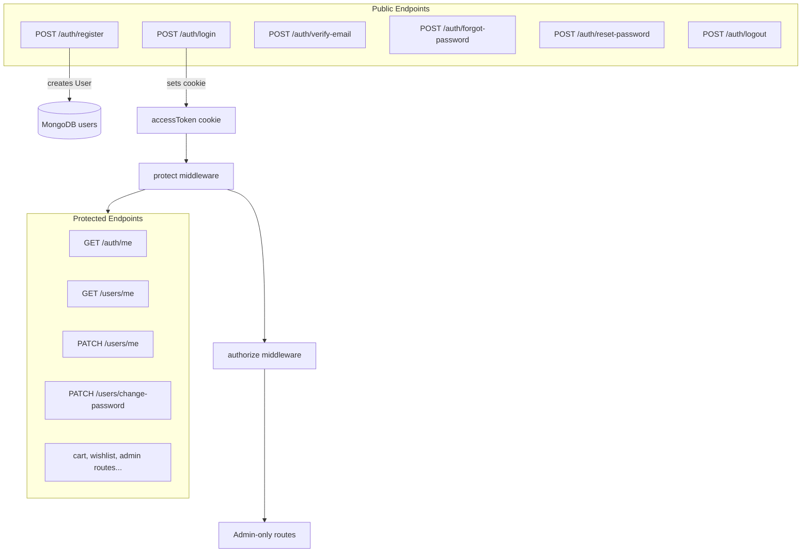
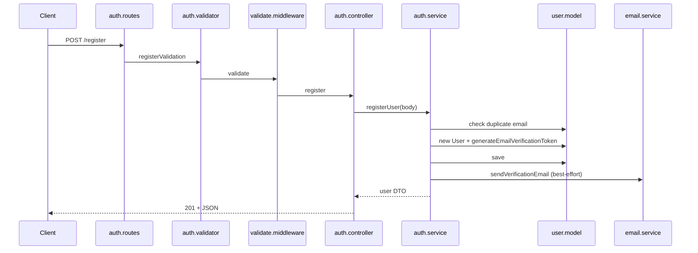
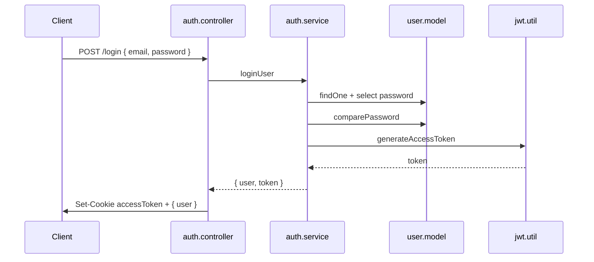
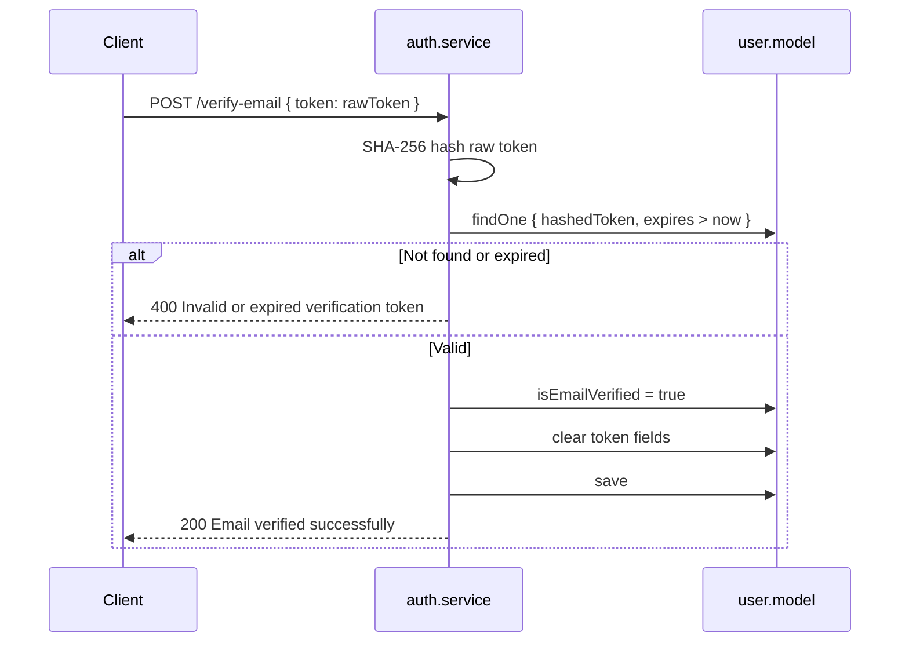
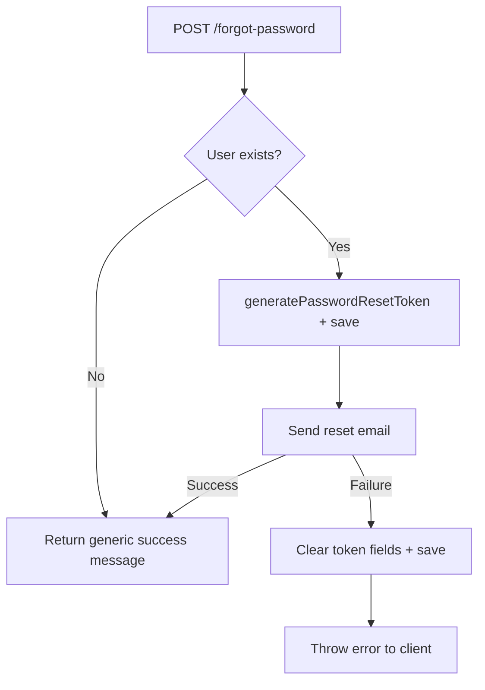
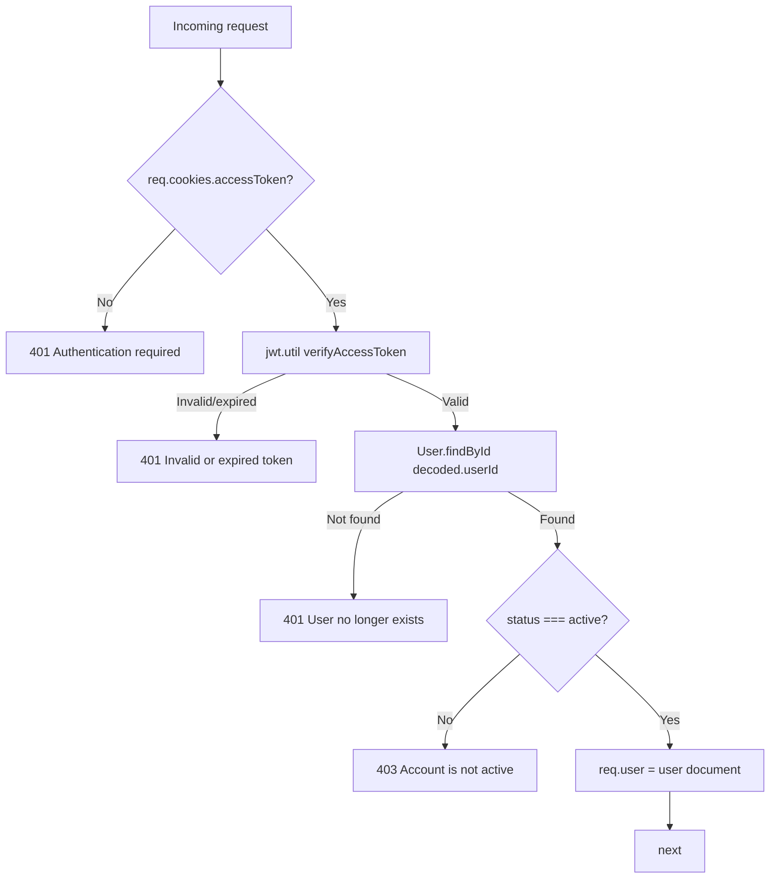

# Authentication Module

This document describes every authentication and authorization feature **actually implemented** in `back-end/`. It covers user identity, session management, password flows, middleware, and related user profile endpoints mounted under `/api/v1/auth` and `/api/v1/users`.

---

# Authentication Overview

The platform uses **JWT-based authentication** delivered via an **HTTP-only cookie** named `accessToken`. There is no refresh token, no session store, and no OAuth/social login.



### Core Components

| Component | File | Purpose |
|-----------|------|---------|
| Auth routes | `routes/auth.routes.js` | Register, login, logout, email verify, password reset |
| User routes | `routes/user.routes.js` | Profile, change password |
| Auth controller | `controllers/auth.controller.js` | HTTP adapter; sets/clears cookie on login/logout |
| User controller | `controllers/user.controller.js` | Profile and change-password HTTP adapter |
| Auth service | `services/auth.service.js` | Registration, login, token-based email/password flows |
| User service | `services/user.service.js` | Profile read/update, authenticated password change |
| Auth middleware | `middleware/auth.middleware.js` | `protect`, `authorize` |
| Validators | `validators/auth.validator.js` | Input validation for all auth/user flows |
| User model | `models/user.model.js` | Schema, password hashing, token generation methods |
| JWT utils | `utils/jwt.util.js` | Sign and verify access tokens |
| Password utils | `utils/password.util.js` | bcrypt hash/compare |
| Token utils | `utils/token.util.js` | Crypto tokens for email/reset (not JWT) |
| Email service | `services/email.service.js` | Verification and reset email HTML |

### Roles and Status

From `constants/user.constants.js`:

| Constant | Values | Default on register |
|----------|--------|---------------------|
| `USER_ROLES` | `customer`, `admin` | `customer` |
| `USER_STATUS` | `active`, `inactive`, `suspended` | `active` |

### Environment Variables

| Variable | Used By | Default |
|----------|---------|---------|
| `JWT_SECRET` | `jwt.util.js` | Required (throws if missing on sign) |
| `JWT_EXPIRES_IN` | `jwt.util.js` | `1h` |
| `BCRYPT_ROUNDS` | `password.util.js` | `12` |
| `TOKEN_EXPIRY_MINUTES` | `user.model.js` | `10` |
| `FRONTEND_URL` | `auth.service.js`, `app.js` CORS | Required for email links and CORS |
| `NODE_ENV` | `auth.controller.js` | `secure` cookie flag when `production` |

---

# User Registration

**Endpoint:** `POST /api/v1/auth/register`

## Request Flow



## Validation

`registerValidation` in `validators/auth.validator.js`:

| Field | Rules |
|-------|-------|
| `firstName` | Required, trimmed, 1–50 chars |
| `lastName` | Required, trimmed, 1–50 chars |
| `email` | Required, valid email, normalized |
| `password` | Required, 8–128 chars, strong password (upper, lower, number, symbol) |

Failures return `400` with `Validation failed` and field-level `errors` array.

## Service Logic

`auth.service.js` → `registerUser`:

1. `User.findOne({ email })` — if exists, throw `AppError('Email already exists', 409)`
2. Create `User` with `firstName`, `lastName`, `email`, `password` only
3. Call `user.generateEmailVerificationToken()` — stores **hashed** token on user, returns **raw** token
4. `user.save()` — triggers `pre('save')` password hashing
5. On MongoDB `11000` duplicate key, throw `409` with field name
6. Build `verificationUrl`: `${FRONTEND_URL}/verify-email?token=${rawToken}`
7. Send verification email via `emailService.sendVerificationEmail`
8. If email send fails: **log error only** — registration still succeeds
9. Return safe user DTO (no password, no tokens)

## Database Changes

New document in `users` collection:

| Field | Value on Register |
|-------|-------------------|
| `firstName`, `lastName`, `email`, `password` | From request (password hashed on save) |
| `role` | `customer` (default) |
| `status` | `active` (default) |
| `isEmailVerified` | `false` (default) |
| `isPhoneVerified` | `false` (default) |
| `emailVerificationToken` | SHA-256 hash of raw token |
| `emailVerificationTokenExpires` | `now + TOKEN_EXPIRY_MINUTES` |
| `createdAt`, `updatedAt` | Mongoose timestamps |

---

# Login

**Endpoint:** `POST /api/v1/auth/login`

## Credential Verification

`auth.service.js` → `loginUser`:

1. `User.findOne({ email }).select('+password')` — password excluded by default in schema
2. If no user → `AppError('Invalid email or password', 401)` (generic message)
3. `user.comparePassword(password)` via bcrypt
4. If mismatch → same `401` message (prevents user enumeration)
5. If `user.status !== USER_STATUS.ACTIVE` → `AppError('Account is not active', 403)`
6. **Does not check** `isEmailVerified` — unverified users can log in

## JWT Creation

```javascript
// services/auth.service.js
const token = generateAccessToken({ userId: user._id, role: user.role });
```

```javascript
// utils/jwt.util.js
jwt.sign(payload, process.env.JWT_SECRET, {
  expiresIn: process.env.JWT_EXPIRES_IN || '1h',
});
```

JWT payload contains:

| Claim | Source |
|-------|--------|
| `userId` | `user._id` |
| `role` | `user.role` |
| `iat`, `exp` | Added by `jsonwebtoken` |

Token is returned to the controller but **not** included in the JSON response body.

## Cookie Creation

```javascript
// controllers/auth.controller.js
res.cookie('accessToken', token, {
  httpOnly: true,
  secure: process.env.NODE_ENV === 'production',
  sameSite: 'strict',
  maxAge: 24 * 60 * 60 * 1000, // 24 hours
});
```

| Option | Value | Security intent |
|--------|-------|-----------------|
| `httpOnly` | `true` | Not accessible via `document.cookie` (XSS mitigation) |
| `secure` | `true` in production | HTTPS-only in production |
| `sameSite` | `strict` | CSRF mitigation for cross-site requests |
| `maxAge` | 24 hours | Browser cookie lifetime |

> **Mismatch:** Cookie `maxAge` is 24h but JWT default expiry is 1h. After JWT expires, cookie may still be sent but `protect` will reject with `401`.

## Request Flow



---

# Logout

**Endpoint:** `POST /api/v1/auth/logout`

## Cookie Clearing Strategy

```javascript
// controllers/auth.controller.js
res.clearCookie('accessToken');
```

| Aspect | Behavior |
|--------|----------|
| Authentication required | **No** — anyone can call logout |
| Cookie options on clear | Default Express clear (no explicit `path`, `domain`, `secure`, `sameSite`) |
| Server-side invalidation | **None** — JWT remains valid until expiry; no blocklist |
| Response | `{ success: true, message: 'Logged out successfully' }` |

Logout is **client-oriented**: removes the cookie from the browser. A stolen JWT remains usable until `JWT_EXPIRES_IN` elapses.

---

# Email Verification

**Endpoint:** `POST /api/v1/auth/verify-email`

## Token Creation

On registration, `user.model.js` → `generateEmailVerificationToken`:

```javascript
// utils/token.util.js
const rawToken = crypto.randomBytes(32).toString('hex');       // 64 hex chars
const hashedToken = crypto.createHash('sha256').update(rawToken).digest('hex');
```

| Stored in DB | Sent to user |
|--------------|--------------|
| `emailVerificationToken` = hashed | Raw token in email URL query param |
| `emailVerificationTokenExpires` = now + `TOKEN_EXPIRY_MINUTES` (default 10 min) | — |

Only the hash is persisted — a database leak does not expose usable verification links.

## Verification Flow



`auth.service.js` → `verifyEmail`:

1. Hash incoming `token` with SHA-256
2. Find user where `emailVerificationToken` matches and `emailVerificationTokenExpires > Date.now()`
3. If not found → `400`
4. Set `isEmailVerified = true`, clear token fields, save

### Email Workflow

`email.service.js` loads `templates/verification-email.html`, substitutes `{{firstName}}` and `{{verificationUrl}}`, sends via Nodemailer (`providers/email.provider.js`).

**Subject:** `Verify your email address`

**Link format:** `{FRONTEND_URL}/verify-email?token={rawToken}`

---

# Forgot Password

**Endpoint:** `POST /api/v1/auth/forgot-password`

## Token Generation

Uses `user.generatePasswordResetToken()` — identical crypto pattern to email verification:

| Stored | Sent |
|--------|------|
| `passwordResetToken` (SHA-256 hash) | Raw token in reset URL |
| `passwordResetExpires` (default 10 min) | — |

## Email Workflow



`auth.service.js` → `forgotPassword`:

1. Find user by email
2. If **no user** — return generic message (anti-enumeration):
   > `If an account exists for that email, a password reset link has been sent.`
3. Generate reset token, save user
4. Email link: `${FRONTEND_URL}/reset-password?token=${rawToken}`
5. On email failure: **clear** `passwordResetToken` and `passwordResetExpires`, re-save, **re-throw error**

Unlike registration, forgot-password **rolls back** the token if email cannot be sent.

---

# Reset Password

**Endpoint:** `POST /api/v1/auth/reset-password`

## Validation

`resetPasswordValidation`:

| Field | Rules |
|-------|-------|
| `token` | Required |
| `password` | Required, 8–128 chars, strong password |
| `confirmPassword` | Required, must match `password` |

## Token Verification

`auth.service.js` → `resetPassword`:

1. SHA-256 hash the `token` from body
2. `User.findOne({ passwordResetToken: hash, passwordResetExpires: { $gt: Date.now() } }).select('+password')`
3. If not found → `400 Invalid or expired password reset token`
4. Set `user.password = password` (plain — `pre('save')` hashes it)
5. Clear `passwordResetToken`, `passwordResetExpires`
6. Save user

## Post-Reset Behavior

| Behavior | Implemented? |
|----------|--------------|
| Invalidate existing JWT sessions | **No** |
| Clear `accessToken` cookie | **No** |
| Force re-login | **No** |

Active sessions remain valid until JWT expires.

---

# Change Password

**Endpoint:** `PATCH /api/v1/users/change-password`  
**Requires:** `protect` middleware (authenticated user)

## Security Checks

### Validator (`changePasswordValidation`)

| Field | Rules |
|-------|-------|
| `currentPassword` | Required |
| `newPassword` | Required, strong password, must differ from `currentPassword` |
| `confirmPassword` | Required, must match `newPassword` |

### Service (`user.service.js` → `changePassword`)

1. `User.findById(userId).select('+password')`
2. If not found → `404`
3. `comparePassword(currentPassword, user.password)` — if fail → `400 Current password is incorrect`
4. Set `user.password = newPassword`, save (bcrypt via hook)

### Not Implemented

- No verification that `isEmailVerified` is true
- No rate limiting on attempts
- No session invalidation after password change
- No password history / reuse prevention

---

# Get Current User

Two endpoints return the authenticated user. Both require `protect`.

## `GET /api/v1/auth/me`

**Controller:** `auth.controller.js` → `getMe`  
**Service:** None — projects fields directly from `req.user`

| Field | Included |
|-------|----------|
| `id`, `firstName`, `lastName`, `fullName`, `email`, `role`, `status`, `isEmailVerified` | Yes |
| `isPhoneVerified`, `address`, `phone` | **No** |

```json
{
  "success": true,
  "data": {
    "id": "665f1a2b3c4d5e6f7a8b9c0d",
    "firstName": "Jane",
    "lastName": "Doe",
    "fullName": "Jane Doe",
    "email": "jane@example.com",
    "role": "customer",
    "status": "active",
    "isEmailVerified": false
  }
}
```

## `GET /api/v1/users/me`

**Controller:** `user.controller.js` → `getProfile`  
**Service:** `user.service.js` → `getProfile`

Includes all auth `/me` fields plus:

| Additional Field | Included |
|------------------|----------|
| `isPhoneVerified` | Yes |
| `address` | Yes (embedded array from model) |

Use `/api/v1/users/me` for the complete profile snapshot.

---

# Update Profile

**Endpoint:** `PATCH /api/v1/users/me`  
**Requires:** `protect`

## Supported Updates

`user.service.js` whitelists only:

| Field | Validator | Model notes |
|-------|-----------|-------------|
| `firstName` | Optional, 1–50 chars | — |
| `lastName` | Optional, 1–50 chars | — |
| `phone` | Optional, valid mobile phone | Unique sparse index on model |

### Not Updatable via This Endpoint

| Field | Notes |
|-------|-------|
| `email` | No endpoint to change email |
| `password` | Use `/users/change-password` |
| `role` | No self-service role change |
| `status` | Admin-only (no API implemented) |
| `avatar`, `dateOfBirth`, `address` | Schema exists; no update API |

Service saves via `user.save()` on the Mongoose document attached by `protect` (not a fresh `findById`).

---

# Protect Middleware

**File:** `middleware/auth.middleware.js`

## Authentication Flow



### Step-by-Step

1. Read `req.cookies.accessToken`
2. If missing → `AppError('Authentication required', 401)`
3. `verifyAccessToken(token)` — JWT verify with `JWT_SECRET`
4. Load full user from database (`User.findById(decoded.userId)`)
5. If user deleted → `401 User no longer exists`
6. If `user.status !== 'active'` → `403 Account is not active`
7. Attach `req.user` (Mongoose document) and call `next()`

### Design Notes

| Aspect | Behavior |
|--------|----------|
| Token location | Cookie only — no `Authorization: Bearer` support |
| User reload | DB lookup on **every** protected request (role/status always fresh) |
| Password on `req.user` | Not loaded (`select: false`) |
| Error handling | All errors passed to `next(error)` |

### Routes Using `protect`

| Router | Endpoints |
|--------|-----------|
| `auth.routes.js` | `GET /me` |
| `user.routes.js` | `GET /me`, `PATCH /me`, `PATCH /change-password` |
| `cart.routes.js` | All endpoints |
| `wishlist.routes.js` | All endpoints |
| `product.routes.js` | All mutating/admin endpoints |
| `category.routes.js` | Admin endpoints |
| `inventory.routes.js` | All endpoints |

---

# Authorize Middleware

**File:** `middleware/auth.middleware.js`

## Role-Based Access Control

```javascript
const authorize = (...allowedRoles) => {
  return (req, res, next) => {
    if (!allowedRoles.includes(req.user.role)) {
      return next(new AppError('Forbidden', 403));
    }
    next();
  };
};
```

### Requirements

| Prerequisite | Reason |
|--------------|--------|
| `protect` must run first | `authorize` reads `req.user.role` |
| Role in JWT vs DB | **DB role** used at request time (from `req.user`, not decoded JWT) |

### Usage Pattern

```javascript
// routes/product.routes.js
router.post('/', protect, authorize(USER_ROLES.ADMIN), createProductValidation, validate, createProduct);
```

### Admin-Only Route Groups

| Module | Operations |
|--------|------------|
| Products | Create, update, archive, restore, image management |
| Categories | Create, update, archive, restore |
| Inventory | Adjust, history, summary |

Customers (`role: 'customer'`) receive `403 Forbidden` on admin routes.

### Not Implemented

- Fine-grained permissions (e.g. `products:write`)
- Resource-level ownership checks
- Multiple roles per user

---

# Security Decisions

## Password Hashing

| Aspect | Implementation |
|--------|----------------|
| Algorithm | bcrypt (`bcrypt` package) |
| Rounds | `BCRYPT_ROUNDS` env var, default **12** |
| When hashed | `user.model.js` `pre('save')` when password modified |
| Storage | `password` field with `select: false` |
| Comparison | `user.comparePassword()` → `bcrypt.compare` |
| Update guard | `pre('findOneAndUpdate')` rejects pre-hashed passwords |

**Schema vs validator mismatch:** Model `minlength: 6` on password; API validators require **8** chars with strength rules. API path is stricter.

## JWT

| Aspect | Implementation |
|--------|----------------|
| Library | `jsonwebtoken` |
| Secret | `JWT_SECRET` environment variable |
| Expiry | `JWT_EXPIRES_IN` or default `1h` |
| Payload | `{ userId, role }` only |
| Refresh tokens | **Not implemented** |
| Token revocation | **Not implemented** |

## Cookies

| Aspect | Implementation |
|--------|----------------|
| Name | `accessToken` |
| Content | Signed JWT |
| `httpOnly` | Yes |
| `sameSite` | `strict` |
| `secure` | Production only |
| CORS | `credentials: true`, origin `FRONTEND_URL` |

## Token Expiration (Email / Reset)

| Token Type | Expiry | Storage |
|------------|--------|---------|
| Email verification | `TOKEN_EXPIRY_MINUTES` (default 10 min) | Hashed in `users` |
| Password reset | `TOKEN_EXPIRY_MINUTES` (default 10 min) | Hashed in `users` |
| JWT access | `JWT_EXPIRES_IN` (default 1h) | Client cookie |
| Cookie maxAge | 24 hours | Browser |

## Other Security Measures in `app.js`

| Measure | Implementation |
|---------|----------------|
| Helmet | Security headers via `helmet()` |
| CORS | Restricted to `FRONTEND_URL` |
| Body size limit | JSON limited to 100kb |
| Generic login errors | Same message for wrong email vs wrong password |
| Generic forgot-password | Same response whether email exists |
| Hashed reset/verify tokens | SHA-256 before DB storage |

---

# API Endpoints

## Authentication (`/api/v1/auth`)

| Method | Route | Auth | Role | Validator |
|--------|-------|------|------|-----------|
| POST | `/register` | No | — | `registerValidation` |
| POST | `/login` | No | — | `loginValidation` |
| GET | `/me` | Yes | Any | — |
| POST | `/logout` | No | — | — |
| POST | `/verify-email` | No | — | `verifyEmailValidation` |
| POST | `/forgot-password` | No | — | `forgotPasswordValidation` |
| POST | `/reset-password` | No | — | `resetPasswordValidation` |

## Users (`/api/v1/users`)

| Method | Route | Auth | Role | Validator |
|--------|-------|------|------|-----------|
| GET | `/me` | Yes | Any | — |
| PATCH | `/me` | Yes | Any | `updateProfileValidation` |
| PATCH | `/change-password` | Yes | Any | `changePasswordValidation` |

## Error Responses (Common)

| Status | Message | Endpoint(s) |
|--------|---------|-------------|
| `400` | Validation failed | All validated endpoints |
| `400` | Invalid or expired verification token | verify-email |
| `400` | Invalid or expired password reset token | reset-password |
| `400` | Current password is incorrect | change-password |
| `401` | Invalid email or password | login |
| `401` | Authentication required | protect (no cookie) |
| `401` | Invalid or expired token | protect (bad JWT) |
| `401` | User no longer exists | protect |
| `403` | Account is not active | login, protect |
| `403` | Forbidden | authorize (wrong role) |
| `409` | Email already exists | register |

---

# Request/Response Examples

## Register

```http
POST /api/v1/auth/register HTTP/1.1
Content-Type: application/json

{
  "firstName": "Jane",
  "lastName": "Doe",
  "email": "jane@example.com",
  "password": "SecureP@ss1"
}
```

```json
{
  "success": true,
  "message": "User registered successfully. Please verify your email address.",
  "data": {
    "id": "665f1a2b3c4d5e6f7a8b9c0d",
    "firstName": "Jane",
    "lastName": "Doe",
    "fullName": "Jane Doe",
    "email": "jane@example.com",
    "role": "customer",
    "status": "active",
    "isEmailVerified": false
  }
}
```

## Login

```http
POST /api/v1/auth/login HTTP/1.1
Content-Type: application/json

{
  "email": "jane@example.com",
  "password": "SecureP@ss1"
}
```

```http
HTTP/1.1 200 OK
Set-Cookie: accessToken=eyJhbGciOiJIUzI1NiIs...; HttpOnly; SameSite=Strict; Max-Age=86400
Content-Type: application/json
```

```json
{
  "success": true,
  "message": "Login successfully",
  "data": {
    "user": {
      "id": "665f1a2b3c4d5e6f7a8b9c0d",
      "firstName": "Jane",
      "lastName": "Doe",
      "fullName": "Jane Doe",
      "email": "jane@example.com",
      "role": "customer",
      "status": "active",
      "isEmailVerified": false
    }
  }
}
```

## Authenticated Request

```http
GET /api/v1/users/me HTTP/1.1
Cookie: accessToken=eyJhbGciOiJIUzI1NiIs...
```

```json
{
  "success": true,
  "data": {
    "id": "665f1a2b3c4d5e6f7a8b9c0d",
    "firstName": "Jane",
    "lastName": "Doe",
    "fullName": "Jane Doe",
    "email": "jane@example.com",
    "role": "customer",
    "status": "active",
    "isEmailVerified": true,
    "isPhoneVerified": false,
    "address": []
  }
}
```

## Verify Email

```http
POST /api/v1/auth/verify-email HTTP/1.1
Content-Type: application/json

{
  "token": "a1b2c3d4e5f6789..."
}
```

```json
{
  "success": true,
  "message": "Email verified successfully"
}
```

## Forgot Password

```http
POST /api/v1/auth/forgot-password HTTP/1.1
Content-Type: application/json

{
  "email": "jane@example.com"
}
```

```json
{
  "success": true,
  "message": "If an account exists for that email, a password reset link has been sent."
}
```

## Reset Password

```http
POST /api/v1/auth/reset-password HTTP/1.1
Content-Type: application/json

{
  "token": "f6e5d4c3b2a1...",
  "password": "NewSecureP@ss2",
  "confirmPassword": "NewSecureP@ss2"
}
```

```json
{
  "success": true,
  "message": "Password reset successful"
}
```

## Change Password

```http
PATCH /api/v1/users/change-password HTTP/1.1
Content-Type: application/json
Cookie: accessToken=eyJhbGciOiJIUzI1NiIs...

{
  "currentPassword": "SecureP@ss1",
  "newPassword": "NewSecureP@ss2",
  "confirmPassword": "NewSecureP@ss2"
}
```

```json
{
  "success": true,
  "message": "Password changed successfully"
}
```

## Logout

```http
POST /api/v1/auth/logout HTTP/1.1
```

```json
{
  "success": true,
  "message": "Logged out successfully"
}
```

## Validation Error

```json
{
  "success": false,
  "status": "error",
  "message": "Validation failed",
  "errors": [
    {
      "field": "password",
      "message": "Password must be at least 8 characters long and contain at least one uppercase letter, one lowercase letter, one number, and one special character"
    }
  ]
}
```

## Forbidden (Admin Route)

```http
POST /api/v1/products HTTP/1.1
Cookie: accessToken=<customer-jwt>
```

```json
{
  "success": false,
  "status": "error",
  "message": "Forbidden",
  "errors": []
}
```

---

# Known Limitations

| Limitation | Detail |
|------------|--------|
| **Email verification not enforced** | `loginUser` does not check `isEmailVerified`; unverified users can authenticate |
| **Registration email failure silent** | User created even if verification email fails to send |
| **JWT/cookie expiry mismatch** | Cookie lives 24h; JWT default 1h — cookie may outlive valid token |
| **No refresh tokens** | Users must re-login after JWT expiry |
| **No session revocation** | Logout only clears client cookie; password reset/change does not invalidate JWTs |
| **No rate limiting** | Login, register, forgot-password vulnerable to brute force / abuse |
| **No account lockout** | Unlimited failed login attempts |
| **Logout is unauthenticated** | No guarantee caller owned the session |
| **`clearCookie` options incomplete** | May not match `setCookie` options in all browsers (path/domain/secure) |
| **Phone verification not implemented** | `generatePhoneVerificationToken` exists on model; no routes or service |
| **No email change flow** | Email is immutable via API |
| **No admin user management API** | Roles cannot be assigned via endpoints |
| **Bearer token not supported** | Cookie-only; non-browser clients must manage cookies |
| **Role in JWT unused for authz** | `authorize` reads DB `req.user.role`, not JWT claim (good for revocation lag on role change, but JWT still valid) |
| **Debug logging** | `console.log(req.user)` in `user.controller.js` updatedProfile |
| **Short verification window** | 10-minute default may be tight for email delivery delays |
| **Password minlength schema gap** | Model allows 6 chars if validation bypassed |

---

# Future Security Improvements

The following are **not implemented** but align with gaps in the current codebase:

| Improvement | Addresses |
|-------------|-----------|
| **Enforce `isEmailVerified` on login** | Unverified account access |
| **Refresh token rotation** | JWT expiry UX; shorter access token lifetime |
| **Token blocklist / session store** | Logout and password change invalidation |
| **Rate limiting** (`express-rate-limit`) | Brute force on auth endpoints |
| **Account lockout** after N failed logins | Credential stuffing |
| **Align cookie `maxAge` with JWT expiry** | Token/cookie mismatch |
| **Explicit `clearCookie` options** | Logout reliability across environments |
| **Require auth for logout** | Session ownership |
| **Email verification resend endpoint** | Failed registration emails |
| **Phone verification API** | Existing model scaffolding |
| **2FA / TOTP** | Account takeover risk |
| **CSRF tokens** | Defense-in-depth beyond `sameSite: strict` |
| **Audit log for auth events** | Login, reset, password change tracking |
| **Password breach checking** (Have I Been Pwned) | Weak/compromised passwords |
| **Secure admin bootstrap** | No seed/script for initial admin in codebase |
| **Remove debug `console.log`** | Information leakage in logs |

---

# Module File Map

```
back-end/
├── routes/
│   ├── auth.routes.js          # Auth HTTP routes
│   └── user.routes.js          # Profile & change-password routes
├── controllers/
│   ├── auth.controller.js      # Cookie set/clear, auth responses
│   └── user.controller.js      # Profile responses
├── services/
│   ├── auth.service.js         # Core auth business logic
│   ├── user.service.js         # Profile & password change logic
│   └── email.service.js        # Verification & reset emails
├── middleware/
│   └── auth.middleware.js      # protect, authorize
├── validators/
│   └── auth.validator.js       # All auth/user input validation
├── models/
│   └── user.model.js           # User schema, hooks, token methods
├── utils/
│   ├── jwt.util.js             # JWT sign/verify
│   ├── password.util.js        # bcrypt
│   └── token.util.js           # Crypto tokens for email/reset
├── constants/
│   └── user.constants.js       # USER_ROLES, USER_STATUS
├── providers/
│   └── email.provider.js       # Nodemailer SMTP
└── templates/
    ├── verification-email.html
    └── reset-password-email.html
```

This module provides cookie-based JWT authentication, email verification, password reset, role-gated admin access, and authenticated user profile management — with the limitations documented above reflecting the current production posture of the codebase.
