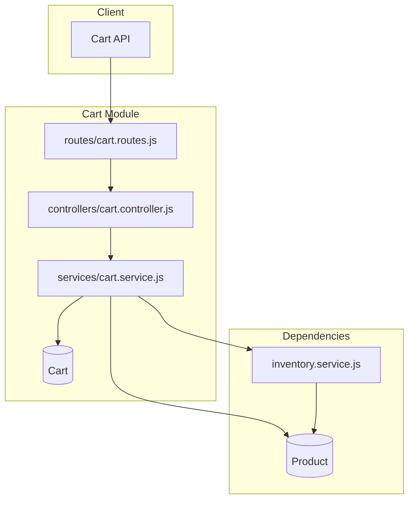
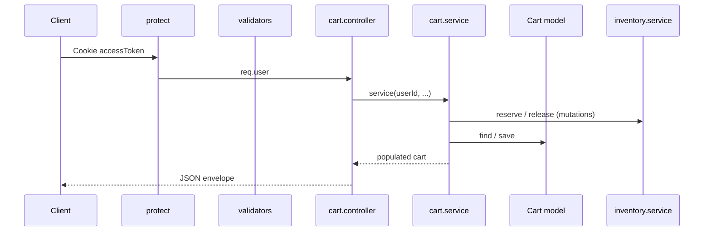
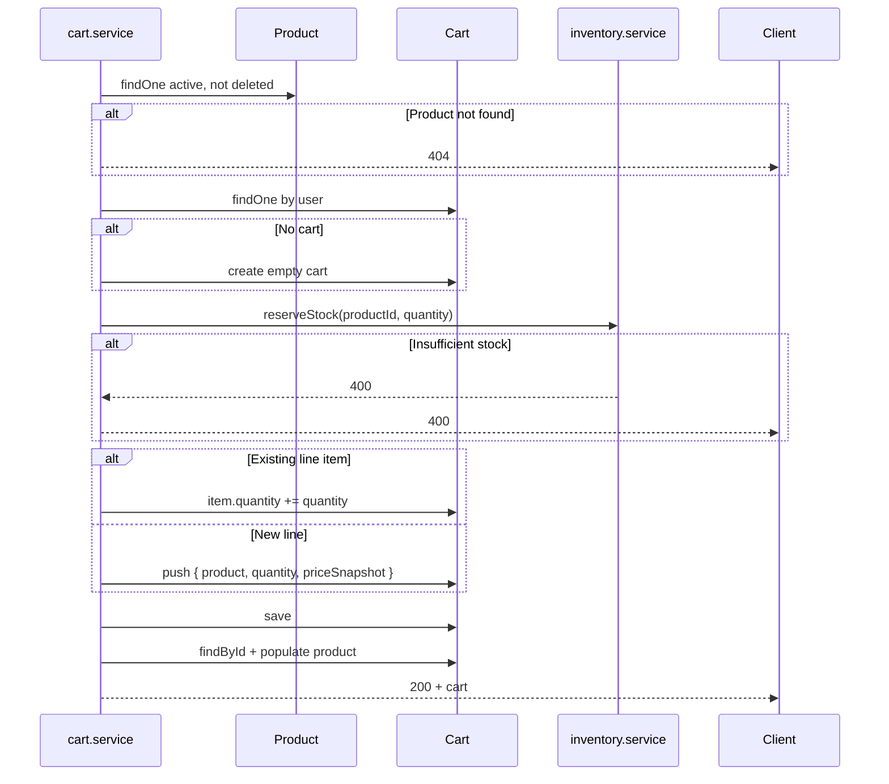
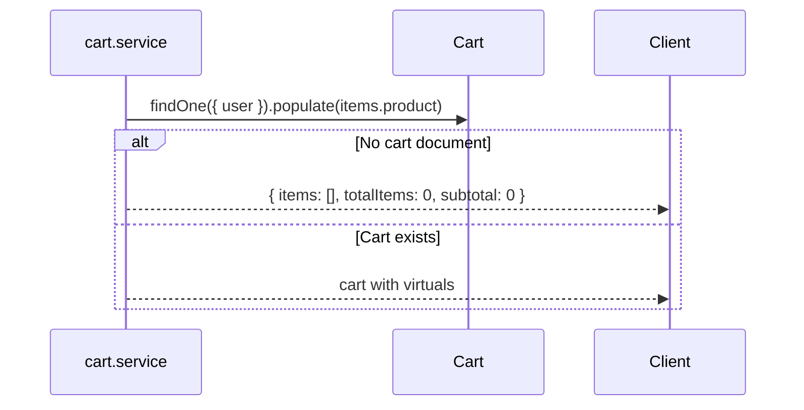
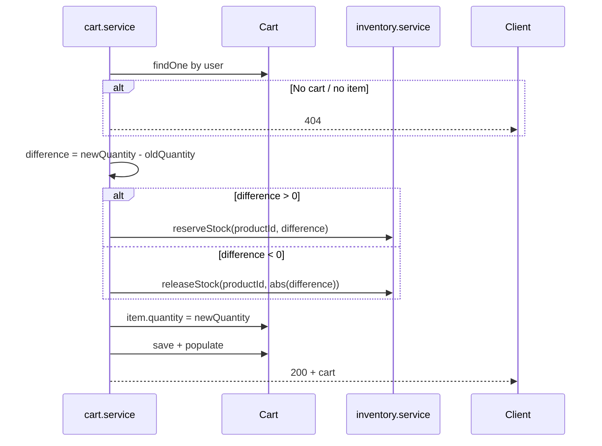
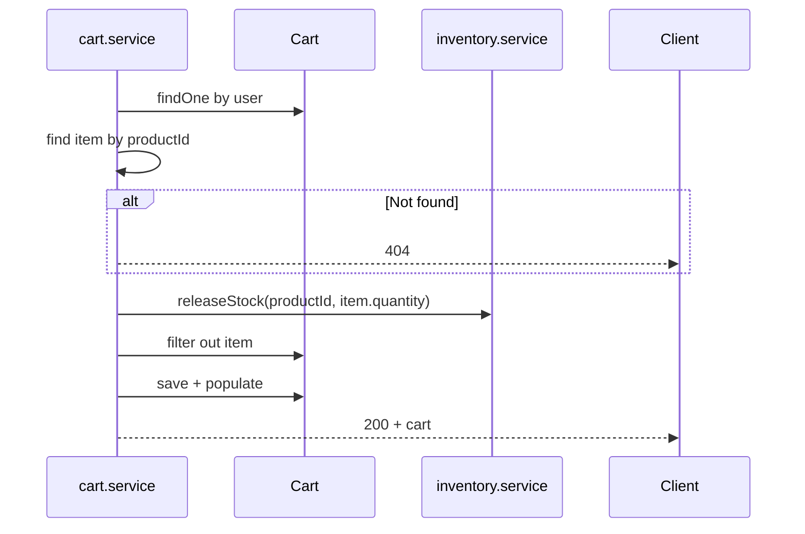
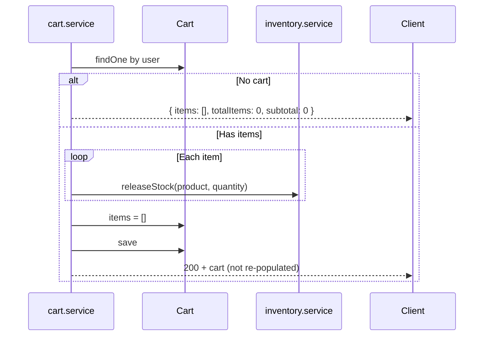
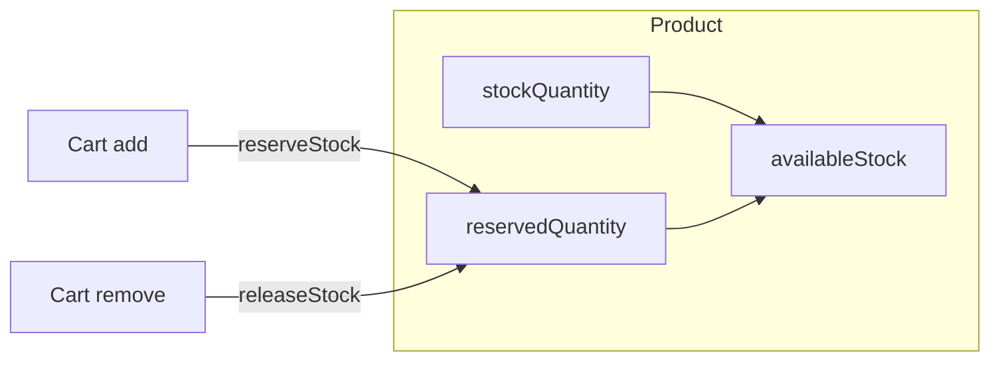
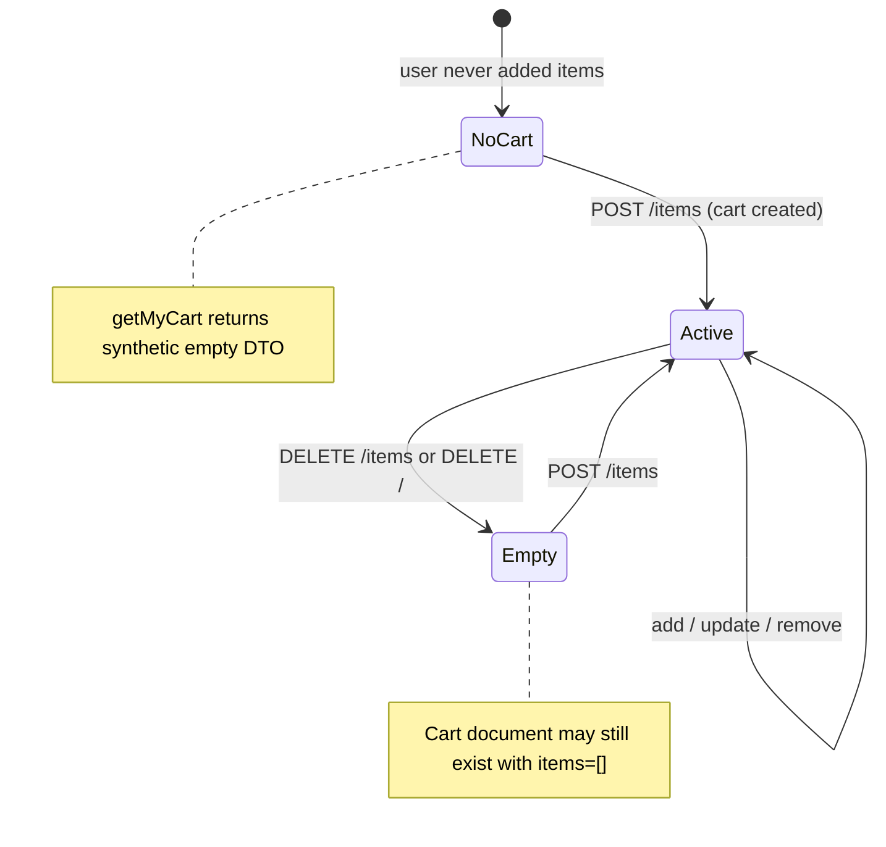
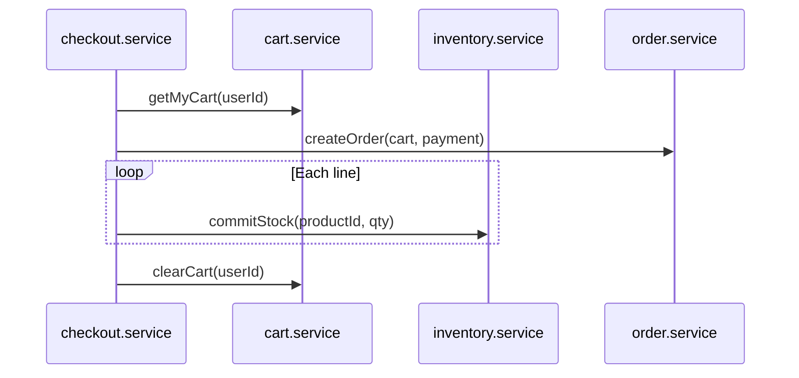

# Cart Module

Documentation for the shopping cart feature in `back-end/`. Each authenticated user has **one cart** with embedded line items. Cart mutations synchronize with product inventory through `reserveStock` and `releaseStock` in `inventory.service.js`.

**Base path:** `/api/v1/cart`  
**Mount:** `app.js` → `app.use('/api/v1/cart', cartRoutes)`

---

# Cart Overview

The cart is a **persistent, user-scoped basket** stored in MongoDB. It is not session-based or anonymous — all endpoints require authentication (`protect` middleware).

| Aspect | Implementation |
|--------|----------------|
| Ownership | One cart per user (`user` field unique) |
| Line items | Embedded subdocuments in `items[]` |
| Pricing | `priceSnapshot` captured at add time |
| Inventory | Reservations on add/increase; release on decrease/remove/clear |
| Checkout | **Not implemented** — no orders, no `commitStock` |
| Guest cart | **Not implemented** |



### File Map

| Layer | File |
|-------|------|
| Routes | `routes/cart.routes.js` |
| Controller | `controllers/cart.controller.js` |
| Service | `services/cart.service.js` |
| Model | `models/cart.model.js` |
| Validator | `validators/cart.validator.js` |

---

# Cart Schema

**Model:** `Cart`  
**Collection:** `carts`  
**Timestamps:** `createdAt`, `updatedAt`

## Cart Document Fields

| Field | Type | Purpose | Validation | Default |
|-------|------|---------|------------|---------|
| `_id` | `ObjectId` | Cart primary key | Auto-generated | — |
| `user` | `ObjectId` → `User` | Cart owner | Required; **unique** (one cart per user) | — |
| `items` | `[cartItemSchema]` | Line items | Array of embedded items | `[]` |
| `createdAt` | `Date` | First cart creation | Mongoose timestamps | Auto |
| `updatedAt` | `Date` | Last mutation | Mongoose timestamps | Auto |

## Embedded `cartItemSchema`

| Field | Type | Purpose | Validation | Default |
|-------|------|---------|------------|---------|
| `product` | `ObjectId` → `Product` | Product reference | Required | — |
| `quantity` | `Number` | Units in cart | Required; `min: 1` | — |
| `priceSnapshot` | `Number` | Unit price at add time | Required | Set from `product.price` on add |

Sub-schema uses `{ _id: false }` — line items have **no individual `_id`**.

### Design Notes

| Decision | Rationale in code |
|----------|-------------------|
| `priceSnapshot` | Preserves price when product price changes later |
| Unique `user` | `Cart.findOne({ user })` — no multi-cart logic |
| Product ref not duplicated | Same `productId` appears once per cart; quantity merged on re-add |

---

# Cart Virtuals

Enabled via `toJSON: { virtuals: true }` and `toObject: { virtuals: true }`.

## `totalItems`

**Formula:**

```
totalItems = sum(item.quantity for each item in items)
```

| `items` | `totalItems` |
|---------|--------------|
| `[{ qty: 2 }, { qty: 3 }]` | `5` |
| `[]` | `0` |

Counts **units**, not distinct product lines.

## `subtotal`

**Formula:**

```
subtotal = sum(item.priceSnapshot * item.quantity for each item in items)
```

| Line | `priceSnapshot` | `quantity` | Line total |
|------|-----------------|------------|------------|
| A | 100.00 | 2 | 200.00 |
| B | 49.99 | 1 | 49.99 |
| **subtotal** | | | **249.99** |

### Important Behaviors

| Behavior | Detail |
|----------|--------|
| Uses `priceSnapshot` | Not live `product.price` from populate |
| Re-add same product | Increments quantity; **does not update** `priceSnapshot` |
| Quantity update | Changes `quantity` only; snapshot unchanged |
| Empty cart fallback | `getMyCart` / `clearCart` (no cart) return `{ totalItems: 0, subtotal: 0 }` as plain object literals |

---

# Cart Architecture

## Request Pipeline

All routes: `protect` → (validators on POST/PATCH) → controller → service.



## Layer Responsibilities

| Layer | Responsibility |
|-------|----------------|
| **Routes** | HTTP mapping, `protect`, validation chains |
| **Controller** | Extract `req.user.id`, body, params; JSON response |
| **Service** | Product validation, inventory sync, cart CRUD |
| **Model** | Schema, virtuals |
| **inventory.service** | `reservedQuantity` on Product |

## Endpoints

| Method | Route | Validator | Service |
|--------|-------|-----------|---------|
| `POST` | `/items` | `addCartItemValidation` | `addItemToCart` |
| `GET` | `/` | — | `getMyCart` |
| `PATCH` | `/items/:productId` | `updateCartItemValidation` | `updateCartItemQuantity` |
| `DELETE` | `/items/:productId` | — | `removeCartItem` |
| `DELETE` | `/` | — | `clearCart` |

All endpoints require authentication. No admin-only operations.

---

# Add Item Workflow

**Endpoint:** `POST /api/v1/cart/items`  
**Body:** `{ productId, quantity }`



## Steps

| # | Action |
|---|--------|
| 1 | Validate `productId` (MongoId), `quantity` (int ≥ 1) |
| 2 | Load product: `isDeleted: false`, `status: PRODUCT_STATUS.ACTIVE` |
| 3 | Find or create cart for `userId` |
| 4 | `reserveStock(productId, quantity)` |
| 5 | Merge into existing line or push new item with `priceSnapshot: product.price` |
| 6 | `cart.save()` |
| 7 | Return populated cart |

**HTTP status:** `200` (not `201`)

---

# Get Cart Workflow

**Endpoint:** `GET /api/v1/cart`



## Populated Product Fields

`name`, `slug`, `price`, `images`, `stockQuantity`, `reservedQuantity`, `lowStockThreshold`, `status`, `isDeleted`

**No inventory calls** on read — reservations already reflected in `reservedQuantity` on populated product.

---

# Update Quantity Workflow

**Endpoint:** `PATCH /api/v1/cart/items/:productId`  
**Body:** `{ quantity }` — **new absolute quantity**, not delta



| Old qty | New qty | Inventory action |
|---------|---------|------------------|
| 2 | 5 | `reserveStock(3)` |
| 5 | 2 | `releaseStock(3)` |
| 3 | 3 | None |

`priceSnapshot` is **not** updated when quantity changes.

---

# Remove Item Workflow

**Endpoint:** `DELETE /api/v1/cart/items/:productId`



Releases **full line quantity** before removing the embedded item.

---

# Clear Cart Workflow

**Endpoint:** `DELETE /api/v1/cart`



| Aspect | Behavior |
|--------|----------|
| Cart document | Retained (not deleted) — empty `items[]` |
| Inventory | Sequential `releaseStock` per line |
| Response | Returns saved cart **without** populate (unlike other mutations) |

---

# Inventory Synchronization

Cart mutations change **`Product.reservedQuantity`**, not `stockQuantity`.

## `reserveStock(productId, quantity)`

**File:** `services/inventory.service.js`

```
if (availableStock < quantity) → 400 Insufficient inventory available
reservedQuantity += quantity
```

Where `availableStock = stockQuantity - reservedQuantity` (product virtual).

## `releaseStock(productId, quantity)`

```
reservedQuantity = max(0, reservedQuantity - quantity)
```

No error if release exceeds reserved — floors at zero.

## Why Cart Affects Inventory

| Without reservations | With reservations (implemented) |
|---------------------|-------------------------------|
| User A and B both see 5 in stock | First add reserves units |
| Both add 5 to cart | `availableStock` drops for others |
| Oversell at checkout | Reduces concurrent oversell risk |

Reservations are **soft holds** — physical `stockQuantity` unchanged until order `commitStock` (not wired).



### Cart → Inventory Matrix

| Cart operation | Inventory function | When |
|----------------|-------------------|------|
| Add item | `reserveStock` | Always, full add quantity |
| Update qty up | `reserveStock` | `difference > 0` |
| Update qty down | `releaseStock` | `difference < 0` |
| Remove item | `releaseStock` | Full line quantity |
| Clear cart | `releaseStock` | Each line, sequentially |
| Get cart | — | Read only |

### Not Synchronized

| Gap | Detail |
|-----|--------|
| No transactions | Reserve then `cart.save()` — failure leaves orphan reservation |
| No `commitStock` | Checkout does not reduce `stockQuantity` |
| No TTL | Abandoned carts hold stock indefinitely |
| Product archive | Existing cart lines remain; add blocked for inactive products |

---

# Business Rules

| Rule | Enforcement |
|------|-------------|
| Authentication required | All routes use `protect` |
| One cart per user | Unique index on `user` |
| Product must be active | `PRODUCT_STATUS.ACTIVE` + `isDeleted: false` on add |
| Quantity minimum 1 | Validator + schema `min: 1` on items |
| Merge duplicate products | Same `productId` → increment quantity, single line |
| Price at add time | `priceSnapshot` set only on new line creation |
| Stock availability | `reserveStock` checks `availableStock` |
| No max quantity cap | No per-line or per-cart limit in code |
| No coupon/shipping/tax | Not implemented |
| `productId` in URL on update/delete | Must match embedded `product` ObjectId |

---

# Request/Response Examples

## Add Item

```http
POST /api/v1/cart/items HTTP/1.1
Content-Type: application/json
Cookie: accessToken=<jwt>

{
  "productId": "665f1a2b3c4d5e6f7a8b9c0d",
  "quantity": 2
}
```

```json
{
  "success": true,
  "message": "Item added to cart successfully",
  "data": {
    "_id": "665f1a2b3c4d5e6f7a8b9c0f",
    "user": "665f1a2b3c4d5e6f7a8b9c01",
    "items": [
      {
        "product": {
          "_id": "665f1a2b3c4d5e6f7a8b9c0d",
          "name": "Pro Runner X",
          "slug": "pro-runner-x",
          "price": 129.99,
          "stockQuantity": 50,
          "reservedQuantity": 10,
          "lowStockThreshold": 5,
          "images": []
        },
        "quantity": 2,
        "priceSnapshot": 129.99
      }
    ],
    "totalItems": 2,
    "subtotal": 259.98
  }
}
```

## Get Cart (Empty)

```json
{
  "success": true,
  "data": {
    "items": [],
    "totalItems": 0,
    "subtotal": 0
  }
}
```

## Update Quantity

```http
PATCH /api/v1/cart/items/665f1a2b3c4d5e6f7a8b9c0d HTTP/1.1
Content-Type: application/json
Cookie: accessToken=<jwt>

{
  "quantity": 4
}
```

## Remove Item

```http
DELETE /api/v1/cart/items/665f1a2b3c4d5e6f7a8b9c0d HTTP/1.1
Cookie: accessToken=<jwt>
```

## Clear Cart

```http
DELETE /api/v1/cart HTTP/1.1
Cookie: accessToken=<jwt>
```

```json
{
  "success": true,
  "message": "Cart cleared successfully",
  "data": {
    "_id": "665f1a2b3c4d5e6f7a8b9c0f",
    "user": "665f1a2b3c4d5e6f7a8b9c01",
    "items": [],
    "totalItems": 0,
    "subtotal": 0
  }
}
```

## Errors

```json
{
  "success": false,
  "status": "error",
  "message": "Insufficient inventory available",
  "errors": []
}
```

```json
{
  "success": false,
  "status": "error",
  "message": "Cart item not found",
  "errors": []
}
```

---

# Edge Cases

| Scenario | Behavior |
|----------|----------|
| **Add inactive/archived product** | `404 Product not found` |
| **Add when `availableStock` insufficient** | `400` before cart modified |
| **Reserve succeeds, `cart.save()` fails** | Orphaned `reservedQuantity` — no rollback |
| **Concurrent adds for last units** | Race on `reservedQuantity`; possible oversell without transactions |
| **Re-add same product after price change** | Quantity increases; old `priceSnapshot` kept |
| **Update quantity to same value** | No inventory call; save still runs |
| **Remove non-existent line** | `404 Cart item not found` |
| **Clear empty cart (no document)** | Returns empty DTO, no error |
| **Clear cart with many lines** | N sequential `releaseStock` + N product saves |
| **Product deleted after in cart** | Populate may return null product; reservation remains until user removes |
| **User ID source** | Controller uses `req.user.id` (Mongoose id virtual) |
| **No validation on DELETE productId** | URL param not validated as MongoId |
| **`authorize` imported in routes** | Unused import in `cart.routes.js` |

---

# Cart Lifecycle



| State | Cart document | `items` | Reservations |
|-------|---------------|---------|--------------|
| No cart yet | None | — | None |
| Active | Exists | ≥ 1 line | Sum of line quantities per product |
| Empty (cleared) | Exists | `[]` | Released |
| Never deleted | — | Cart doc never removed from DB | — |

---

# Performance Considerations

| Topic | Current state | Impact |
|-------|---------------|--------|
| **One cart per user** | Unique `user` index | Fast `findOne({ user })` |
| **Embedded items** | No separate line-item collection | Single read/write per mutation |
| **Populate on every mutation** | Extra query after save | Larger response; 2 round-trips |
| **Sequential release on clear** | Loop `releaseStock` | O(n) product saves for n lines |
| **No cart caching** | Always MongoDB | Simple but no Redis layer |
| **Inventory per mutation** | 1–2 product saves + 1 cart save | High write volume under load |
| **No pagination** | Full cart returned | Fine for typical basket sizes |

---

# Future Checkout Integration

**Not implemented.** The codebase provides hooks for a future Orders/Checkout module.

## `commitStock` (Ready, Unused)

```javascript
// services/inventory.service.js
stockQuantity -= quantity;
reservedQuantity -= quantity;
```

| Checkout step | Proposed integration |
|---------------|------------------------|
| Validate cart | Re-check products active, prices (optional) |
| Create order | New Order model from cart lines |
| Per line item | `commitStock(productId, quantity)` |
| Clear cart | `clearCart` or remove committed lines |
| Payment failure | `releaseStock` to undo reservations |

## Recommended Flow (Future)



## Other Future Enhancements

| Enhancement | Status |
|-------------|--------|
| MongoDB transactions (cart + inventory) | Not implemented |
| Reservation TTL / abandoned cart job | Not implemented |
| Guest cart → merge on login | Not implemented |
| Price refresh on checkout | `priceSnapshot` only today |
| Max quantity per product | Not implemented |
| Cart item `_id` for partial ops | Disabled in schema |
| Shipping / tax / coupons | Not implemented |
| Idempotent add-to-cart | Not implemented |
| Populate on `clearCart` response | Inconsistent with other endpoints |

---

# Summary

The Cart module provides an **authenticated, single-cart-per-user** basket with **embedded line items**, **price snapshots**, and **inventory reservations** on every quantity increase. Reads are inventory-neutral; mutations call `reserveStock` or `releaseStock` before persisting cart changes. Virtuals `totalItems` and `subtotal` drive display totals from snapshots. Checkout is not built — `commitStock` awaits an Orders module, and cart/inventory operations lack transactional guarantees.
