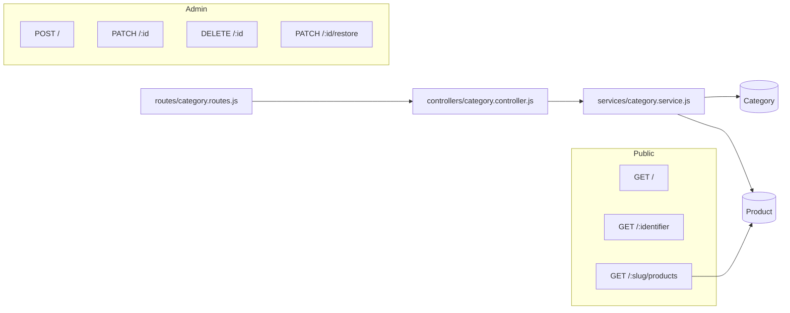
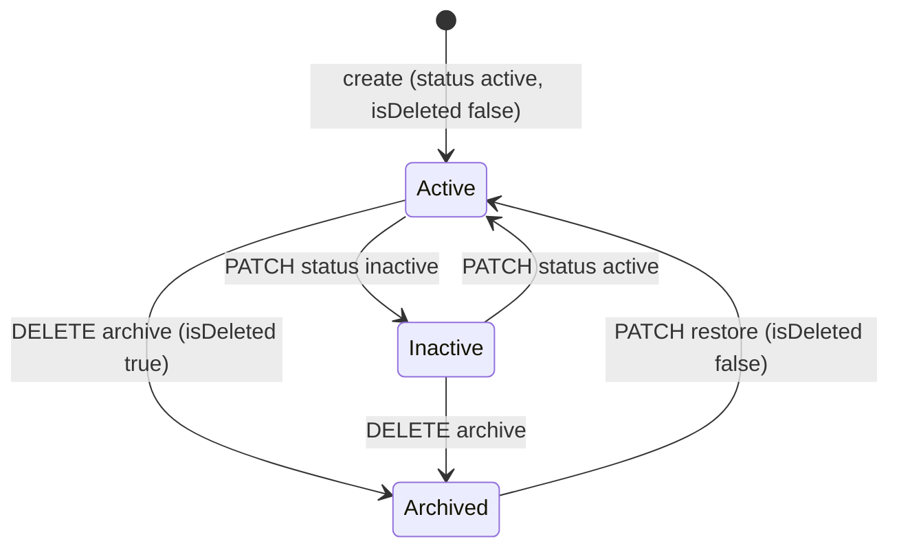
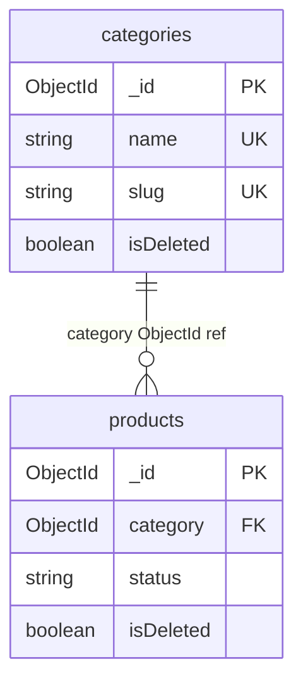
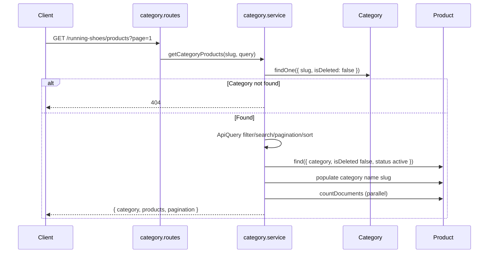

# Category Module

Documentation for the Category feature in `back-end/`. Categories organize the product catalog and expose public listing endpoints plus admin lifecycle management.

**Base path:** `/api/v1/categories`  
**Mount:** `app.js` → `app.use('/api/v1/categories', categoryRoutes)`

---

# Module Overview

The Category module provides **taxonomy management** for the sports e-commerce catalog. Each category has a unique name, URL-friendly slug, optional description and image, status flag, and soft-delete support.



### File Map

| Layer | File |
|-------|------|
| Routes | `routes/category.routes.js` |
| Controller | `controllers/category.controller.js` |
| Service | `services/category.service.js` |
| Model | `models/category.model.js` |
| Validator | `validators/category.validator.js` |
| Constants | `constants/category.constants.js` |
| Query helper | `utils/api-query.util.js` |

### Access Control Summary

| Operation | Auth | Role |
|-----------|------|------|
| List, get, category products | Public | — |
| Create, update, archive, restore | Required (`protect`) | `admin` |

---

# Category Schema

**Model:** `Category`  
**Collection:** `categories`  
**Timestamps:** `createdAt`, `updatedAt`

## Field-by-Field Explanation

| Field | Type | Purpose | Validation | Default |
|-------|------|---------|------------|---------|
| `_id` | `ObjectId` | Primary key | Auto-generated | — |
| `name` | `String` | Display name; drives slug generation | Required; `trim`; **unique**; `maxlength: 100` | — |
| `slug` | `String` | URL-safe identifier for routes and SEO | Required; **unique**; `lowercase`; `trim`; auto-generated from `name` | Set in `pre('validate')` |
| `description` | `String` | Optional category description | Optional; `trim`; `maxlength: 500` | `undefined` |
| `image` | `String` | Category image URL | Optional; `trim` (no URL validation at schema level) | `undefined` |
| `status` | `String` | Visibility/state flag | `enum`: `active`, `inactive` (`CATEGORY_STATUS`) | `active` |
| `isDeleted` | `Boolean` | Soft-delete flag | — | `false` |
| `createdBy` | `ObjectId` → `User` | Admin who created the category | Required | Set by service on create |
| `createdAt` | `Date` | Creation timestamp | Mongoose `timestamps` | Auto |
| `updatedAt` | `Date` | Last update timestamp | Mongoose `timestamps` | Auto |

### Schema Options

| Option | Value | Effect |
|--------|-------|--------|
| `timestamps` | `true` | Adds `createdAt`, `updatedAt` |
| `toJSON.versionKey` | `false` | Omits `__v` in JSON |
| `toJSON.virtuals` | `true` | Includes virtuals if any defined (none on Category) |

### Indexes (Implicit via Unique Constraints)

| Field | Index Type | Purpose |
|-------|------------|---------|
| `name` | Unique | Prevent duplicate category names |
| `slug` | Unique | Fast slug lookup; URL uniqueness |

No explicit `categorySchema.index()` calls — unlike `Product`, which defines compound indexes.

---

# Category Lifecycle



## Create

| Step | Layer | Action |
|------|-------|--------|
| 1 | Route | `POST /` → `protect` → `authorize(admin)` → `createCategoryValidation` → `validate` |
| 2 | Service | `Category.findOne({ name })` — duplicate name → `409` |
| 3 | Service | `Category.create({ ...categoryData, createdBy: userId })` |
| 4 | Model | `pre('validate')` generates `slug` from `name` |
| 5 | Controller | `201` with full category document |

**Body fields accepted:** Any keys in `categoryData` spread into create; validator enforces `name`, `description`, `image`. `status` can be passed but is **not validated** at API layer.

## Read

### List (`getCategories`)

- Filters: `isDeleted: false` always applied
- Supports search, status filter, pagination, sort
- Returns `{ categories, pagination }`

### Single (`getCategory`)

- Lookup by **MongoDB ObjectId** or **slug** (`req.params.identifier`)
- Filters: `isDeleted: false`
- Not found → `404`

## Update

| Step | Layer | Action |
|------|-------|--------|
| 1 | Route | `PATCH /:id` — admin only |
| 2 | Service | `Category.findById` — missing or `isDeleted` → `404` |
| 3 | Service | Whitelist: `name`, `description`, `image`, `status` |
| 4 | Model | If `name` changes, `pre('validate')` regenerates `slug` |
| 5 | Controller | `200` with updated category |

**Not updatable via service:** `slug` (indirect via name), `isDeleted`, `createdBy`.

## Archive

| Step | Layer | Action |
|------|-------|--------|
| 1 | Route | `DELETE /:id` — admin only |
| 2 | Service | `category.isDeleted = true`; `save()` |
| 3 | Controller | `200` message only (no `data`) |

**Does not:** set `status` to `inactive`; cascade to products; prevent duplicate name on re-create of same name while archived.

## Restore

| Step | Layer | Action |
|------|-------|--------|
| 1 | Route | `PATCH /:id/restore` — admin only |
| 2 | Service | `category.isDeleted = false`; `save()` |
| 3 | Controller | `200` with restored category |

**Does not:** change `status` field.

---

# Endpoints

| Method | Route | Auth | Role | Validator | Description |
|--------|-------|------|------|-----------|-------------|
| `GET` | `/api/v1/categories` | No | — | — | List categories |
| `GET` | `/api/v1/categories/:slug/products` | No | — | — | Products in category by slug |
| `GET` | `/api/v1/categories/:identifier` | No | — | — | Get category by ID or slug |
| `POST` | `/api/v1/categories` | Yes | Admin | `createCategoryValidation` | Create category |
| `PATCH` | `/api/v1/categories/:id` | Yes | Admin | `updateCategoryValidation` | Update category |
| `DELETE` | `/api/v1/categories/:id` | Yes | Admin | — | Archive (soft delete) |
| `PATCH` | `/api/v1/categories/:id/restore` | Yes | Admin | — | Restore archived category |

### Route Ordering

```javascript
router.get('/', getCategories);
router.get('/:slug/products', getCategoryProducts);  // before /:identifier
router.get('/:identifier', getCategory);
```

`/:slug/products` is registered **before** `/:identifier` so `running-shoes/products` is not captured as identifier `running-shoes/products`.

---

# Validation Rules

Defined in `validators/category.validator.js`. Aggregated by `validate.middleware.js` → `AppError('Validation failed', 400)`.

## Create (`createCategoryValidation`)

| Field | Rules |
|-------|-------|
| `name` | Required, trimmed, max 100 characters |
| `description` | Optional, max 500 characters |
| `image` | Optional, must be valid URL |

## Update (`updateCategoryValidation`)

| Field | Rules |
|-------|-------|
| `name` | Optional, trimmed, max 100 characters |
| `description` | Optional, max 500 characters |
| `image` | Optional, must be valid URL |

## Not Validated at API Layer

| Field | Notes |
|-------|-------|
| `status` | Enum enforced by Mongoose on save only (`active`, `inactive`) |
| `slug` | Auto-generated; not accepted from client |
| `isDeleted` | Managed by archive/restore only |

## Service-Level Validation

| Check | Endpoint | Error |
|-------|----------|-------|
| Duplicate `name` | Create | `409 Category already exists` |
| Category exists, not deleted | Get, update | `404 Category not found` |
| Category exists | Archive, restore | `404 Category not found` |

---

# Search Functionality

Powered by `ApiQuery.search()` in `utils/api-query.util.js`.

## List Categories (`GET /`)

| Aspect | Detail |
|--------|--------|
| Query param | `?search=<term>` |
| Fields searched | `name` only |
| Match type | Case-insensitive regex (`$options: 'i'`) |
| Implementation | `$or: [{ name: { $regex: term, $options: 'i' } }]` |

## Category Products (`GET /:slug/products`)

| Aspect | Detail |
|--------|--------|
| Query param | `?search=<term>` |
| Fields searched | `name`, `brand` |
| Match type | Case-insensitive regex on either field |

### Example

```http
GET /api/v1/categories?search=run
GET /api/v1/categories/running-shoes/products?search=nike
```

---

# Pagination

Via `ApiQuery.getPagination()`:

| Parameter | Type | Default | Formula |
|-----------|------|---------|---------|
| `page` | number | `1` | — |
| `limit` | number | `10` | — |
| `skip` | computed | — | `(page - 1) * limit` |

### Response Shape

```json
{
  "pagination": {
    "page": 1,
    "limit": 10,
    "total": 25,
    "totalPages": 3
  }
}
```

`totalPages` = `Math.ceil(total / limit)`

Used by:

- `getCategories` — paginates categories
- `getCategoryProducts` — paginates products within category

List and count run in **parallel** via `Promise.all([find(...), countDocuments(...)])`.

---

# Sorting

Via `ApiQuery.getSort()`:

| Parameter | Default | Description |
|-----------|---------|-------------|
| `sort` | `-createdAt` | Mongoose sort string |

### Examples

| Query | Sort behavior |
|-------|---------------|
| `?sort=name` | Ascending by name |
| `?sort=-createdAt` | Newest first (default) |
| `?sort=price` | Used on category products only (product field) |

Passed directly to `.sort(sort)` on Mongoose queries.

---

# Slug Generation

## Mechanism

```javascript
// models/category.model.js — pre('validate')
if (this.name) {
  this.slug = slugify(this.name, {
    lower: true,
    strict: true,
    trim: true,
  });
}
```

| Option | Effect |
|--------|--------|
| `lower: true` | Lowercase output |
| `strict: true` | Strip special characters |
| `trim: true` | Trim whitespace |

**Library:** `slugify` v1.6.9

## When Slug Updates

| Event | Slug behavior |
|-------|---------------|
| Create | Generated from `name` before validation |
| Update name | Regenerated on `save()` when `name` is set |
| Update description/image/status only | Slug unchanged |

## Uniqueness

`slug` has `unique: true` on schema. Two categories with names that slugify to the same value (e.g. "Running" and "running") would conflict — second save fails at MongoDB level.

## Usage in API

| Endpoint | Slug usage |
|----------|------------|
| `GET /:identifier` | Accepts slug or ObjectId |
| `GET /:slug/products` | **Slug only** (param name `slug`) |

---

# Soft Delete Strategy

| Aspect | Implementation |
|--------|----------------|
| Flag | `isDeleted: Boolean` (default `false`) |
| Archive | `DELETE /:id` sets `isDeleted: true` |
| Restore | `PATCH /:id/restore` sets `isDeleted: false` |
| Public reads | All list/get/product queries filter `isDeleted: false` |
| Physical delete | **Never** — documents remain in MongoDB |
| `status` on archive | **Unchanged** — only `isDeleted` toggled |

### Implications

| Scenario | Behavior |
|----------|----------|
| Archived category in list | Hidden from `GET /` and `GET /:identifier` |
| Products referencing archived category | **Still exist** — no cascade archive |
| Create category with same name as archived | `findOne({ name })` may find archived doc → `409` (check is not scoped to `isDeleted: false`) |
| Admin restore | Category reappears in public APIs |

---

# Product Relationship

Categories and products are linked via **reference**, not embedding.



## Product Schema Reference

```javascript
// models/product.model.js
category: {
  type: mongoose.Schema.Types.ObjectId,
  ref: 'Category',
  required: true,
},
```

## Integration Points

| Operation | Module | Behavior |
|-----------|--------|----------|
| **Create product** | `product.service.js` | `Category.findOne({ _id, isDeleted: false })` — category must exist and not be archived |
| **List products** | `product.service.js` | `.populate('category', 'name slug')` |
| **Get product** | `product.service.js` | Populates category `name`, `slug` |
| **Category products** | `category.service.js` | `Product.find({ category: category._id, ... })` |
| **Filter products by category** | `product.service.js` | `?category=<ObjectId>` via `ApiQuery.filter` |

## Product Indexes Supporting Category Queries

```javascript
// models/product.model.js
productSchema.index({ category: 1 });
productSchema.index({ category: 1, status: 1 });
```

These support `getCategoryProducts` and filtered product listings.

## Cardinality

| Relationship | Type |
|--------------|------|
| Category → Product | One-to-many |
| Product → Category | Many-to-one (single `category` field) |

No nested categories (parent/child) — flat taxonomy only.

---

# Category Product Listing

**Endpoint:** `GET /api/v1/categories/:slug/products`

## Workflow



## Step-by-Step

1. Resolve category by **slug** (not ObjectId on this route)
2. Require `isDeleted: false`
3. Build product filters:
   - `category: category._id`
   - `isDeleted: false`
   - `status: 'active'`
   - Optional: `brand`, `featured` from query
   - Optional: `search` on `name`, `brand`
4. Paginate and sort products
5. Populate each product's `category` with `name`, `slug`
6. Return summary category object + products array + pagination

## Query Parameters

| Parameter | Applies to | Description |
|-----------|------------|-------------|
| `page` | Pagination | Page number |
| `limit` | Pagination | Page size |
| `sort` | Sort | Product sort field |
| `search` | Search | Product `name` or `brand` |
| `brand` | Filter | Exact brand filter |
| `featured` | Filter | Featured flag filter |

## Response Structure

```json
{
  "success": true,
  "data": {
    "category": {
      "_id": "...",
      "name": "Running Shoes",
      "slug": "running-shoes"
    },
    "products": [],
    "pagination": {
      "page": 1,
      "limit": 10,
      "total": 0,
      "totalPages": 0
    }
  }
}
```

## Difference from `GET /api/v1/products?category=<id>`

| Aspect | `GET /categories/:slug/products` | `GET /products?category=` |
|--------|----------------------------------|---------------------------|
| Category lookup | By slug in path | By ObjectId in query |
| Category metadata | Included in response | Not included |
| Product filters | `brand`, `featured`, `search` | `brand`, `status`, `featured`, `category`, `search` |

Both return active, non-deleted products only.

---

# Request/Response Examples

## List Categories

```http
GET /api/v1/categories?page=1&limit=10&search=shoe&status=active HTTP/1.1
```

```json
{
  "success": true,
  "data": {
    "categories": [
      {
        "_id": "665f1a2b3c4d5e6f7a8b9c0d",
        "name": "Running Shoes",
        "slug": "running-shoes",
        "description": "Footwear for runners",
        "image": "https://cdn.example.com/categories/running.jpg",
        "status": "active",
        "isDeleted": false,
        "createdBy": "665f1a2b3c4d5e6f7a8b9c01",
        "createdAt": "2026-01-10T08:00:00.000Z",
        "updatedAt": "2026-01-10T08:00:00.000Z"
      }
    ],
    "pagination": {
      "page": 1,
      "limit": 10,
      "total": 1,
      "totalPages": 1
    }
  }
}
```

## Get Category by Slug

```http
GET /api/v1/categories/running-shoes HTTP/1.1
```

```json
{
  "success": true,
  "data": {
    "_id": "665f1a2b3c4d5e6f7a8b9c0d",
    "name": "Running Shoes",
    "slug": "running-shoes",
    "status": "active",
    "isDeleted": false
  }
}
```

## Create Category (Admin)

```http
POST /api/v1/categories HTTP/1.1
Content-Type: application/json
Cookie: accessToken=<admin-jwt>

{
  "name": "Basketball",
  "description": "Balls, hoops, and court gear",
  "image": "https://cdn.example.com/categories/basketball.jpg"
}
```

```json
{
  "success": true,
  "message": "Category created successfully",
  "data": {
    "_id": "665f1a2b3c4d5e6f7a8b9c0e",
    "name": "Basketball",
    "slug": "basketball",
    "description": "Balls, hoops, and court gear",
    "image": "https://cdn.example.com/categories/basketball.jpg",
    "status": "active",
    "isDeleted": false,
    "createdBy": "665f1a2b3c4d5e6f7a8b9c01"
  }
}
```

## Update Category (Admin)

```http
PATCH /api/v1/categories/665f1a2b3c4d5e6f7a8b9c0e HTTP/1.1
Content-Type: application/json
Cookie: accessToken=<admin-jwt>

{
  "name": "Basketball Gear",
  "status": "inactive"
}
```

```json
{
  "success": true,
  "message": "Category updated successfully",
  "data": {
    "_id": "665f1a2b3c4d5e6f7a8b9c0e",
    "name": "Basketball Gear",
    "slug": "basketball-gear",
    "status": "inactive"
  }
}
```

## Archive Category (Admin)

```http
DELETE /api/v1/categories/665f1a2b3c4d5e6f7a8b9c0e HTTP/1.1
Cookie: accessToken=<admin-jwt>
```

```json
{
  "success": true,
  "message": "Category archived successfully"
}
```

## Category Products

```http
GET /api/v1/categories/running-shoes/products?page=1&featured=true&sort=-createdAt HTTP/1.1
```

```json
{
  "success": true,
  "data": {
    "category": {
      "_id": "665f1a2b3c4d5e6f7a8b9c0d",
      "name": "Running Shoes",
      "slug": "running-shoes"
    },
    "products": [
      {
        "_id": "665f1a2b3c4d5e6f7a8b9c0f",
        "name": "Pro Runner X",
        "slug": "pro-runner-x",
        "price": 129.99,
        "featured": true,
        "category": {
          "_id": "665f1a2b3c4d5e6f7a8b9c0d",
          "name": "Running Shoes",
          "slug": "running-shoes"
        }
      }
    ],
    "pagination": {
      "page": 1,
      "limit": 10,
      "total": 1,
      "totalPages": 1
    }
  }
}
```

## Error Examples

```json
{
  "success": false,
  "status": "error",
  "message": "Category not found",
  "errors": []
}
```

```json
{
  "success": false,
  "status": "error",
  "message": "Category already exists",
  "errors": []
}
```

---

# Performance Considerations

| Topic | Current State | Impact |
|-------|---------------|--------|
| **Parallel count + find** | `Promise.all` in list endpoints | Reduces latency vs sequential queries |
| **Product indexes** | `{ category: 1 }`, `{ category: 1, status: 1 }` | Supports category product listing |
| **Category indexes** | Unique on `name`, `slug` only | Slug lookup is indexed; no index on `isDeleted` or `status` |
| **Regex search** | `$regex` on name/brand without anchor | Can be slow at scale; no text index |
| **Populate** | `populate('category', 'name slug')` on product lists | Extra query per list; acceptable for paginated results |
| **No caching** | Every request hits MongoDB | CDN/API cache not implemented |
| **Duplicate name check** | `findOne({ name })` without `isDeleted` filter | May return archived doc; extra index use |
| **Default limit** | 10 items | Prevents unbounded result sets |

### Query Filter Stack (Category Products)

```javascript
{
  category: category._id,      // uses product index
  isDeleted: false,
  status: 'active',            // compound index { category, status }
  // + optional brand, featured, search $or
}
```

---

# Future Improvements

The following are **not implemented** but address gaps in the current module:

| Improvement | Rationale |
|-------------|-----------|
| **Filter `isDeleted` on duplicate name check** | Allow reusing names after archive |
| **Set `status: inactive` on archive** | Align status with soft-delete semantics |
| **Cascade or block archive when products exist** | Prevent orphaned active products in archived categories |
| **Validate `status` in express-validator** | Reject invalid status at API edge |
| **Nested categories** | Parent `category` ref for subcategories |
| **Explicit index on `slug` + `isDeleted`** | Optimize public slug lookups |
| **Text index for search** | Replace regex search at scale |
| **Category image upload** | Local/Cloudinary upload vs URL-only |
| **Admin list including archived** | `?includeDeleted=true` for admin dashboard |
| **Bulk archive/restore** | Admin operations |
| **Category product count** | Denormalized `productCount` or aggregation |
| **Slug uniqueness check in service** | Friendly error before MongoDB duplicate key |
| **Inactive category visibility** | Public list currently returns inactive if `isDeleted: false` and no status filter |

---

# Summary

The Category module implements a **flat, slug-based taxonomy** with public read access, admin CRUD, soft delete via `isDeleted`, and a dedicated **products-by-category** endpoint. Products reference categories by ObjectId with validation on product create. List and product endpoints share `ApiQuery` for search, filter, pagination, and sort. Archive does not cascade to products or update `status` — documented limitations above reflect actual codebase behavior.
