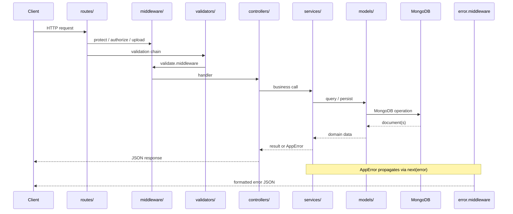

# Backend Folder Structure

This document describes the **actual** folder layout of `back-end/` in the MERN Sports E-commerce Platform. Every folder listed below exists in the repository today. Responsibilities, examples, and lifecycle notes are derived from the current implementation — not from hypothetical patterns.

---

## Folder Hierarchy

```
back-end/
├── app.js                          # Express app: middleware, route mounting, error handling
├── server.js                       # Process entry: env, DB, email verify, listen
├── package.json
│
├── config/                         # Application configuration (not in layered request flow)
│   └── db.js
│
├── routes/                         # HTTP routing & middleware chains
│   ├── auth.routes.js
│   ├── user.routes.js
│   ├── category.routes.js
│   ├── product.routes.js
│   ├── inventory.routes.js
│   ├── cart.routes.js
│   └── wishlist.routes.js
│
├── controllers/                    # Thin HTTP adapters
│   ├── auth.controller.js
│   ├── user.controller.js
│   ├── category.controller.js
│   ├── product.controller.js
│   ├── inventory.controller.js
│   ├── cart.controller.js
│   └── wishlist.controller.js
│
├── services/                       # Business logic & orchestration
│   ├── auth.service.js
│   ├── user.service.js
│   ├── email.service.js
│   ├── category.service.js
│   ├── product.service.js
│   ├── inventory.service.js
│   ├── cart.service.js
│   └── wishlist.service.js
│
├── models/                         # Mongoose schemas & persistence
│   ├── user.model.js
│   ├── category.model.js
│   ├── product.model.js
│   ├── inventory-history.model.js
│   ├── cart.model.js
│   └── wishlist.model.js
│
├── validators/                     # express-validator rule chains
│   ├── auth.validator.js
│   ├── category.validator.js
│   ├── product.validator.js
│   ├── inventory.validator.js
│   └── cart.validator.js
│
├── middleware/                     # Cross-cutting Express middleware
│   ├── auth.middleware.js
│   ├── validate.middleware.js
│   ├── error.middleware.js
│   └── upload.middlware.js
│
├── utils/                          # Stateless reusable helpers
│   ├── app-error.util.js
│   ├── api-query.util.js
│   ├── jwt.util.js
│   ├── password.util.js
│   ├── token.util.js
│   └── file.util.js
│
├── constants/                      # Domain enums & shared literals
│   ├── user.constants.js
│   ├── category.constants.js
│   ├── product.constants.js
│   ├── inventory.constants.js
│   └── upload.constants.js
│
├── providers/                      # External system adapters
│   ├── email.provider.js
│   └── storage/
│       └── localStorage.provider.js
│
└── templates/                      # HTML email templates
    ├── verification-email.html
    └── reset-password-email.html
```

Runtime directories (not source code, created at runtime):

```
back-end/uploads/products/          # Local product image storage (via Multer)
```

---

## Request Lifecycle Overview

Every API request flows through a predictable pipeline. Folders participate at specific stages; none should skip layers.



### Example: Add Item to Cart

`POST /api/v1/cart/items` with cookie `accessToken` and body `{ productId, quantity }`

| Step | Folder | File | Action |
|------|--------|------|--------|
| 1 | `routes/` | `cart.routes.js` | Matches `POST /items`, runs `protect` → `addCartItemValidation` → `validate` → `addItemToCart` |
| 2 | `middleware/` | `auth.middleware.js` | Reads JWT from cookie, loads user onto `req.user` |
| 3 | `validators/` | `cart.validator.js` | Validates `productId` (MongoId) and `quantity` (int ≥ 1) |
| 4 | `middleware/` | `validate.middleware.js` | Aggregates validation errors into `AppError(400)` if any |
| 5 | `controllers/` | `cart.controller.js` | Calls `cartService.addItemToCart(req.user.id, ...)` |
| 6 | `services/` | `cart.service.js` | Validates product, reserves stock via `inventory.service`, updates cart |
| 7 | `services/` | `inventory.service.js` | Adjusts `reservedQuantity` on product |
| 8 | `models/` | `product.model.js`, `cart.model.js` | Mongoose read/write |
| 9 | `controllers/` | `cart.controller.js` | Returns `{ success: true, message, data: cart }` |
| 10 | `middleware/` | `error.middleware.js` | Catches any thrown `AppError` and formats response |

Folders **not** in this path for this request: `constants/` (used indirectly via services), `providers/`, `templates/`, `utils/` (except `AppError` if thrown).

---

## Naming Conventions

| Artifact | Pattern | Example |
|----------|---------|---------|
| Route file | `{domain}.routes.js` | `product.routes.js` |
| Controller file | `{domain}.controller.js` | `product.controller.js` |
| Service file | `{domain}.service.js` | `product.service.js` |
| Model file | `{entity}.model.js` | `inventory-history.model.js` |
| Validator file | `{domain}.validator.js` | `auth.validator.js` |
| Middleware file | `{purpose}.middleware.js` | `auth.middleware.js` |
| Util file | `{purpose}.util.js` | `api-query.util.js` |
| Constants file | `{domain}.constants.js` | `user.constants.js` |
| Provider file | `{system}.provider.js` | `email.provider.js` |
| Export names | camelCase functions; SCREAMING_SNAKE for constants | `createProduct`, `USER_ROLES` |
| API mount path | `/api/v1/{plural-resource}` | `/api/v1/products` |

**Rules observed in the codebase:**

- One primary domain per file (e.g., all auth validators live in `auth.validator.js`, including profile/password validators used by user routes).
- Controller handler names mirror service actions: `addItemToCart` in both `cart.controller.js` and `cart.service.js`.
- Models use singular PascalCase model names (`User`, `Product`, `InventoryHistory`).
- Middleware exports describe behavior (`protect`, `authorize`, `validate`), not domains.

---

## File Organization Rules

1. **Vertical slicing by domain** — Each feature (cart, product, auth) gets matching files across `routes/`, `controllers/`, `services/`, and usually `models/` + `validators/`.
2. **No business logic in routes** — Routes only wire middleware and handlers; see `cart.routes.js`.
3. **No database access in controllers** — Controllers never `require` models directly; they delegate to services.
4. **Shared cross-domain logic goes in `utils/` or `constants/`** — Not duplicated inside services.
5. **External I/O goes in `providers/`** — SMTP and filesystem paths are isolated from business rules.
6. **Presentation assets for email go in `templates/`** — HTML only; rendering logic stays in `services/email.service.js`.
7. **App bootstrap stays at root** — `app.js` composes the app; `server.js` starts the process. Neither contains domain logic.

---

# Folder Reference

---

## `routes/`

### Purpose

Defines HTTP endpoints, attaches middleware chains, and maps URLs to controller handlers. Routes are the **entry point** for every API request.

### What Belongs Here

- `express.Router()` definitions
- HTTP method + path declarations
- Middleware ordering: `protect` → `authorize` → validators → `validate` → controller
- Multer/upload middleware for multipart routes
- Imports from `controllers/`, `validators/`, `middleware/`, `constants/`

### What Should NOT Belong Here

- Business logic (stock checks, uniqueness validation)
- Direct Mongoose queries
- Response formatting beyond delegating to controllers
- Environment variable reads (except what middleware already encapsulates)

### Examples from Current Implementation

```javascript
// routes/cart.routes.js
router.post('/items', protect, addCartItemValidation, validate, addItemToCart);
router.get('/', protect, getMyCart);
```

```javascript
// routes/product.routes.js — admin-gated create with validation
router.post(
  '/',
  protect,
  authorize(USER_ROLES.ADMIN),
  createProductValidation,
  validate,
  createProduct,
);
```

Route mounting in `app.js`:

```javascript
app.use('/api/v1/cart', cartRoutes);
app.use('/api/v1/products', productRoutes);
```

### Best Practices

- Keep routes readable as a table of contents for the API.
- Apply the most restrictive middleware first (`protect` before `authorize`).
- Group related endpoints in one router file per domain.
- Use route ordering carefully — static paths before parameterized paths (e.g., `GET /:slug/products` before `GET /:identifier` in `category.routes.js`).

### Common Mistakes to Avoid

- Putting `async` business logic inline in route callbacks.
- Inconsistent parameter names (`:id` vs `:Id`) — present in `product.routes.js` for image routes.
- Literal path segments where parameters are intended (`/Id/images/reorder` instead of `/:id/images/reorder`).
- Forgetting to export the router with `module.exports = router`.

### Request Lifecycle Role

**First layer.** Parses the URL, runs global and route-level middleware, and dispatches to exactly one controller function.

---

## `controllers/`

### Purpose

Thin HTTP adapters between Express (`req`, `res`, `next`) and the service layer. Controllers translate HTTP inputs into service arguments and service results into JSON responses.

### What Belongs Here

- `try/catch` wrappers that call `next(error)`
- Extracting data from `req.body`, `req.params`, `req.query`, `req.user`, `req.files`
- Setting HTTP status codes and response envelopes (`success`, `message`, `data`)
- Setting/clearing cookies (auth-specific)

### What Should NOT Belong Here

- Database queries or Mongoose model imports
- Business rules (e.g., "SKU must be unique", "reserve stock before save")
- Validation logic (belongs in `validators/`)
- Reusable algorithms (belong in `utils/` or `services/`)

### Examples from Current Implementation

```javascript
// controllers/cart.controller.js
const addItemToCart = async (req, res, next) => {
  try {
    const cart = await cartService.addItemToCart(
      req.user.id,
      req.body.productId,
      Number(req.body.quantity),
    );
    res.status(200).json({
      success: true,
      message: 'Item added to cart successfully',
      data: cart,
    });
  } catch (error) {
    next(error);
  }
};
```

```javascript
// controllers/auth.controller.js — cookie side effect on login
res.cookie('accessToken', token, {
  httpOnly: true,
  secure: process.env.NODE_ENV === 'production',
  sameSite: 'strict',
  maxAge: 24 * 60 * 60 * 1000,
});
```

### Best Practices

- One exported function per route handler.
- Always forward errors with `next(error)` — never swallow service exceptions.
- Keep functions under ~20 lines; if longer, logic belongs in services.
- Use consistent response shape across all controllers.

### Common Mistakes to Avoid

- `console.log(req.user)` left in production handlers (`user.controller.js`).
- Duplicating validation that already exists in `validators/`.
- Calling multiple services with branching business logic — compose that in a service instead.
- Returning different response shapes for the same type of operation.

### Request Lifecycle Role

**HTTP boundary.** Runs after middleware succeeds; invokes exactly one service method per request in the common case.

---

## `services/`

### Purpose

The **core business layer**. Services enforce domain rules, orchestrate models, call other services, throw `AppError` for expected failures, and return domain data.

### What Belongs Here

- Uniqueness checks, authorization preconditions at domain level
- Multi-step workflows (cart + inventory reservation)
- Whitelisting updatable fields
- Cross-model orchestration
- Calls to `providers/` for email or storage
- Throwing `AppError` with appropriate status codes

### What Should NOT Belong Here

- `req` / `res` / `next` references
- HTTP status code selection for success responses (controller responsibility)
- Express-specific concepts (cookies, headers)
- Raw SMTP or filesystem code (use `providers/`)

### Examples from Current Implementation

```javascript
// services/cart.service.js — orchestrates inventory + cart
await inventoryService.reserveStock(productId, quantity);
cart.items.push({ product: product._id, quantity, priceSnapshot: product.price });
await cart.save();
```

```javascript
// services/auth.service.js — domain error
if (existingUser) {
  throw new AppError('Email already exists', 409);
}
```

```javascript
// services/product.service.js — reusable query building
const queryBuilder = new ApiQuery(queryParams)
  .filter(['brand', 'status', 'featured', 'category'])
  .search(['name', 'brand']);
```

```javascript
// services/email.service.js — template rendering + provider dispatch
const html = renderTemplate(template, { firstName, verificationUrl });
await emailProvider.send({ to: email, subject, html });
```

### Best Practices

- Accept primitive arguments or IDs, not entire `req` objects.
- Export named functions; one service file per domain.
- Use `constants/` for enums — avoid magic strings where constants exist.
- Services may call other services (`cart` → `inventory`) but avoid circular dependencies.

### Common Mistakes to Avoid

- Non-atomic multi-document updates without transactions (cart reserve + save in `cart.service.js`).
- Leaking Mongoose documents with internal fields when a DTO would suffice.
- Mixing read and write concerns in one giant function.
- Importing controllers or routes from services (inverts the dependency graph).

### Request Lifecycle Role

**Business execution.** Called by controllers; reads/writes via `models/`; may call `providers/`, `utils/`, and other `services/`.

---

## `models/`

### Purpose

Mongoose schema definitions, indexes, hooks, virtuals, and instance methods. Models are the **persistence and schema contract** for MongoDB collections.

### What Belongs Here

- Schema field definitions, types, defaults, enums
- Indexes (`product.model.js` indexes `slug`, `category`, `status`, `featured`)
- `pre`/`post` hooks (password hashing in `user.model.js`, slug generation in `product.model.js`)
- Virtual fields (`availableStock`, `subtotal`, `fullName`)
- Instance methods (`comparePassword`, `generateEmailVerificationToken`)
- `module.exports = mongoose.model(...)`

### What Should NOT Belong Here

- HTTP or Express logic
- Multi-collection workflows (belongs in `services/`)
- External API calls
- Request validation rules (belongs in `validators/`)

### Examples from Current Implementation

```javascript
// models/user.model.js — hook + instance method
userSchema.pre('save', async function () {
  if (!this.isModified('password')) return;
  this.password = await hashPassword(this.password);
});

userSchema.methods.comparePassword = async function (candidatePassword) {
  return await comparePassword(candidatePassword, this.password);
};
```

```javascript
// models/product.model.js — virtuals for inventory state
productSchema.virtual('availableStock').get(function () {
  return this.stockQuantity - this.reservedQuantity;
});
```

```javascript
// models/cart.model.js — embedded subdocument schema
const cartItemSchema = new mongoose.Schema({
  product: { type: ObjectId, ref: 'Product', required: true },
  quantity: { type: Number, required: true, min: 1 },
  priceSnapshot: { type: Number, required: true },
}, { _id: false });
```

### Best Practices

- Import enums from `constants/` for `enum:` arrays.
- Use `select: false` for sensitive fields (`password`).
- Define indexes for fields used in filters and lookups.
- Keep embedded schemas co-located when they are not standalone entities.

### Common Mistakes to Avoid

- Putting business workflows in `pre('save')` hooks that call other collections.
- Duplicating validation that conflicts with `validators/` (e.g., password minlength 6 in schema vs 8 in validator).
- Over-using `ref` populate in models instead of letting services control population.
- Creating a model per HTTP endpoint instead of per aggregate root.

### Request Lifecycle Role

**Data layer.** Only accessed from `services/` (and occasionally from `middleware/auth.middleware.js` for user lookup). Never from `routes/` or `controllers/` directly in this codebase's intended pattern.

---

## `validators/`

### Purpose

Request **input validation** using `express-validator`. Validators define rule chains that run before controllers, rejecting malformed input early.

### What Belongs Here

- `body()`, `param()`, `query()` validation chains
- Format checks: email, MongoId, URL, array, int ranges
- `express-validator` custom validators (e.g., password confirmation match)
- Exported arrays of middleware (e.g., `registerValidation`)

### What Should NOT Belong Here

- Database existence checks ("does this product exist?") — belongs in `services/`
- Authorization logic — belongs in `middleware/auth.middleware.js`
- Business rules dependent on current DB state
- Response formatting

### Examples from Current Implementation

```javascript
// validators/cart.validator.js
const addCartItemValidation = [
  body('productId').isMongoId().withMessage('Valid product ID is required'),
  body('quantity').isInt({ min: 1 }).withMessage('Quantity must be at least 1'),
];
```

```javascript
// validators/inventory.validator.js — uses constants for allowed values
body('reason')
  .isIn(Object.values(INVENTORY_REASONS))
  .withMessage('Invalid inventory reason'),
```

```javascript
// validators/auth.validator.js — shared across auth and user routes
const changePasswordValidation = [ /* ... */ ];
module.exports = { /* ..., */ changePasswordValidation };
```

### Best Practices

- One validator file per domain, mirroring `routes/`.
- Import allowed enum values from `constants/`.
- Pair every validator array with `validate` middleware in routes.
- Use `.optional()` for PATCH/update payloads.

### Common Mistakes to Avoid

- Skipping validators for URL params (wishlist routes have no `productId` validator).
- Duplicating the same chains across multiple files — share via one validator module (as auth/user do).
- Validating business state ("stock must be sufficient") — that requires DB access in services.
- Forgetting `validate` middleware after the validation chain.

### Request Lifecycle Role

**Input gate.** Runs in `routes/` after auth middleware, before controller. Failures short-circuit to `error.middleware.js` via `validate.middleware.js`.

---

## `middleware/`

### Purpose

Express middleware functions that run **across requests** or at defined points in the chain. Handles authentication, validation aggregation, file uploads, and global error formatting.

### What Belongs Here

- Authentication (`protect`, `authorize`)
- Validation result aggregation (`validate`)
- Global error handler (`errorHandler`)
- Upload configuration (Multer)
- Future: rate limiting, request logging, request ID injection

### What Should NOT Belong Here

- Domain-specific business rules
- Per-entity CRUD logic
- Mongoose schemas
- Full request handlers that should be controllers

### Examples from Current Implementation

```javascript
// middleware/auth.middleware.js
const protect = async (req, res, next) => {
  const token = req.cookies.accessToken;
  const decoded = verifyAccessToken(token);
  req.user = await User.findById(decoded.userId);
  next();
};

const authorize = (...allowedRoles) => (req, res, next) => {
  if (!allowedRoles.includes(req.user.role)) {
    return next(new AppError('Forbidden', 403));
  }
  next();
};
```

```javascript
// middleware/validate.middleware.js
const errors = validationResult(req);
if (!errors.isEmpty()) {
  return next(new AppError('Validation failed', 400, formattedErrors));
}
```

```javascript
// middleware/error.middleware.js — terminal error formatter
if (err instanceof AppError) {
  return res.status(err.statusCode).json({ success: false, status: 'error', message: err.message, errors: err.errors || [] });
}
```

```javascript
// middleware/upload.middlware.js — Multer disk storage for product images
const upload = multer({ storage, fileFilter, limits: { fileSize: MAX_IMAGE_SIZE } });
```

### Best Practices

- Keep middleware focused on one concern per file.
- Register global middleware in `app.js` in correct order (body parsers before routes; error handler last).
- Use `next(error)` for failures — never send duplicate responses.
- Reusable middleware should not assume a specific route.

### Common Mistakes to Avoid

- Registering `errorHandler` before routes (would never catch route errors).
- Fat middleware that grows into a second service layer.
- Sending responses and also calling `next()` (double response bug).
- Filename typos that hurt discoverability (`upload.middlware.js`).

### Request Lifecycle Role

**Cross-cutting pipeline.** Runs before controllers (auth, validate, upload) or after all routes (error handler). Wraps the entire request lifecycle.

---

## `utils/`

### Purpose

Stateless, reusable helper functions and classes with **no domain ownership**. Utils are shared infrastructure used by services, models, and middleware.

### What Belongs Here

- Error class (`AppError`)
- JWT sign/verify
- Password hash/compare
- Token generation (crypto)
- Query builder (`ApiQuery`)
- File deletion helpers
- Pure functions with no side-effectful domain meaning

### What Should NOT Belong Here

- Business workflows (cart checkout logic)
- Express `req`/`res` handlers
- Mongoose models
- Configuration that varies by environment (belongs in `config/` or env)

### Examples from Current Implementation

```javascript
// utils/app-error.util.js
class AppError extends Error {
  constructor(message, statusCode, errors = null) {
    super(message);
    this.statusCode = statusCode;
    this.errors = errors;
    this.isOperational = true;
  }
}
```

```javascript
// utils/api-query.util.js — used by product and category services
class ApiQuery {
  search(fields) { /* builds $or regex filters */ }
  filter(allowedFilters) { /* whitelists query params */ }
  getPagination() { /* page, limit, skip */ }
  getSort() { /* defaults to -createdAt */ }
}
```

```javascript
// utils/jwt.util.js
const generateAccessToken = (payload) => jwt.sign(payload, process.env.JWT_SECRET, { expiresIn: process.env.JWT_EXPIRES_IN || '1h' });
```

### Best Practices

- Pure functions where possible; explicit inputs and outputs.
- No imports from `services/` or `controllers/` (utils sit low in the dependency graph).
- Suffix files with `.util.js` for clarity.
- Throw `AppError` from utils only when the util is explicitly auth-related (`jwt.util.js`).

### Common Mistakes to Avoid

- Turning `utils/` into a dumping ground for one-off service logic.
- Creating `utils/product.util.js` that knows about Product business rules — that is a service concern.
- Circular imports between utils and services.
- Storing stateful singletons without clear lifecycle (acceptable for providers, not utils).

### Request Lifecycle Role

**Shared helpers.** Invoked from services, models, and middleware at any point; never mounted directly on routes.

---

## `constants/`

### Purpose

Single source of truth for **domain enumerations and magic values** used across models, validators, services, and routes.

### What Belongs Here

- Role and status enums (`USER_ROLES`, `PRODUCT_STATUS`)
- Inventory reason codes (`INVENTORY_REASONS`)
- Upload limits and MIME allowlists (`MAX_PRODUCT_IMAGES`, `ALLOWED_IMAGE_TYPES`)
- Frozen objects exported via `module.exports`

### What Should NOT Belong Here

- Functions or classes
- Environment-specific values (use `process.env`)
- Values used by only one private function with no cross-file need
- API response messages

### Examples from Current Implementation

```javascript
// constants/user.constants.js
const USER_ROLES = { CUSTOMER: 'customer', ADMIN: 'admin' };
const USER_STATUS = { ACTIVE: 'active', INACTIVE: 'inactive', SUSPENDED: 'suspended' };
```

```javascript
// constants/inventory.constants.js
const INVENTORY_REASONS = {
  RESTOCK: 'restock',
  MANUAL_ADJUSTMENT: 'manual_adjustment',
  DAMAGED: 'damaged',
  RETURNED: 'returned',
};
```

```javascript
// constants/upload.constants.js
const ALLOWED_IMAGE_TYPES = ['image/jpeg', 'image/png', 'image/webp'];
const MAX_IMAGE_SIZE = 5 * 1024 * 1024;
const MAX_PRODUCT_IMAGES = 10;
```

Usage in routes:

```javascript
// routes/product.routes.js
authorize(USER_ROLES.ADMIN)
```

### Best Practices

- `Object.freeze()` optional but recommended for enum objects.
- Name constants in `SCREAMING_SNAKE_CASE`.
- Group by domain file, matching models and validators.
- Reference constants in Mongoose `enum:` arrays and `express-validator` `.isIn()`.

### Common Mistakes to Avoid

- Hardcoding `'active'` in services when `PRODUCT_STATUS.ACTIVE` exists.
- Putting constants in `utils/` (blurs pure helpers vs domain vocabulary).
- Splitting the same enum across multiple files.
- Adding constants for values that are not yet used anywhere (speculative enums).

### Request Lifecycle Role

**Compile-time vocabulary.** Imported wherever domain values are compared or validated; no runtime request handling.

---

## `providers/`

### Purpose

**Adapters to external systems** — email (SMTP), filesystem storage, and future cloud services. Providers hide third-party SDK details from services.

### What Belongs Here

- Nodemailer transporter setup (`email.provider.js`)
- Storage path resolution (`storage/localStorage.provider.js`)
- Connection verification on startup
- Thin `send()` / `getPath()` style APIs

### What Should NOT Belong Here

- HTML template rendering (belongs in `services/email.service.js`)
- Business decisions about *when* to send email
- Mongoose models
- HTTP handlers

### Examples from Current Implementation

```javascript
// providers/email.provider.js
const transporter = nodemailer.createTransport({
  host: process.env.EMAIL_HOST,
  port: Number(process.env.EMAIL_PORT),
  auth: { user: process.env.EMAIL_USER, pass: process.env.EMAIL_PASSWORD },
});

const send = async ({ to, subject, html }) => {
  await transporter.sendMail({ from: process.env.EMAIL_FROM, to, subject, html });
};
```

```javascript
// providers/storage/localStorage.provider.js
const productUploadPath = path.join(process.cwd(), 'uploads', 'products');
const getProductStoragePath = () => productUploadPath;
```

Consumed by:

- `services/email.service.js` → `email.provider.js`
- `middleware/upload.middlware.js` → `localStorage.provider.js`

### Best Practices

- One provider per external system.
- Subfolder for related providers (`storage/` for local, future S3/Cloudinary).
- Export minimal surface area.
- Verify connections at startup (`emailProvider.verifyConnection()` in `server.js`).

### Common Mistakes to Avoid

- Calling providers directly from controllers.
- Embedding business-specific email copy in providers.
- Hardcoding credentials (always use `process.env`).
- Mixing provider and service in one file.

### Request Lifecycle Role

**Infrastructure I/O.** Invoked from services (email) or middleware (upload destination). Not part of the default read/write JSON API path unless the operation triggers external I/O.

---

## `templates/`

### Purpose

Static **HTML assets** for outbound emails. Templates contain placeholders; rendering logic lives in services.

### What Belongs Here

- HTML email files with `{{variable}}` placeholders
- `verification-email.html`, `reset-password-email.html`

### What Should NOT Belong Here

- JavaScript or rendering logic
- CSS/JS for the React frontend
- API response HTML pages
- Product image templates

### Examples from Current Implementation

```html
<!-- templates/verification-email.html — placeholders replaced at runtime -->
<a href="{{verificationUrl}}">Verify Email</a>
```

```javascript
// services/email.service.js — loads and renders templates
const template = loadTemplate('verification-email.html');
const html = renderTemplate(template, { firstName, verificationUrl });
await emailProvider.send({ to: email, subject: EMAIL_SUBJECTS.VERIFY_EMAIL, html });
```

### Best Practices

- Use consistent placeholder syntax (`{{key}}`).
- Keep templates inline-CSS friendly for email clients.
- Store subjects in the service (`EMAIL_SUBJECTS`), not in HTML files.
- Version templates alongside email-sending service changes.

### Common Mistakes to Avoid

- `fs.readFileSync` in controllers instead of centralized `email.service.js`.
- User-controlled strings injected without sanitization (XSS in email clients).
- Putting templates inside `providers/` (separates content from transport).
- Using the same folder for PDF invoices or other document types without subfolders.

### Request Lifecycle Role

**Async side effect.** Used when auth flows trigger email send (register, forgot password). Not in the critical path of synchronous JSON API responses except as awaited I/O in services.

---

## Supporting Folder: `config/`

Not listed in the primary scope but present in the repo.

| File | Purpose |
|------|---------|
| `config/db.js` | MongoDB connection via `mongoose.connect(process.env.MONGO_URI)` |

**Belongs:** environment-backed connection setup, future app-level config.  
**Does not belong:** business logic, models, routes.

Called once at startup from `server.js`, outside the per-request lifecycle.

---

# Scalability Considerations

## Horizontal Scaling

| Area | Current State | Growth Path |
|------|---------------|-------------|
| **Stateless API** | JWT in cookies; no in-memory sessions | Multiple Node instances behind a load balancer work today |
| **File uploads** | Local `uploads/products/` | Move to `providers/storage/cloudinary.provider.js` (or S3); routes and services unchanged |
| **Email** | Nodemailer SMTP | Swap `email.provider.js` for SendGrid/SES adapter |
| **Database** | Single MongoDB connection | Replica set, read preferences in services for read-heavy catalog endpoints |

## Vertical Domain Growth

Adding a new module (e.g., **Orders**) follows the established slice:

```
routes/order.routes.js
controllers/order.controller.js
services/order.service.js
models/order.model.js
validators/order.validator.js
constants/order.constants.js   # if new enums needed
```

Mount in `app.js`:

```javascript
app.use('/api/v1/orders', orderRoutes);
```

No existing folders need restructuring — only additive files.

## Team Scalability

- Developers can own **domains** (product team, auth team) with minimal merge conflicts because files are split by feature, not by technical layer only.
- Code review checklist maps 1:1 to folders: "Is this in the right layer?"

## Performance

- `ApiQuery` centralizes pagination — prevents unbounded `find()` calls as catalog grows.
- Product indexes already support filter/sort paths; new modules should follow the same index discipline in `models/`.
- Cart/inventory coupling will need **MongoDB transactions** before high-concurrency checkout — service layer is the right place to add them without touching routes or controllers.

---

# Why This Structure Supports Maintainability and Future Growth

## 1. Unidirectional Dependency Graph

```
routes → controllers → services → models
                ↓           ↓
           middleware    providers
           validators    utils
                         constants
                ↓
            templates (via services)
```

Dependencies flow **inward and downward**. `models/` never import `services/`; `utils/` never import `controllers/`. This prevents spaghetti coupling as the codebase grows.

## 2. Thin Boundaries, Fat Domain

Controllers in this project average ~10–15 lines per handler. When requirements change — e.g., "cart must validate max quantity per product" — engineers change **one service file**, not every route and controller touching carts.

## 3. Swappable Infrastructure

`providers/` already isolates SMTP and disk paths. Migrating images to Cloudinary or email to SendGrid is a **provider swap**, not a rewrite of `product.service.js` or `auth.service.js`.

## 4. Predictable Onboarding

A new developer locating "where is cart quantity validated?" follows a fixed path:

1. `routes/cart.routes.js` → find middleware chain
2. `validators/cart.validator.js` → input rules
3. `controllers/cart.controller.js` → handler name
4. `services/cart.service.js` → business logic
5. `models/cart.model.js` → schema

No guessing whether logic lives in a "helper", "manager", or "handler".

## 5. Testability Posture

Services accept plain arguments and throw `AppError` — they can be unit-tested without spinning up Express. Validators can be tested with `express-validator` test utilities. This structure is ready for a `tests/` folder mirroring `services/` and `validators/` when tests are added.

## 6. API Versioning Ready

All routes mount under `/api/v1/`. A future `routes/v2/` or versioned subfolders can coexist without breaking v1 controllers/services immediately — services often remain version-agnostic while response shapes evolve in controllers.

## 7. Consistent Cross-Cutting Concerns

Authentication (`middleware/auth.middleware.js`), validation (`validators/` + `validate.middleware.js`), and errors (`AppError` + `error.middleware.js`) are **centralized**. New routes automatically inherit the same security and error contracts by composing existing middleware.

---

# Quick Reference: Where Does This Code Go?

| I need to… | Folder |
|------------|--------|
| Add a new endpoint | `routes/` + `controllers/` |
| Enforce a business rule | `services/` |
| Change database shape | `models/` |
| Validate request body format | `validators/` |
| Check if user is logged in | `middleware/` |
| Share a pure helper | `utils/` |
| Add a new status enum | `constants/` |
| Integrate a third-party API | `providers/` |
| Change password reset email HTML | `templates/` |
| Connect to MongoDB on startup | `config/` |
| Mount routes or global middleware | `app.js` |
| Start the server process | `server.js` |

---

# Summary

The `back-end/` folder structure implements a **layered, domain-sliced architecture** with clear boundaries: routes wire requests, controllers adapt HTTP, services own business logic, models own data, and supporting folders (`validators/`, `middleware/`, `utils/`, `constants/`, `providers/`, `templates/`) handle cross-cutting and infrastructure concerns without polluting the core layers.

This layout is not accidental — it matches how the application already handles eight domains (auth, users, categories, products, inventory, cart, wishlist, email) and provides a repeatable template for every module that follows.
