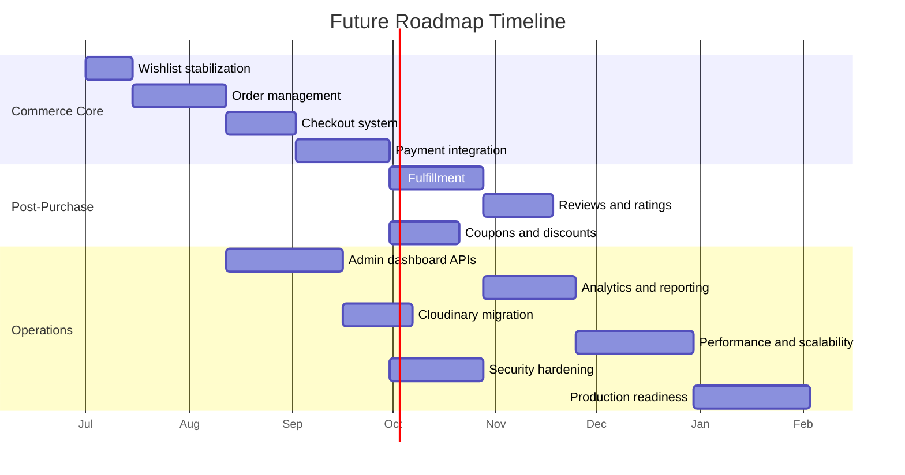
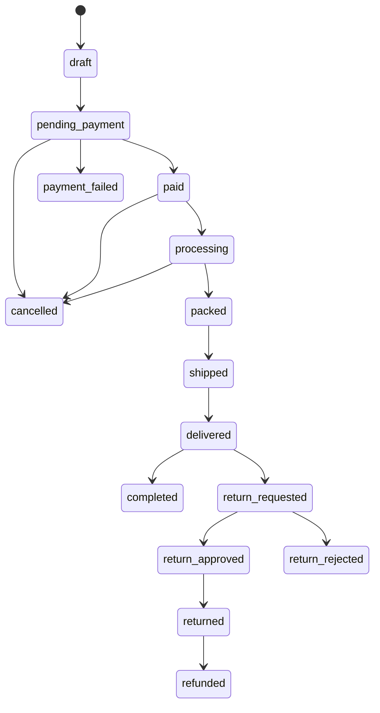
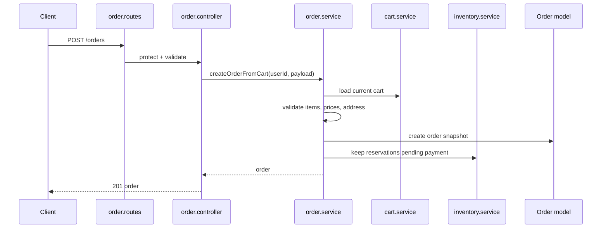
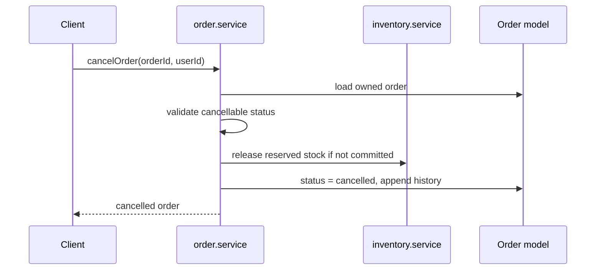
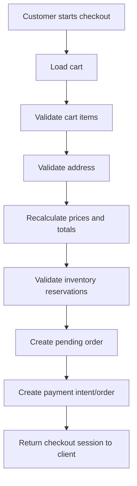
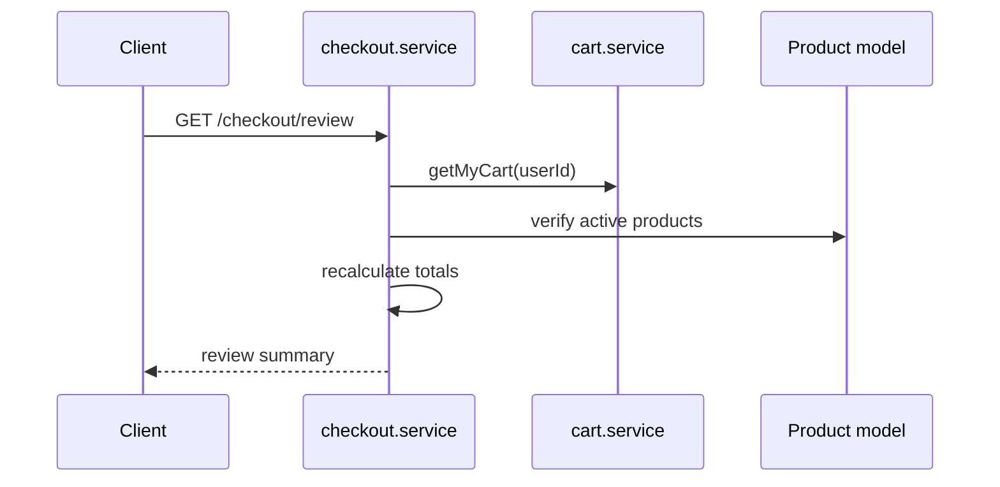
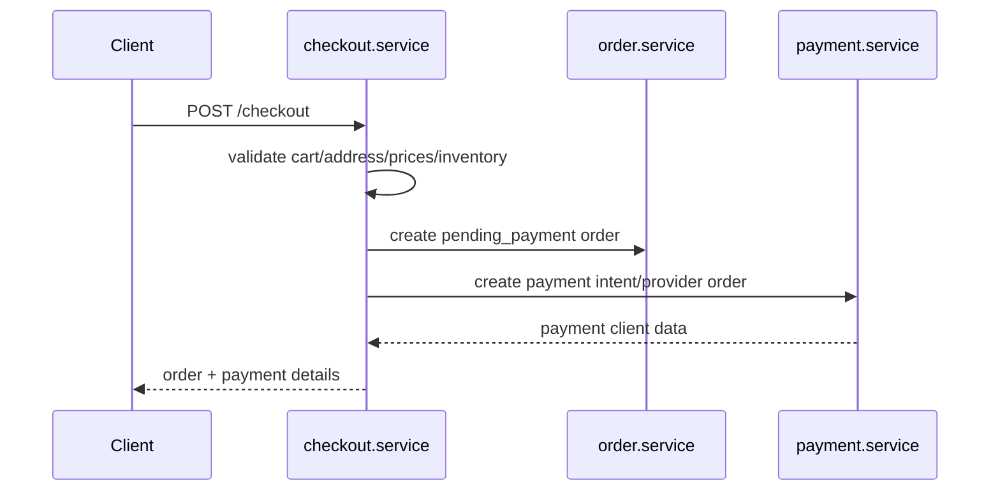
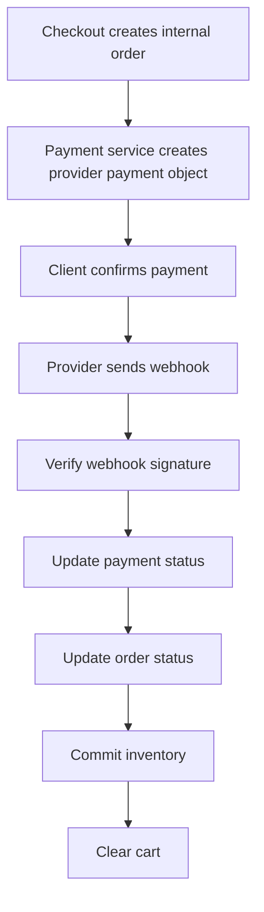
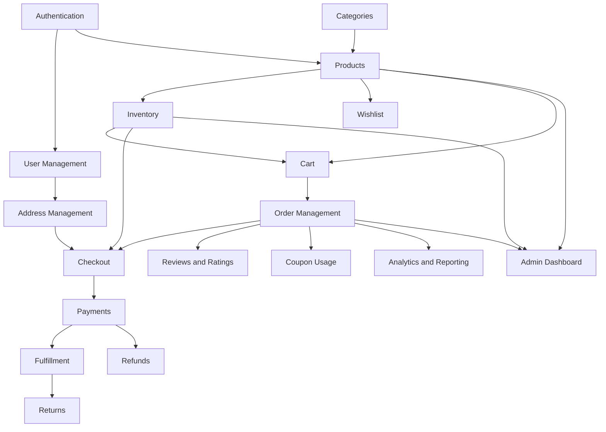

# Future Roadmap Overview

The current MERN Sports E-commerce Platform has a strong backend foundation and a consistent layered architecture:

```text
Route -> Controller -> Service -> Model
```

Authentication, user profiles, categories, products, product image management, inventory, cart, and a partial wishlist module already exist. The backend is meaningfully beyond prototype stage, but it is not production-ready yet because the commerce-critical path is incomplete: orders, checkout, payments, fulfillment, returns, analytics, operational monitoring, automated tests, and production infrastructure are still missing.

The next major milestone is to turn the existing catalog and cart system into a reliable purchase system. The most important architectural shift is moving from isolated CRUD-style modules to transactional workflows that coordinate cart, inventory, order, payment, and fulfillment state. The current service layer is the right place for that orchestration, but order creation and inventory commitment should use MongoDB transactions before real payment traffic is accepted.

The long-term vision is a production-grade sports retail platform where customers can browse products, save products, checkout securely, track orders, request returns, and leave verified reviews, while admins manage catalog, inventory, orders, promotions, reporting, and operational risk through secure APIs and dashboard workflows.

## Current Project Maturity

| Area | Current Maturity | Notes |
|------|------------------|-------|
| Backend architecture | Strong | Route, controller, service, model separation is consistently used. |
| Domain coverage | Medium | Catalog, inventory, cart, and wishlist exist; purchase flow is missing. |
| Frontend | Early | React/Vite scaffold exists, but no real e-commerce UI integration yet. |
| Data consistency | Early-medium | Inventory reservations exist, but cart/inventory writes are not transactional. |
| Security | Baseline | HTTP-only JWT cookie, Helmet, CORS, bcrypt; missing refresh tokens, rate limits, audit logs. |
| Operations | Early | Health endpoint exists; missing structured logs, monitoring, CI/CD, backups. |
| Testing | Not ready | `npm test` is currently a placeholder. |

## Next Major Milestones

1. Complete and harden Wishlist as a customer engagement module.
2. Build Order Management on top of the existing Cart and Inventory services.
3. Add Checkout as an orchestration layer that validates cart, address, price, and inventory before order creation.
4. Integrate Payments with idempotent payment intent/order state transitions and webhook processing.
5. Add Fulfillment, Returns, Reviews, Coupons, Admin Dashboard APIs, Analytics, and production infrastructure.

## Roadmap Timeline

| Timeline | Milestone | Outcome |
|----------|-----------|---------|
| Short term | Phase 6-8 | Wishlist completion, order foundation, checkout workflow. |
| Short term | Phase 9 | Payment provider integration and webhook architecture. |
| Mid term | Phase 10-13 | Fulfillment, reviews, coupons, admin dashboard. |
| Mid term | Phase 14-15 | Analytics/reporting and Cloudinary migration. |
| Long term | Phase 16-18 | Scalability, security hardening, production readiness. |



---

# Phase 6 - Wishlist Module

## Purpose

Wishlist lets authenticated customers save products for later without reserving inventory. A partial backend module already exists with `routes/wishlist.routes.js`, `controllers/wishlist.controller.js`, `services/wishlist.service.js`, and `models/wishlist.model.js`. This phase should stabilize that module rather than introduce a new architectural pattern.

## Why This Phase Exists

Wishlist is a lightweight customer retention feature that can be completed before the heavier order and payment work. It also creates useful customer intent data for future analytics, recommendations, and email campaigns.

## Business Value

| Value | Explanation |
|-------|-------------|
| Conversion support | Customers can return to products they considered earlier. |
| Personalization | Saved products can inform recommendations and campaigns. |
| Low operational risk | Wishlist does not affect stock, payment, or fulfillment. |
| Frontend readiness | Supports account pages and product detail interactions. |

## Core Features

- Get my wishlist.
- Add product to wishlist.
- Remove product from wishlist.
- Prevent duplicate wishlist entries.
- Validate `productId` route params.
- Show active, non-deleted products only.
- Optional: move item from wishlist to cart.
- Optional: clear wishlist.

## Suggested Architecture

Follow the existing vertical slice:

```text
wishlist.routes.js
  -> wishlist.controller.js
  -> wishlist.service.js
  -> wishlist.model.js
```

Recommended supporting additions:

| Layer | Recommendation |
|-------|----------------|
| Validators | Add wishlist validator for `productId` MongoDB ObjectId. |
| Service | Keep product activity checks in service, matching current implementation. |
| Model | Keep one wishlist document per user with embedded product references. |
| Constants | Add wishlist messages or limits only if they become reused. |

## Endpoints

| Method | Endpoint | Auth | Purpose |
|--------|----------|------|---------|
| GET | `/api/v1/wishlist` | Customer | Get current user's wishlist. |
| POST | `/api/v1/wishlist/:productId` | Customer | Save product. |
| DELETE | `/api/v1/wishlist/:productId` | Customer | Remove saved product. |
| DELETE | `/api/v1/wishlist` | Customer | Future clear wishlist. |
| POST | `/api/v1/wishlist/:productId/move-to-cart` | Customer | Future move saved item to cart. |

## Database Design

Current design is appropriate for MVP:

| Field | Type | Notes |
|-------|------|-------|
| `user` | ObjectId ref `User` | Required, unique. |
| `products` | ObjectId[] ref `Product` | Saved product references. |
| `createdAt` | Date | Mongoose timestamp. |
| `updatedAt` | Date | Mongoose timestamp. |

Recommended indexes:

| Index | Purpose |
|-------|---------|
| `{ user: 1 }` unique | Fast lookup by current user. |
| `{ products: 1 }` | Optional, useful for product popularity analytics later. |

## Frontend Integration Considerations

- Product cards should expose a wishlist toggle.
- Product detail pages should show saved state.
- Account area should include wishlist page.
- Add-to-cart from wishlist should reuse cart API behavior and inventory checks.
- UI should gracefully handle archived or deleted products that may no longer populate.

## Potential Challenges

- Current wishlist routes lack request validators.
- Products can be archived after being added to wishlist.
- Populated wishlist products may become null if products are deleted or filtered later.
- Duplicate behavior should remain idempotent and not produce confusing errors.

## Future Enhancements

- Move to cart.
- Share wishlist.
- Wishlist folders or sport-specific lists.
- Price drop notifications.
- Back-in-stock notifications.
- Recommendation engine based on wishlist intent.

## Risks

| Risk Type | Risks |
|-----------|-------|
| Technical | Missing validators can allow invalid IDs to reach service/model logic. |
| Business | Wishlist has limited direct revenue impact unless connected to reminders or cart actions. |
| Scaling | Very large wishlists may need pagination or capped list sizes. |
| Security | Wishlist ownership must always be derived from `req.user`, never from request body. |

---

# Phase 7 - Order Management

## Purpose

Order Management creates the canonical purchase record. It converts a validated cart into a durable order snapshot containing customer, address, line items, prices, totals, inventory decisions, and status history.

## Why This Phase Exists

The existing cart has `priceSnapshot` and inventory reservations, and `inventory.service.js` already exposes an unused `commitStock` function. Orders are the missing domain that connects cart reservations to checkout, payments, fulfillment, returns, refunds, analytics, and customer support.

## Business Value

| Value | Explanation |
|-------|-------------|
| Revenue capture | Orders are the system of record for purchases. |
| Customer trust | Customers need order history, status, and cancellation options. |
| Operations | Admins need order search, fulfillment, and support workflows. |
| Analytics | Sales, revenue, and inventory reporting depend on orders. |

## Dependencies

- Authentication for customer ownership.
- User address data or a dedicated address API.
- Product and category data for line item snapshots.
- Cart for selected products and quantities.
- Inventory for reservation and commit logic.
- Checkout phase for validation orchestration.
- Payment phase for paid order transitions.

## Order Schema Design

Recommended `Order` model:

| Field | Type | Purpose |
|-------|------|---------|
| `orderNumber` | String | Human-friendly unique order identifier. |
| `user` | ObjectId ref `User` | Customer owner. |
| `items` | Embedded array | Product, name, sku, image, quantity, unit price snapshot, line total. |
| `shippingAddress` | Embedded object | Address snapshot at order time. |
| `billingAddress` | Embedded object | Optional billing snapshot. |
| `subtotal` | Number | Sum of line totals before discounts/tax/shipping. |
| `discountTotal` | Number | Coupon or promotion discount. |
| `shippingFee` | Number | Shipping charge. |
| `taxTotal` | Number | Tax amount if supported. |
| `grandTotal` | Number | Final payable amount. |
| `currency` | String | Use `INR` or `USD` consistently. |
| `status` | String | Order lifecycle state. |
| `paymentStatus` | String | Payment lifecycle state. |
| `paymentProvider` | String | Stripe, Razorpay, COD, etc. |
| `paymentReference` | String | Provider payment intent/order ID. |
| `history` | Embedded array | Status changes with actor and reason. |
| `cancelledAt` | Date | Cancellation timestamp. |
| `cancelReason` | String | Customer/admin cancellation reason. |
| `createdAt` / `updatedAt` | Date | Mongoose timestamps. |

Recommended order item snapshot:

| Field | Purpose |
|-------|---------|
| `product` | Product ObjectId reference. |
| `name` | Product name at purchase time. |
| `slug` | Product slug at purchase time. |
| `sku` | SKU at purchase time. |
| `image` | Primary image URL at purchase time. |
| `quantity` | Purchased quantity. |
| `unitPrice` | Final unit price used for order. |
| `priceSnapshot` | Original cart price snapshot if retained separately. |
| `lineTotal` | `quantity * unitPrice`. |

## Order Lifecycle



## Order Statuses

| Status | Meaning |
|--------|---------|
| `draft` | Internal pre-checkout order record, if used. |
| `pending_payment` | Order created, waiting for payment confirmation. |
| `payment_failed` | Payment failed or expired. |
| `paid` | Payment confirmed, ready for processing. |
| `processing` | Admin/warehouse started fulfillment. |
| `packed` | Items packed. |
| `shipped` | Carrier has shipment. |
| `delivered` | Delivery confirmed. |
| `completed` | Order closed successfully. |
| `cancelled` | Order cancelled before fulfillment completion. |
| `return_requested` | Customer requested return. |
| `return_approved` | Admin approved return. |
| `return_rejected` | Admin rejected return. |
| `returned` | Returned goods received. |
| `refunded` | Refund completed. |

## Suggested Constants

Add `constants/order.constants.js` for:

| Constant Group | Values |
|----------------|--------|
| `ORDER_STATUS` | `draft`, `pending_payment`, `paid`, `processing`, `packed`, `shipped`, `delivered`, `completed`, `cancelled`, `return_requested`, `return_approved`, `return_rejected`, `returned`, `refunded` |
| `PAYMENT_STATUS` | `unpaid`, `pending`, `authorized`, `paid`, `failed`, `refunded`, `partially_refunded` |
| `ORDER_CANCELLED_BY` | `customer`, `admin`, `system` |
| `ORDER_HISTORY_ACTOR_TYPE` | `customer`, `admin`, `system`, `webhook` |

## Order History

Order history should be append-only and should track:

| Field | Purpose |
|-------|---------|
| `fromStatus` | Previous order status. |
| `toStatus` | New order status. |
| `actor` | User ID when available. |
| `actorType` | Customer/admin/system/webhook. |
| `reason` | Human-readable reason. |
| `metadata` | Provider event, shipment ID, refund ID, etc. |
| `createdAt` | Timestamp of transition. |

## Order Cancellation

Cancellation should depend on state:

| Current State | Customer Cancellation | Admin Cancellation |
|---------------|-----------------------|--------------------|
| `pending_payment` | Allowed | Allowed |
| `paid` | Allowed before processing, may require refund | Allowed |
| `processing` | Optional policy | Allowed with reason |
| `packed` / `shipped` | Usually blocked; return flow preferred | Admin exception only |
| `delivered` | Not cancellation; use return request | Not cancellation |

Cancellation must release reserved inventory if stock has not been committed. If payment is already captured, cancellation must trigger refund flow or mark refund pending.

## Inventory Impact

The current inventory model has:

- `stockQuantity` for on-hand stock.
- `reservedQuantity` for cart reservations.
- `commitStock(productId, quantity)` ready but unused.

Recommended order behavior:

| Event | Inventory Action |
|-------|------------------|
| Cart add | Already reserves stock. |
| Order creation from cart | Keep reservation associated with order. |
| Payment success | Commit stock atomically: reduce `stockQuantity` and `reservedQuantity`. |
| Payment failure/expiry | Release reserved stock. |
| Cancellation before commit | Release reserved stock. |
| Cancellation after commit | Restock only if business policy requires. |
| Return received | Increase stock through inventory adjustment with reason `returned`. |

## Admin Operations

| Endpoint | Purpose |
|----------|---------|
| `GET /api/v1/admin/orders` | List/search/filter all orders. |
| `GET /api/v1/admin/orders/:id` | Admin order detail. |
| `PATCH /api/v1/admin/orders/:id/status` | Controlled status transition. |
| `POST /api/v1/admin/orders/:id/cancel` | Admin cancellation. |
| `POST /api/v1/admin/orders/:id/refund` | Admin refund request. |
| `PATCH /api/v1/admin/orders/:id/tracking` | Add shipment tracking. |

Customer endpoints:

| Endpoint | Purpose |
|----------|---------|
| `GET /api/v1/orders` | Current user's orders. |
| `GET /api/v1/orders/:id` | Current user's order detail. |
| `POST /api/v1/orders/:id/cancel` | Customer cancellation where allowed. |

## Potential Challenges

- Cart reservations are not currently tied to an order ID.
- No MongoDB transactions exist yet for multi-document consistency.
- Direct product stock updates can bypass inventory history.
- Payment webhooks may arrive out of order or more than once.
- Order snapshots must remain stable even if product data changes later.

## Sequence Diagrams

### Create Order From Cart



### Cancel Pending Order



## Risks

| Risk Type | Risks |
|-----------|-------|
| Technical | Without transactions, order creation can desync from inventory reservations. |
| Business | Incorrect status rules can create support burden and refund disputes. |
| Scaling | Admin order search requires indexes on `user`, `orderNumber`, `status`, `createdAt`, and `paymentStatus`. |
| Security | Users must never access orders owned by another user; admin transitions need audit history. |

---

# Phase 8 - Checkout System

## Checkout Architecture

Checkout should be an orchestration layer, not a replacement for cart, order, inventory, or payment services. It should coordinate existing services through a dedicated `checkout.service.js` while preserving the current architecture.

```text
checkout.routes.js
  -> checkout.controller.js
  -> checkout.service.js
      -> cart.service.js
      -> inventory.service.js
      -> order.service.js
      -> payment.service.js
      -> user/address data
```

## Why This Phase Exists

Cart is not checkout. The cart stores intent and reserves stock, but checkout must perform final validation, apply addresses, recalculate totals, create an order, and prepare payment. This phase protects the business from stale prices, invalid addresses, unavailable inventory, and inconsistent order totals.

## Address Selection

The current `User` model includes address data, but there is no full address CRUD API yet. Checkout should either depend on a completed address management feature or accept a shipping address snapshot during checkout.

Recommended address rules:

- Validate required shipping fields.
- Snapshot address into the order.
- Do not rely only on mutable user profile address after order creation.
- Support billing address separately when payments require it.
- Consider phone number requirement for delivery.

## Order Review

Order review should show:

| Field | Source |
|-------|--------|
| Items | Cart populated products. |
| Unit prices | Current product prices and/or cart price snapshots. |
| Subtotal | Recalculated in service. |
| Discount | Coupon service when Phase 12 exists. |
| Shipping fee | Shipping policy or provider estimate. |
| Tax | Tax policy, if applicable. |
| Grand total | Service-calculated final amount. |

## Price Validation

Current cart line items store `priceSnapshot`. Checkout should decide whether price snapshot is honored or current product price wins.

Recommended policy:

| Scenario | Recommendation |
|----------|----------------|
| Product price unchanged | Continue checkout. |
| Product price increased | Notify customer and require review confirmation. |
| Product price decreased | Apply lower current price or show discount effect. |
| Product inactive/archived | Block checkout for that item. |

## Inventory Validation

Checkout must re-check:

- Product exists.
- Product is active and not deleted.
- Cart quantity is still valid.
- Reservation exists or can be confirmed.
- `reservedQuantity` is sufficient for order commit.

Inventory commit should happen at payment success, not simply at review, unless using cash-on-delivery or manual payment.

## Cart Validation

Checkout should reject:

- Empty cart.
- Null populated products.
- Inactive or archived products.
- Invalid quantities.
- Products with insufficient reserved inventory.
- Cart line totals that do not match service recalculation.

## Checkout Workflow



## Failure Scenarios

| Failure | Expected Behavior |
|---------|-------------------|
| Empty cart | Return 400 with clear message. |
| Product removed | Block checkout and identify unavailable item. |
| Price changed | Require customer review before order creation. |
| Insufficient inventory | Block checkout and release invalid reservations if needed. |
| Invalid address | Return validation errors. |
| Payment provider unavailable | Keep order pending or fail gracefully without stock commit. |
| Duplicate submit | Use idempotency key to prevent duplicate orders. |

## Security Considerations

- Trust only server-side price calculation.
- Never accept subtotal/grand total from client as authoritative.
- Use authenticated user ID from `req.user`.
- Use idempotency keys for checkout attempts.
- Validate address input with route validators.
- Keep payment provider secrets out of client-visible responses.
- Rate-limit checkout creation.

## Suggested Service Design

| Service | Responsibility |
|---------|----------------|
| `checkout.service.js` | Orchestrates cart, address, totals, order, payment intent. |
| `order.service.js` | Creates order snapshot and owns order status transitions. |
| `inventory.service.js` | Validates reservation, releases, commits. |
| `payment.service.js` | Provider-specific payment intent/order creation. |
| `coupon.service.js` | Applies validated discounts once Phase 12 exists. |

## Sequence Diagrams

### Checkout Review



### Checkout Submit



## Risks

| Risk Type | Risks |
|-----------|-------|
| Technical | Duplicate checkout submissions can create duplicate orders without idempotency. |
| Business | Price-change policy must be clear to avoid customer disputes. |
| Scaling | Checkout is write-heavy and latency-sensitive; provider calls should be isolated. |
| Security | Client-submitted totals are unsafe; all totals must be recalculated server-side. |

---

# Phase 9 - Payment Integration

## Purpose

Payment integration captures money and synchronizes provider events with internal order state. This phase should create a provider abstraction so Stripe, Razorpay, and future providers can share the same order and webhook architecture.

## Why This Phase Exists

Orders without payment are not a complete e-commerce platform. Payment introduces external asynchronous state, so this phase needs careful idempotency, webhook verification, and failure recovery before launch.

## Recommended Providers

| Provider | Best Fit |
|----------|----------|
| Stripe | Global card payments, strong developer tooling, payment intents. |
| Razorpay | India-focused payments including UPI, cards, wallets, net banking. |

## Stripe

Use Stripe when global card payment support and mature webhook tooling are priorities. Stripe's PaymentIntent model maps well to `pending_payment -> paid/failed` order transitions.

Recommended internal mapping:

| Stripe Concept | Internal Concept |
|----------------|------------------|
| PaymentIntent | Order payment attempt. |
| Client secret | Client-side confirmation token. |
| Webhook event | Authoritative payment status update. |
| Refund | Refund request/result record. |

## Razorpay

Use Razorpay when India payment methods are core to the business. Razorpay creates provider orders before payment and verifies payment signature after client completion.

Recommended internal mapping:

| Razorpay Concept | Internal Concept |
|------------------|------------------|
| Razorpay Order | Provider payment order linked to internal order. |
| Payment ID | Captured payment reference. |
| Signature | Server-side verification requirement. |
| Webhook | Authoritative asynchronous confirmation. |

## Payment Flow



## Webhook Architecture

Recommended webhook rules:

- Expose provider-specific webhook routes outside normal auth middleware.
- Verify provider signatures before parsing state.
- Store provider event ID to prevent duplicate processing.
- Process events idempotently.
- Do not trust client-side payment success alone.
- Keep webhook handlers thin; delegate to `payment.service.js` or provider-specific services.

## Payment Statuses

| Status | Meaning |
|--------|---------|
| `unpaid` | No payment attempt created. |
| `pending` | Payment attempt/order created. |
| `authorized` | Funds authorized but not captured, if supported. |
| `paid` | Payment captured/confirmed. |
| `failed` | Payment failed. |
| `cancelled` | Payment cancelled or expired. |
| `refunded` | Full refund completed. |
| `partially_refunded` | Partial refund completed. |

## Payment Security

- Verify all webhook signatures.
- Use provider event IDs for idempotency.
- Store secret keys only in environment variables.
- Never expose secret keys to frontend.
- Recalculate payable amount server-side.
- Validate currency and amount before creating provider payment.
- Use HTTPS only in production.
- Rate-limit payment creation endpoints.

## Refund Architecture

Recommended entities:

| Entity | Purpose |
|--------|---------|
| `Refund` model | Tracks requested, approved, provider-submitted, completed, failed refunds. |
| `refund.service.js` | Owns refund eligibility and provider calls. |
| Order history | Records refund-related status changes. |

Refund statuses:

| Status | Meaning |
|--------|---------|
| `requested` | Customer/admin requested refund. |
| `approved` | Admin approved refund. |
| `submitted` | Sent to payment provider. |
| `completed` | Provider confirmed refund. |
| `failed` | Provider refund failed. |
| `rejected` | Admin rejected refund. |

## Failure Handling

| Failure | Handling |
|---------|----------|
| Provider payment creation fails | Keep order pending or mark payment failed; do not commit stock. |
| Client abandons payment | Expire pending order after TTL and release reservations. |
| Webhook duplicate | Ignore after detecting processed event ID. |
| Webhook out of order | Apply only valid state transitions. |
| Payment succeeds but inventory commit fails | Alert and retry with background job; order needs manual review. |
| Refund fails | Keep refund record failed and notify admin. |

## Recommended Folder Structure

```text
back-end/
  constants/
    payment.constants.js
  controllers/
    payment.controller.js
    webhook.controller.js
  models/
    payment-event.model.js
    refund.model.js
  providers/
    payments/
      stripe.provider.js
      razorpay.provider.js
  routes/
    payment.routes.js
    webhook.routes.js
  services/
    payment.service.js
    refund.service.js
```

## Potential Challenges

- Reconciling provider status with internal order status.
- Handling duplicate and delayed webhooks.
- Keeping inventory consistent if payment succeeds but local update fails.
- Supporting multiple currencies and provider-specific behavior.
- Testing webhooks locally and in CI.

## Risks

| Risk Type | Risks |
|-----------|-------|
| Technical | Webhook idempotency mistakes can double-commit inventory or double-update orders. |
| Business | Failed payment handling affects trust and support volume. |
| Scaling | Webhook spikes should be processed reliably, ideally through a queue later. |
| Security | Signature verification and secret management are mandatory. |

---

# Phase 10 - Order Fulfillment

## Purpose

Fulfillment turns paid orders into shipped and delivered orders. It supports warehouse/admin workflows, shipment tracking, return requests, and refund requests.

## Why This Phase Exists

Payment confirms revenue, but fulfillment delivers the promise. Without fulfillment tooling, admins cannot reliably process paid orders, customers cannot track delivery, and support cannot manage returns.

## Order Processing

Recommended admin flow:

1. Paid order enters `paid`.
2. Admin marks order `processing`.
3. Warehouse verifies items and inventory.
4. Admin marks `packed`.
5. Shipment is created and tracking is attached.
6. Order moves to `shipped`.
7. Delivery confirmation moves it to `delivered`.
8. After return window expires, order becomes `completed`.

## Packing

Packing should record:

| Field | Purpose |
|-------|---------|
| `packedBy` | Admin/warehouse user. |
| `packedAt` | Timestamp. |
| `packageCount` | Shipment/package count. |
| `notes` | Internal packing notes. |

## Shipping

Shipping should support:

- Carrier name.
- Tracking number.
- Tracking URL.
- Shipped timestamp.
- Estimated delivery date.
- Shipment events, if provider integration is added.

## Delivery Tracking

Delivery can be manual initially and provider-integrated later.

| Stage | Source |
|-------|--------|
| MVP | Admin updates tracking fields and status. |
| Later | Carrier API/webhooks update shipment events. |

## Order Completion

Completion should occur:

- Manually by admin, or
- Automatically after delivered status plus return window expiry.

Completion should prevent cancellation and move customer issues into return/refund workflows.

## Return Requests

Return request fields:

| Field | Purpose |
|-------|---------|
| `order` | Order reference. |
| `user` | Customer reference. |
| `items` | Returned item quantities and reasons. |
| `reason` | Customer reason. |
| `status` | Return lifecycle state. |
| `requestedAt` | Timestamp. |
| `reviewedBy` | Admin reviewer. |
| `resolution` | Approved/rejected notes. |

## Refund Requests

Refunds should depend on payment and return status:

| Scenario | Recommendation |
|----------|----------------|
| Cancel before shipment | Refund can be triggered immediately if paid. |
| Return approved | Refund after returned item is received or policy allows. |
| Partial return | Partial refund by line item amount. |
| Failed refund | Admin-visible retry/manual review. |

## Admin Workflows

| Workflow | Endpoint Category |
|----------|-------------------|
| View paid orders queue | Admin order list filters. |
| Mark processing/packed/shipped | Admin order status transitions. |
| Attach tracking | Admin shipment update. |
| Review returns | Admin return endpoints. |
| Trigger refund | Admin refund endpoints. |
| Add internal notes | Order support notes. |

## Recommended Status Lifecycle

```text
paid -> processing -> packed -> shipped -> delivered -> completed
                  \-> cancelled
delivered -> return_requested -> return_approved -> returned -> refunded
delivered -> return_requested -> return_rejected -> completed
```

## Risks

| Risk Type | Risks |
|-----------|-------|
| Technical | Fulfillment status transitions can conflict with payment/refund status if not centralized. |
| Business | Poor return/refund policy modeling creates support disputes. |
| Scaling | Admin queues need indexes and filtering by status/date. |
| Security | Only authorized admin roles should mutate fulfillment state; every transition needs audit history. |

---

# Phase 11 - Review & Rating System

## Purpose

Reviews and ratings provide product social proof and customer feedback. The system should only allow verified purchasers to review products and should support moderation.

## Why This Phase Exists

Reviews improve conversion once real orders exist. This phase should depend on completed orders because purchase verification prevents low-quality or fraudulent reviews.

## Review Schema

Recommended `Review` model:

| Field | Type | Purpose |
|-------|------|---------|
| `product` | ObjectId ref `Product` | Reviewed product. |
| `user` | ObjectId ref `User` | Reviewer. |
| `order` | ObjectId ref `Order` | Purchase verification source. |
| `rating` | Number | 1-5. |
| `title` | String | Short review heading. |
| `comment` | String | Review body. |
| `status` | String | `pending`, `approved`, `rejected`, `hidden`. |
| `moderationReason` | String | Admin or AI moderation note. |
| `helpfulCount` | Number | Future voting support. |
| `createdAt` / `updatedAt` | Date | Timestamps. |

Recommended uniqueness:

| Constraint | Purpose |
|------------|---------|
| `{ product: 1, user: 1, order: 1 }` unique | Prevent duplicate reviews for same purchased item/order. |

## Rating Aggregation

Recommended product-level denormalized fields:

| Field | Purpose |
|-------|---------|
| `averageRating` | Product listing/detail display. |
| `reviewCount` | Display and sorting. |
| `ratingBreakdown` | Count of 1-star to 5-star reviews. |

Aggregation should update when a review is approved, hidden, or deleted. Keep raw reviews as source of truth and product fields as read optimization.

## Review Validation

- Rating must be integer 1-5.
- Comment length should be bounded.
- User must be authenticated.
- Product must exist and be active or previously purchased.
- Review must be tied to a delivered/completed order.

## Purchase Verification

Use orders to verify:

- Order belongs to user.
- Order contains product.
- Order status is `delivered` or `completed`.
- Product was not refunded/returned, depending on policy.

## Review Moderation

Moderation states:

| Status | Meaning |
|--------|---------|
| `pending` | Awaiting review, if pre-moderation is enabled. |
| `approved` | Publicly visible. |
| `rejected` | Not public, rejected by admin. |
| `hidden` | Previously visible but hidden. |

## Future AI Moderation Possibilities

- Detect profanity, spam, and abusive content.
- Flag suspicious repeated text.
- Summarize product sentiment.
- Extract recurring issues by product.
- Assist admins with moderation suggestions.

## Potential Abuse Prevention

- Verified purchase requirement.
- One review per product/order.
- Rate limit review creation.
- Abuse report endpoint.
- Admin moderation queue.
- Detect duplicate text across accounts.

## Risks

| Risk Type | Risks |
|-----------|-------|
| Technical | Rating aggregation can become inconsistent without controlled update paths. |
| Business | Fake or abusive reviews reduce trust. |
| Scaling | Product review lists need pagination and indexes on product/status/createdAt. |
| Security | Review ownership and moderation endpoints need strict role checks. |

---

# Phase 12 - Coupon & Discount System

## Purpose

Coupons and discounts allow promotional pricing, customer acquisition campaigns, and retention offers.

## Why This Phase Exists

Discounts directly affect revenue and must be integrated with checkout and orders only after server-side price validation exists. This phase should not be implemented as client-side cart math.

## Coupon Architecture

```text
coupon.routes.js
  -> coupon.controller.js
  -> coupon.service.js
  -> coupon.model.js
```

Checkout should call `coupon.service.js` to validate and calculate discounts.

## Discount Types

| Type | Meaning |
|------|---------|
| `percentage` | Percent off eligible subtotal. |
| `fixed_amount` | Fixed amount off order. |
| `free_shipping` | Waives shipping fee. |
| `category_percentage` | Percent off products in selected categories. |
| `product_percentage` | Percent off selected products. |

## Validation Rules

Coupon validation should check:

- Coupon code exists.
- Coupon is active.
- Current date is within start/end date.
- Minimum order amount is satisfied.
- Usage limit has not been exceeded.
- Per-user usage limit has not been exceeded.
- Eligible products/categories match.
- Coupon is compatible with existing discounts.

## Expiration Handling

| Field | Purpose |
|-------|---------|
| `startsAt` | Coupon cannot be used before this date. |
| `expiresAt` | Coupon cannot be used after this date. |
| `status` | `draft`, `active`, `expired`, `disabled`. |

Expired coupons can be hidden from customer validation but retained for order history.

## Usage Limits

Recommended fields:

| Field | Purpose |
|-------|---------|
| `maxUses` | Global usage cap. |
| `usedCount` | Current global usage count. |
| `maxUsesPerUser` | Per-customer cap. |
| `userUsage` | Separate collection or embedded usage records. |

Usage should be committed when payment succeeds, not merely when checkout review happens.

## Order Integration

Order should snapshot:

- Coupon code.
- Discount type.
- Discount amount.
- Eligible item breakdown.
- Coupon ID.

This ensures historical orders remain accurate even if the coupon changes later.

## Potential Abuse Prevention

- Rate-limit coupon validation attempts.
- Avoid revealing whether high-value private coupons exist.
- Enforce per-user and global limits in transactions.
- Prevent stacking unless explicitly supported.
- Track coupon usage by user and order.

## Risks

| Risk Type | Risks |
|-----------|-------|
| Technical | Race conditions can exceed coupon usage limits without atomic updates. |
| Business | Incorrect discount math directly loses revenue. |
| Scaling | High-volume promotions need efficient coupon lookup by normalized code. |
| Security | Coupon brute forcing and privilege-only discounts need protection. |

---

# Phase 13 - Admin Dashboard

## Purpose

Admin Dashboard APIs provide operational control over catalog, inventory, orders, users, fulfillment, coupons, returns, and analytics. The frontend admin dashboard can be built after APIs are stable.

## Why This Phase Exists

Existing admin APIs cover products, categories, images, and inventory. Once orders and fulfillment exist, admins need a unified operational surface to run the business.

## Product Management

Admin should support:

- Create/update/archive/restore products.
- Manage images and primary image.
- Manage featured status.
- View draft/active/archived products.
- Bulk update status or inventory in later iterations.

## Inventory Monitoring

Admin should support:

- Low-stock product list.
- Out-of-stock product list.
- Inventory adjustment history.
- Reserved stock visibility.
- Reservation cleanup visibility.

## Order Management

Admin should support:

- Search by order number, customer, email, status.
- Filter by payment status, fulfillment status, date.
- Update order status with valid transitions.
- Add tracking.
- Cancel/refund orders.
- View order history and support notes.

## User Management

Admin should support:

- List users.
- Search users by name/email/phone.
- View user order history.
- Suspend/reactivate users.
- Assign roles with strong authorization.

## Analytics

Admin should see:

- Total revenue.
- Orders by status.
- Sales over time.
- Top products.
- Low-stock alerts.
- Customer count.

## Reporting

Reporting should include:

- Sales export by date range.
- Inventory export.
- Customer export for authorized roles only.
- Coupon performance report.
- Refund/return report.

## Recommended Admin APIs

| Endpoint | Purpose |
|----------|---------|
| `GET /api/v1/admin/products` | Admin product list including draft/archived. |
| `GET /api/v1/admin/inventory/low-stock` | Low-stock dashboard. |
| `GET /api/v1/admin/orders` | Order management list. |
| `GET /api/v1/admin/users` | User management list. |
| `GET /api/v1/admin/analytics/summary` | Dashboard summary. |
| `GET /api/v1/admin/reports/sales` | Sales report. |

## Recommended Role Structure

Current roles are `customer` and `admin`. Production should consider:

| Role | Scope |
|------|-------|
| `customer` | Storefront account actions. |
| `admin` | Full administrative access. |
| `catalog_manager` | Products, categories, images. |
| `inventory_manager` | Inventory and fulfillment stock actions. |
| `order_manager` | Orders, fulfillment, returns. |
| `support_agent` | Read orders/users, limited support updates. |
| `analyst` | Analytics and reports only. |

## Risks

| Risk Type | Risks |
|-----------|-------|
| Technical | Admin APIs can duplicate existing domain logic if not routed through services. |
| Business | Overly broad admin access increases operational mistakes. |
| Scaling | Dashboard queries can become expensive without aggregation and indexes. |
| Security | Role-based authorization must be granular and audited. |

---

# Phase 14 - Analytics & Reporting

## Purpose

Analytics and reporting turn operational data into business decisions: revenue, inventory, customer behavior, product performance, returns, and discounts.

## Why This Phase Exists

Analytics depends on reliable orders, payments, fulfillment, reviews, and coupons. Building it after those domains avoids speculative metrics and creates trustworthy reports.

## Sales Analytics

Metrics:

- Gross revenue.
- Net revenue after refunds/discounts.
- Order count.
- Average order value.
- Conversion-support metrics from cart/wishlist later.
- Revenue by day/week/month.

## Inventory Analytics

Metrics:

- Low-stock products.
- Out-of-stock products.
- Slow-moving products.
- Fast-moving products.
- Reserved stock value.
- Return-to-stock volume.

## Customer Analytics

Metrics:

- New customers.
- Repeat customers.
- Customer lifetime value.
- Orders per customer.
- Wishlist-to-order conversion, later.

## Top Products

Track by:

- Units sold.
- Revenue.
- Wishlist count.
- Review rating.
- Return rate.

## Revenue Tracking

Revenue should distinguish:

| Metric | Meaning |
|--------|---------|
| Gross revenue | Before discounts/refunds. |
| Discount total | Promotions applied. |
| Refund total | Money returned. |
| Net revenue | Gross minus discounts/refunds. |
| Pending revenue | Orders not yet paid or fulfilled. |

## Dashboard Architecture

Recommended stages:

| Stage | Approach |
|-------|----------|
| MVP | Read from orders/products with indexed queries. |
| Growth | Scheduled aggregation collections. |
| Scale | Event pipeline and BI warehouse. |

## Future BI Integration

Future options:

- Export to warehouse.
- Scheduled CSV reports.
- Metabase/Superset dashboards.
- Event stream for order/payment/refund events.
- Product performance cohorts by category/brand/sport.

## Risks

| Risk Type | Risks |
|-----------|-------|
| Technical | Direct aggregation on hot collections can slow transactional APIs. |
| Business | Misdefined metrics can mislead pricing and inventory decisions. |
| Scaling | Reports need pre-aggregation as data grows. |
| Security | Reports may expose PII and revenue data; restrict access carefully. |

---

# Phase 15 - Cloudinary Migration

## Why Migrate

The current image system uses local disk storage served from `/uploads`. That is acceptable for development but not suitable for horizontal scaling, immutable deployments, or CDN-backed performance.

## Current Limitations

| Limitation | Impact |
|------------|--------|
| Local disk uploads | Images do not automatically exist on other server instances. |
| No CDN | Slower global image delivery. |
| Manual file deletion | Risk of orphaned files. |
| No transformations | Cannot easily generate thumbnails or responsive variants. |
| Deployment risk | Uploaded files may be lost in ephemeral environments. |

## Migration Strategy

Use the existing provider pattern. Add a Cloudinary storage provider and keep product image business rules in `product.service.js`.

Recommended migration steps:

1. Add Cloudinary provider beside local storage provider.
2. Add image metadata fields while preserving existing `url` and `filename`.
3. Support both local and Cloudinary images during transition.
4. Backfill existing local images to Cloudinary.
5. Update upload middleware/service to store Cloudinary metadata.
6. Stop serving new product images from local disk.
7. Remove local-only assumptions after all records migrate.

## Backward Compatibility

Current image schema:

| Field | Current Use |
|-------|-------------|
| `url` | Local `/uploads/products/...` path. |
| `filename` | Local filename. |
| `alt` | Accessibility text. |
| `isPrimary` | Primary image flag. |
| `sortOrder` | Gallery order. |

Recommended additions:

| Field | Purpose |
|-------|---------|
| `provider` | `local` or `cloudinary`. |
| `publicId` | Cloudinary deletion/transformation key. |
| `secureUrl` | HTTPS image URL. |
| `width` / `height` | Optional image metadata. |
| `format` | Image format. |

## Database Changes

- Add optional provider metadata first.
- Do not remove existing fields during initial rollout.
- Add migration status tracking if many images exist.
- Keep product image array embedded unless gallery requirements grow.

## Performance Benefits

- CDN delivery.
- Responsive transformations.
- Automatic optimization.
- Reduced backend bandwidth.
- Safer horizontal scaling.

## Cost Considerations

- Storage usage.
- Transformations.
- Bandwidth.
- Backup/retention settings.
- Development vs production account separation.

## Rollout Plan

| Step | Rollout |
|------|---------|
| 1 | Add provider config and environment variables. |
| 2 | Upload new images to Cloudinary in staging. |
| 3 | Render mixed local/cloud images in frontend. |
| 4 | Backfill existing images. |
| 5 | Switch production upload path. |
| 6 | Monitor broken image rate. |
| 7 | Decommission local uploads for production. |

## Risks

| Risk Type | Risks |
|-----------|-------|
| Technical | Partial migration can create broken image URLs if compatibility is not maintained. |
| Business | Cloud cost can grow with large images and transformations. |
| Scaling | CDN solves delivery but upload processing still needs limits and monitoring. |
| Security | Signed upload/delete operations and Cloudinary credentials must be protected. |

---

# Phase 16 - Performance & Scalability

## Purpose

This phase prepares the platform for higher traffic, larger catalogs, more orders, and admin/reporting workloads without degrading customer experience.

## Why This Phase Exists

The current architecture is clean but synchronous and database-centric. As traffic grows, catalog reads, cart writes, inventory reservations, checkout, webhooks, and analytics need caching, indexing, queues, pagination discipline, and horizontal deployment safety.

## Caching Strategy

| Area | Cache Candidate |
|------|-----------------|
| Product listing | Short TTL cache by query/filter. |
| Product detail | Cache by slug/id. |
| Category list | Cache active categories. |
| Admin dashboard summary | Cache aggregated metrics. |
| Auth user session | Optional Redis-backed session/refresh token metadata. |

## Redis Opportunities

- Rate limiting counters.
- Refresh token/session store.
- Idempotency keys for checkout/payment.
- Cart reservation TTL tracking.
- Cached product/category reads.
- Background job queues with BullMQ or equivalent.

## Database Optimization

Recommended indexes:

| Collection | Index |
|------------|-------|
| `products` | `{ isDeleted: 1, status: 1, category: 1 }` |
| `products` | Text index on `name`, `brand`, `description` when replacing regex search. |
| `orders` | `{ user: 1, createdAt: -1 }` |
| `orders` | `{ orderNumber: 1 }` unique |
| `orders` | `{ status: 1, createdAt: -1 }` |
| `orders` | `{ paymentStatus: 1, createdAt: -1 }` |
| `inventoryhistories` | `{ product: 1, createdAt: -1 }` |
| `reviews` | `{ product: 1, status: 1, createdAt: -1 }` |
| `coupons` | `{ code: 1 }` unique |

## Pagination Improvements

- Enforce maximum `limit`.
- Add cursor pagination for large order/admin lists.
- Keep page pagination for simple storefront browsing.
- Add consistent pagination metadata across modules.

## Search Improvements

Current product search uses case-insensitive regex on name and brand. Future options:

| Stage | Approach |
|-------|----------|
| MVP | Add MongoDB text index. |
| Growth | Add weighted search fields and filters. |
| Scale | Use dedicated search engine such as Meilisearch, Typesense, or Elasticsearch. |

## CDN Strategy

- Serve product images through Cloudinary/CDN.
- Cache static frontend assets.
- Use immutable asset filenames.
- Keep API responses uncached unless explicitly safe.

## Rate Limiting

Apply rate limits to:

- Login.
- Register.
- Forgot password.
- Checkout.
- Payment creation.
- Coupon validation.
- Review creation.
- Admin auth-sensitive actions.

## Queue Systems

Use background jobs for:

- Email sending.
- Webhook retries.
- Inventory reservation cleanup.
- Analytics aggregation.
- Order status automation.
- Image migration or cleanup.

## Background Jobs

Recommended jobs:

| Job | Purpose |
|-----|---------|
| `expirePendingOrders` | Release reservations for unpaid expired orders. |
| `cleanupAbandonedCarts` | Release stale cart reservations. |
| `sendOrderEmails` | Decouple email from request lifecycle. |
| `aggregateAnalytics` | Precompute dashboard metrics. |
| `retryFailedWebhooks` | Recover transient payment failures. |

## Horizontal Scaling

Before multiple instances:

- Move uploads to Cloudinary.
- Use shared Redis for rate limits/session/idempotency.
- Avoid local in-memory job state.
- Make webhooks idempotent.
- Use database transactions for checkout/order/payment state.

## Risks

| Risk Type | Risks |
|-----------|-------|
| Technical | Premature caching can serve stale price/inventory data if invalidation is weak. |
| Business | Slow checkout or product pages reduce conversion. |
| Scaling | Local file storage and in-process state block multi-instance deployments. |
| Security | Shared Redis/session infrastructure must be protected and isolated. |

---

# Phase 17 - Security Hardening

## Purpose

Security hardening moves the platform from baseline protections to production-grade account, session, payment, admin, and operational security.

## Why This Phase Exists

The current system has a good start: bcrypt passwords, JWT cookies, Helmet, and role checks. Production commerce requires stronger sessions, rate limits, audit trails, secret management, monitoring, and protection around checkout/payment/admin workflows.

## Advanced Authentication

Recommended improvements:

- Enforce email verification before login or before checkout.
- Add refresh tokens with rotation.
- Add device/session tracking.
- Add optional MFA for admins.
- Add password reset abuse protection.
- Add account lockout or throttling after repeated failures.

## Refresh Tokens

Recommended model:

| Token | Storage | Lifetime |
|-------|---------|----------|
| Access token | HTTP-only cookie | Short, e.g. 15 minutes. |
| Refresh token | HTTP-only cookie plus hashed DB/Redis record | Longer, e.g. days/weeks. |

Refresh token rotation should invalidate old refresh tokens after use.

## Session Management

Track:

- User ID.
- Hashed refresh token.
- Device/user agent.
- IP metadata.
- Created/last used timestamps.
- Revoked timestamp.

## CSRF Protection

Because auth uses cookies, assess CSRF exposure:

- Current `sameSite: strict` helps.
- For cross-site frontend deployments, consider CSRF tokens.
- Protect state-changing endpoints.
- Keep CORS origin strict.

## Rate Limiting

Use Redis-backed rate limiting for:

- Auth endpoints.
- Password reset.
- Checkout/payment.
- Coupon validation.
- Admin mutations.

## Audit Logs

Audit:

- Admin login/logout.
- Role changes.
- Product changes.
- Inventory adjustments.
- Order status transitions.
- Refund approvals.
- Coupon creation/changes.

Recommended `AuditLog` fields:

| Field | Purpose |
|-------|---------|
| `actor` | User/admin performing action. |
| `action` | Stable action name. |
| `targetType` | Product/order/user/etc. |
| `targetId` | Target document ID. |
| `metadata` | Before/after or request context. |
| `ip` | Request IP. |
| `userAgent` | Request user agent. |
| `createdAt` | Timestamp. |

## Security Monitoring

- Alert on repeated failed logins.
- Alert on suspicious admin activity.
- Alert on payment webhook verification failures.
- Alert on high refund volume.
- Alert on unexpected 500 spikes.

## Secrets Management

- Add `.env.example` for onboarding, not real secrets.
- Use environment-specific secret stores in production.
- Rotate JWT and provider secrets.
- Never commit payment keys, SMTP passwords, or Cloudinary credentials.

## Risks

| Risk Type | Risks |
|-----------|-------|
| Technical | Token rotation and session revocation must be carefully tested. |
| Business | Security friction can reduce conversion if applied too aggressively to customers. |
| Scaling | Rate limiting and sessions need shared infrastructure across instances. |
| Security | Admin endpoints, payment webhooks, and cookie auth are high-value attack surfaces. |

---

# Phase 18 - Production Readiness

## Purpose

Production readiness ensures the system can be deployed, observed, recovered, and maintained safely.

## Why This Phase Exists

A feature-complete platform is not launch-ready without operational discipline. Production requires predictable environments, logs, monitoring, health checks, CI/CD, backups, disaster recovery, and support processes.

## Environment Strategy

Recommended environments:

| Environment | Purpose |
|-------------|---------|
| Local | Developer iteration. |
| Test/CI | Automated validation. |
| Staging | Production-like validation. |
| Production | Customer traffic. |

Add `.env.example` documenting all required variables.

## Logging

Replace ad hoc console logs with structured logging:

- Request ID.
- User ID where available.
- Route/method/status/latency.
- Error stack in non-production or secure logs.
- Payment/order IDs for commerce workflows.

## Monitoring

Track:

- API latency.
- Error rate.
- Checkout success/failure.
- Payment webhook failures.
- Order creation failures.
- Database latency.
- Job queue failures.
- Email delivery failures.

## Health Checks

Current `/health` returns a simple status. Production should add:

| Endpoint | Purpose |
|----------|---------|
| `/health` | Basic process liveness. |
| `/ready` | Database/provider readiness. |
| `/metrics` | Metrics endpoint if using Prometheus-style monitoring. |

## CI/CD

Pipeline should include:

- Install dependencies.
- Lint.
- Unit tests.
- Integration tests.
- Build frontend.
- Security/dependency audit.
- Deploy to staging.
- Smoke tests.
- Manual approval for production, initially.

## Deployment Strategy

Recommended progression:

| Stage | Strategy |
|-------|----------|
| MVP | Single backend instance, managed MongoDB, Cloudinary, hosted frontend. |
| Growth | Multiple backend instances behind load balancer, Redis, queues. |
| Scale | Blue/green or rolling deploys with migration discipline. |

## Backup Strategy

- Managed MongoDB backups.
- Point-in-time restore if available.
- Regular restore drills.
- Export critical reports.
- Cloudinary asset backup/retention policy.

## Disaster Recovery

Define:

- Recovery time objective.
- Recovery point objective.
- Database restore process.
- Secret rotation process.
- Payment reconciliation process.
- Incident roles and communication.

## Observability

Observability should connect:

- Logs.
- Metrics.
- Traces.
- Request IDs.
- Order IDs.
- Payment provider event IDs.

Commerce-critical workflows should be traceable end to end from checkout request to order/payment/inventory updates.

## Risks

| Risk Type | Risks |
|-----------|-------|
| Technical | Missing automated tests and deployment checks increase regression risk. |
| Business | Downtime during checkout/payment directly loses revenue. |
| Scaling | Single-instance assumptions can fail during traffic spikes. |
| Security | Production secrets, logs, and backups must be access-controlled. |

---

# Implementation Priority Matrix

| Phase | Priority | Complexity | Business Impact | Recommended Order |
|-------|----------|------------|-----------------|-------------------|
| Phase 6 - Wishlist | Medium | Low | Medium | 1 |
| Phase 7 - Order Management | Critical | High | Critical | 2 |
| Phase 8 - Checkout System | Critical | High | Critical | 3 |
| Phase 9 - Payment Integration | Critical | High | Critical | 4 |
| Phase 10 - Order Fulfillment | High | Medium-high | High | 5 |
| Phase 17 - Security Hardening | High | Medium-high | High | 6 |
| Phase 18 - Production Readiness | High | High | High | 7 |
| Phase 13 - Admin Dashboard | High | Medium-high | High | 8 |
| Phase 12 - Coupon & Discount System | Medium | Medium | Medium-high | 9 |
| Phase 11 - Review & Rating System | Medium | Medium | Medium | 10 |
| Phase 15 - Cloudinary Migration | High | Medium | Medium-high | 11 |
| Phase 14 - Analytics & Reporting | Medium | Medium-high | Medium-high | 12 |
| Phase 16 - Performance & Scalability | Medium-high | High | High | 13 |

Note: Phase 17 and Phase 18 should begin before their final listed order as cross-cutting work. The table represents feature completion order, not the first day of work.

---

# Dependency Map

## Core Commerce Dependency Chain

```text
Authentication
    |
    v
Products
    |
    v
Inventory
    |
    v
Cart
    |
    v
Wishlist
    |
    v
Orders
    |
    v
Checkout
    |
    v
Payments
    |
    v
Fulfillment
```

## Expanded Dependency Diagram



---

# Architectural Recommendations

## Preserve the Existing Layered Pattern

Every future module should follow:

```text
routes -> controllers -> services -> models
```

Controllers should remain thin. Services should own business rules, cross-module orchestration, state transitions, and expected `AppError` failures.

## Add Transactions Before Real Checkout

MongoDB transactions should be introduced for:

- Cart reservation changes.
- Order creation.
- Inventory commit/release.
- Coupon usage increments.
- Payment success processing.
- Refund state updates.

## Centralize State Transitions

Order, payment, fulfillment, return, and refund statuses should be changed only through service methods that validate allowed transitions and append history.

## Use Constants for Domain Vocabulary

Add constants for:

- Orders.
- Payments.
- Refunds.
- Returns.
- Reviews.
- Coupons.
- Admin roles.
- Audit actions.

This matches existing usage of user, product, category, inventory, and upload constants.

## Add Idempotency as a First-Class Concept

Checkout, payment creation, webhook handling, refund requests, and background jobs should be idempotent. Store idempotency keys or provider event IDs and return the original result for duplicate submissions.

## Introduce Background Jobs Carefully

Start with synchronous service behavior where reasonable, but move retries, emails, expiration, analytics, and webhook recovery into a queue before production traffic grows.

## Keep Snapshots for Historical Accuracy

Orders should snapshot product, price, address, discount, and payment-relevant details. Do not rely on mutable product/user data to render historical order receipts.

---

# Architectural Risks

| Future Phase | Technical Risks | Business Risks | Scaling Concerns | Security Concerns |
|--------------|-----------------|----------------|------------------|-------------------|
| Phase 6 - Wishlist | Missing validators; stale product refs. | Limited ROI if not surfaced in UI. | Large wishlists need pagination. | Ownership must be user-derived. |
| Phase 7 - Orders | Multi-document consistency; status complexity. | Wrong order totals/statuses create support burden. | Order search requires indexes. | Cross-user order access prevention. |
| Phase 8 - Checkout | Duplicate submissions; stale cart data. | Failed checkout loses sales. | Checkout latency under provider calls. | Server-side total validation required. |
| Phase 9 - Payments | Webhook idempotency and retries. | Payment disputes and failed captures. | Webhook bursts need queueing. | Signature verification and secret storage. |
| Phase 10 - Fulfillment | Conflicting status transitions. | Late shipments/returns hurt trust. | Admin queues and shipment events grow. | Admin-only mutations and audit trails. |
| Phase 11 - Reviews | Aggregation drift. | Fake/abusive reviews. | Review pagination and moderation queues. | Verified purchase and abuse controls. |
| Phase 12 - Coupons | Atomic usage limits. | Revenue leakage from bad discounts. | Campaign spikes. | Coupon brute force and privilege misuse. |
| Phase 13 - Admin | Duplicate business logic. | Operational mistakes. | Expensive dashboard queries. | Granular RBAC and audit logs. |
| Phase 14 - Analytics | Slow aggregations on hot collections. | Misleading metrics. | Need pre-aggregated data. | PII and revenue access control. |
| Phase 15 - Cloudinary | Broken URLs during migration. | Storage/bandwidth cost. | Upload throughput and transformations. | Provider credentials and signed operations. |
| Phase 16 - Performance | Cache invalidation bugs. | Slow site hurts conversion. | Horizontal scaling dependencies. | Redis/session protection. |
| Phase 17 - Security | Token/session complexity. | Too much friction can affect conversion. | Shared rate limits/sessions required. | Admin/payment/auth attack surface. |
| Phase 18 - Production | Deployment/test gaps. | Downtime and recovery gaps. | Single-instance limitations. | Secrets, logs, backups access control. |

---

# Final Recommendation

## 1. Recommended Implementation Order

1. Stabilize Wishlist: validators, tests, frontend integration.
2. Add address management or checkout address snapshot validation.
3. Build Order Management with order snapshots and history.
4. Add Checkout orchestration with server-side validation.
5. Integrate Payment provider with verified webhooks and idempotency.
6. Add fulfillment and cancellation/refund workflows.
7. Harden security around auth, checkout, payments, and admin.
8. Add production readiness foundations: tests, CI/CD, logging, monitoring, backups.
9. Build admin dashboard APIs and frontend.
10. Add coupons, reviews, analytics, Cloudinary migration, and scalability improvements.

## 2. High ROI Features

| Feature | Why It Is High ROI |
|---------|--------------------|
| Orders + Checkout + Payments | Converts the platform from catalog/cart to revenue-generating commerce. |
| Admin order management | Enables real operations after payment launch. |
| Cloudinary migration | Removes local storage blocker for production scaling. |
| Security hardening | Reduces launch risk around auth, payments, and admin access. |
| Basic analytics | Gives leadership visibility into revenue and product performance. |

## 3. Features to Postpone

| Feature | Reason to Postpone |
|---------|--------------------|
| Advanced recommendation engine | Needs order/wishlist/review data first. |
| AI review moderation | Manual moderation is enough for early launch. |
| Dedicated search engine | Start with indexed MongoDB search unless catalog grows quickly. |
| Complex BI warehouse | Pre-aggregated MongoDB reports are enough for MVP. |
| Multi-warehouse inventory | Current inventory model is single-stock-location. |
| Guest cart | Useful, but authenticated checkout path should launch first. |

## 4. MVP Completion Path

Minimum production-commerce MVP:

- Fix known product image route issues.
- Add automated tests for auth, products, inventory, cart, wishlist, orders, checkout, payments.
- Add MongoDB transactions for cart/order/inventory/payment success paths.
- Complete Wishlist validation.
- Add user address management or checkout address snapshot validation.
- Implement Orders.
- Implement Checkout.
- Integrate one payment provider.
- Implement webhook verification and idempotency.
- Implement basic fulfillment statuses.
- Add admin order management.
- Add Cloudinary or another production-safe image provider.
- Add rate limiting, structured logs, and monitoring.
- Add CI/CD and environment documentation.

## 5. Production Launch Readiness Checklist

| Area | Checklist |
|------|-----------|
| Architecture | All new modules follow Route -> Controller -> Service -> Model. |
| Data consistency | Transactions protect checkout, orders, inventory, coupon usage, and payment success. |
| Security | Refresh tokens, rate limits, CSRF assessment, admin RBAC, audit logs, secret management. |
| Payments | Webhook signature verification, idempotency, refund path, reconciliation strategy. |
| Inventory | Reservation TTL, commit/release correctness, low-stock visibility. |
| Operations | Structured logs, monitoring, health/readiness checks, alerting. |
| Testing | Unit and integration tests for commerce-critical flows. |
| Deployment | CI/CD, staging environment, rollback strategy. |
| Data | Backup and restore tested. |
| Frontend | Auth, catalog, cart, wishlist, checkout, payment, order history, admin workflows. |
| Documentation | API reference, environment variables, operational runbooks. |

The strongest path is to treat Orders, Checkout, and Payments as one connected commerce-core program, not three isolated CRUD modules. The current architecture is already well-shaped for that work: keep controllers thin, put orchestration in services, define constants for every lifecycle, and use transactions/idempotency wherever money or inventory can change.
