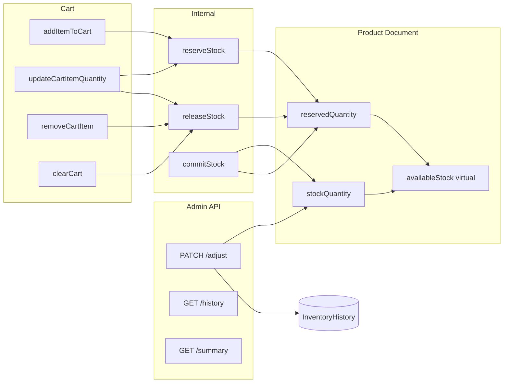
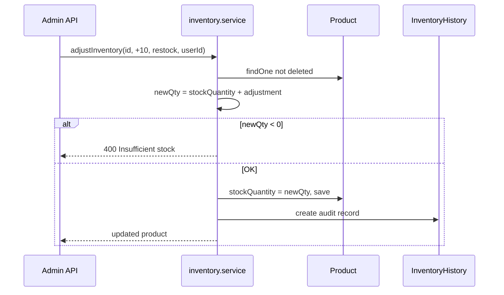
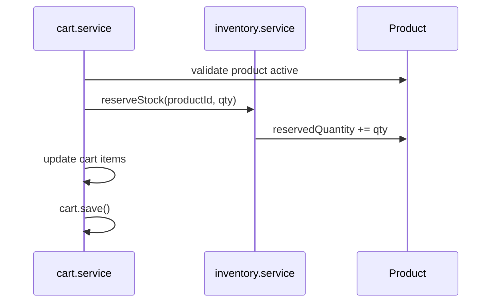
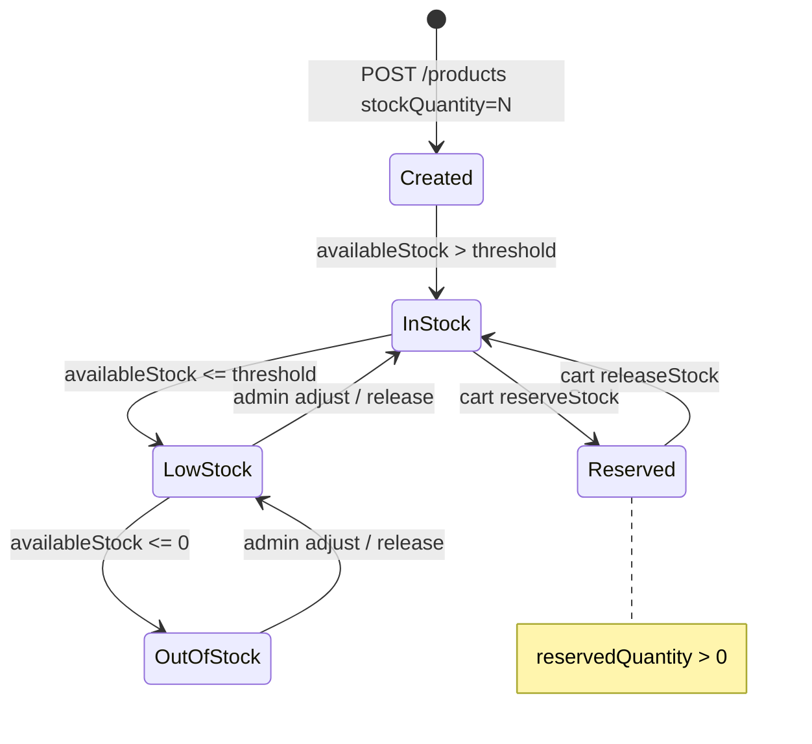

# Inventory Module

Documentation for inventory tracking in `back-end/`. Inventory state lives **on the Product document** (`stockQuantity`, `reservedQuantity`, `lowStockThreshold`); the Inventory module adds admin adjustment APIs, audit history, computed virtuals, and internal reservation primitives consumed by the Cart module.

**Base path:** `/api/v1/inventory`  
**Service:** `services/inventory.service.js`  
**Audit model:** `models/inventory-history.model.js`

---

# Inventory Overview

The platform uses a **two-bucket stock model**:

| Bucket | Field | Meaning |
|--------|-------|---------|
| **On-hand** | `stockQuantity` | Physical units in warehouse |
| **Reserved** | `reservedQuantity` | Units held for items in user carts |
| **Sellable** | `availableStock` (virtual) | What can still be sold or reserved |



### What Exists Today

| Capability | Exposed via API | Notes |
|------------|-----------------|-------|
| Admin stock adjustment | Yes | With audit trail |
| Inventory history | Yes | Admin read |
| Inventory summary | Yes | Admin read |
| Cart reservations | Internal only | `reserveStock` / `releaseStock` |
| Order fulfillment commit | **No** | `commitStock` implemented, unused |
| Low-stock alerts | **No** | Virtual `lowStock` only |
| MongoDB transactions | **No** | Each operation is separate save |

---

# Inventory Architecture

Inventory is **not a separate aggregate collection** for live stock — it is embedded in `Product`. The `InventoryHistory` collection is append-only audit log for **admin adjustments only**.

| Layer | File | Role |
|-------|------|------|
| Routes | `routes/inventory.routes.js` | Admin-only HTTP endpoints |
| Controller | `controllers/inventory.controller.js` | HTTP adapter |
| Service | `services/inventory.service.js` | All inventory business logic |
| Product model | `models/product.model.js` | Stock fields + virtuals |
| History model | `models/inventory-history.model.js` | Adjustment audit records |
| Constants | `constants/inventory.constants.js` | Reasons + status enums |
| Validator | `validators/inventory.validator.js` | Adjust endpoint validation |
| Consumer | `services/cart.service.js` | Calls reserve/release |

### Dual Paths to Change `stockQuantity`

| Path | Audit history | Used by |
|------|---------------|---------|
| `inventory.service.adjustInventory` | Yes | `PATCH /inventory/:productId/adjust` |
| `product.service.updateProduct` | **No** | `PATCH /products/:id` with `stockQuantity` in body |
| `Product.create` on register | **No** | `POST /products` initial stock |

Only the inventory adjust endpoint creates `InventoryHistory` records.

---

# Inventory Fields

All fields are on `models/product.model.js`.

| Field | Type | Default | Min | Purpose |
|-------|------|---------|-----|---------|
| `stockQuantity` | `Number` | `0` | `0` | Total on-hand units |
| `reservedQuantity` | `Number` | `0` | `0` | Units reserved by carts |
| `lowStockThreshold` | `Number` | `5` | — | Threshold for `lowStock` / `low_stock` status |

### `stockQuantity`

- Set on product create (`POST /products`, required in validator)
- Increased/decreased by `adjustInventory(adjustment)` (signed integer)
- Can be updated directly via `PATCH /products/:id` (bypasses audit)
- Would be decreased by `commitStock` on order completion (not wired)

**Constraint in `adjustInventory`:** `stockQuantity + adjustment >= 0` → else `400 Insufficient stock`

**Not validated in adjust:** whether `stockQuantity` remains `>= reservedQuantity`

### `reservedQuantity`

- Incremented by `reserveStock(productId, quantity)`
- Decremented by `releaseStock(productId, quantity)` — floored at `0` via `Math.max(0, ...)`
- Would be decremented with `stockQuantity` by `commitStock` (not wired)
- **Never modified** by `adjustInventory` directly

### `lowStockThreshold`

- Default `5` on schema
- Not required on product create — uses default if omitted
- Not in product update whitelist explicitly but could be set if added to body spread on create only; **update whitelist does not include `lowStockThreshold`** — immutable via `PATCH /products` after create unless set at creation through spread

> **Note:** `lowStockThreshold` is not in `updateProduct` allowed fields — only set at create time via `...productData` spread or schema default.

---

# Inventory Virtuals

Defined on `product.model.js` with `toJSON: { virtuals: true }`.

## `availableStock`

```
availableStock = stockQuantity - reservedQuantity
```

| Input | `stockQuantity` | `reservedQuantity` | `availableStock` |
|-------|-----------------|--------------------|--------------------|
| Example A | 100 | 12 | 88 |
| Example B | 10 | 10 | 0 |
| Example C | 5 | 8 | -3 (possible if stock adjusted down after reservations) |

Used by `reserveStock` guard: `if (product.availableStock < quantity) throw 400`.

## `inStock`

```
inStock = availableStock > 0
```

Boolean sellability flag. `false` when all stock is reserved or on-hand is zero.

## `lowStock`

```
lowStock = availableStock <= lowStockThreshold
```

**Note:** When `availableStock === 0`, `lowStock` is `true` (0 <= threshold). Overlaps with out-of-stock semantically.

## `inventoryStatus`

Derived using `INVENTORY_STATUS` constants — evaluated **in order**:

```
if (availableStock <= 0)           → out_of_stock
else if (availableStock <= lowStockThreshold) → low_stock
else                               → in_stock
```

| `stockQuantity` | `reservedQuantity` | `lowStockThreshold` | `availableStock` | `inventoryStatus` |
|-----------------|--------------------|--------------------|------------------|-------------------|
| 100 | 0 | 5 | 100 | `in_stock` |
| 100 | 95 | 5 | 5 | `low_stock` |
| 100 | 100 | 5 | 0 | `out_of_stock` |
| 3 | 0 | 5 | 3 | `low_stock` |

Exposed in `getInventorySummary` response and product JSON serialization.

---

# Inventory Status Constants

From `constants/inventory.constants.js`:

## `INVENTORY_STATUS` (computed virtual values)

| Constant | Value | When assigned |
|----------|-------|---------------|
| `INVENTORY_STATUS.IN_STOCK` | `in_stock` | `availableStock > lowStockThreshold` |
| `INVENTORY_STATUS.LOW_STOCK` | `low_stock` | `0 < availableStock <= lowStockThreshold` |
| `INVENTORY_STATUS.OUT_OF_STOCK` | `out_of_stock` | `availableStock <= 0` |

## `INVENTORY_REASONS` (admin adjust API only)

| Constant | Value | Typical use |
|----------|-------|-------------|
| `INVENTORY_REASONS.RESTOCK` | `restock` | Incoming shipment |
| `INVENTORY_REASONS.MANUAL_ADJUSTMENT` | `manual_adjustment` | Correction |
| `INVENTORY_REASONS.DAMAGED` | `damaged` | Write-off (negative adjustment) |
| `INVENTORY_REASONS.RETURNED` | `returned` | Customer return (positive adjustment) |

Validated on `PATCH /:productId/adjust` via `express-validator` `.isIn(Object.values(INVENTORY_REASONS))`.

---

# Inventory Service

**File:** `services/inventory.service.js`

All functions query `Product.findOne({ _id: productId, isDeleted: false })` unless noted.

---

## `adjustInventory(productId, adjustment, reason, userId)`

**Exposed:** `PATCH /api/v1/inventory/:productId/adjust` (admin)

### Workflow



| Step | Action |
|------|--------|
| 1 | Load product |
| 2 | `previousQuantity = product.stockQuantity` |
| 3 | `newQuantity = previousQuantity + adjustment` |
| 4 | Reject if `newQuantity < 0` |
| 5 | Save new `stockQuantity` |
| 6 | `InventoryHistory.create({ product, previousQuantity, newQuantity, adjustment, reason, adjustedBy })` |
| 7 | Return product document |

| Parameter | Type | Description |
|-----------|------|-------------|
| `adjustment` | integer | Positive or negative delta |
| `reason` | string | One of `INVENTORY_REASONS` |
| `userId` | ObjectId | Admin performing adjust (`req.user.id`) |

**Does not modify:** `reservedQuantity`

---

## `reserveStock(productId, quantity)`

**Exposed:** No HTTP route — called by `cart.service.js`

### Workflow

| Step | Action |
|------|--------|
| 1 | Load product |
| 2 | If `availableStock < quantity` → `400 Insufficient inventory available` |
| 3 | `reservedQuantity += quantity` |
| 4 | `product.save()` |

```
Before: stockQuantity=50, reservedQuantity=5, availableStock=45
reserveStock(id, 3)
After:  stockQuantity=50, reservedQuantity=8, availableStock=42
```

**No audit history** written for reservations.

---

## `releaseStock(productId, quantity)`

**Exposed:** No HTTP route — called by `cart.service.js`

### Workflow

| Step | Action |
|------|--------|
| 1 | Load product |
| 2 | `reservedQuantity = Math.max(0, reservedQuantity - quantity)` |
| 3 | `product.save()` |

Releasing more than reserved floors at `0` — no error thrown.

```
Before: reservedQuantity=8
releaseStock(id, 3)
After:  reservedQuantity=5

releaseStock(id, 100)  → reservedQuantity=0 (no error)
```

---

## `getInventorySummary(productId)`

**Exposed:** `GET /api/v1/inventory/:productId/summary` (admin)

### Workflow

| Step | Action |
|------|--------|
| 1 | Load non-deleted product |
| 2 | Return DTO with stored fields + virtuals |

### Response DTO

```javascript
{
  productId,
  stockQuantity,
  reservedQuantity,
  availableStock,      // virtual
  lowStockThreshold,
  inStock,             // virtual
  lowStock,            // virtual
  inventoryStatus,     // virtual
}
```

---

## `getInventoryHistory(productId)`

**Exposed:** `GET /api/v1/inventory/:productId/history` (admin)

Returns all `InventoryHistory` documents for product, `adjustedBy` populated with `firstName`, `lastName`, `email`, sorted `createdAt` descending.

**Only records `adjustInventory` operations** — not cart reserves/releases.

---

## `commitStock(productId, quantity)` — Partially Implemented

**Exposed:** No route, **no caller** in codebase.

### Intended workflow

| Step | Action |
|------|--------|
| 1 | Load product |
| 2 | If `reservedQuantity < quantity` → `400 Insufficient reserved inventory` |
| 3 | `stockQuantity -= quantity` |
| 4 | `reservedQuantity -= quantity` |
| 5 | Save |

Designed for **order completion**: convert reservation into actual stock reduction. Awaiting Orders module.

---

# Inventory Endpoints

Base: `/api/v1/inventory`  
All endpoints require `protect` + `authorize(USER_ROLES.ADMIN)`.

| Method | Route | Validator | Service | Description |
|--------|-------|-----------|---------|-------------|
| `PATCH` | `/:productId/adjust` | `adjustInventoryValidation` | `adjustInventory` | Apply signed stock adjustment |
| `GET` | `/:productId/history` | — | `getInventoryHistory` | List adjustment audit log |
| `GET` | `/:productId/summary` | — | `getInventorySummary` | Stock snapshot with virtuals |

### `PATCH /:productId/adjust`

| Aspect | Detail |
|--------|--------|
| Auth | Admin |
| URL param | `productId` — MongoDB ObjectId (not validated at route level) |
| Body | `{ adjustment: integer, reason: string }` |

### Validation

| Field | Rules |
|-------|-------|
| `adjustment` | Required integer (positive or negative) |
| `reason` | Required; must be `restock`, `manual_adjustment`, `damaged`, or `returned` |

---

# Reservation System

## Why Reservations Exist

Without reservations, two users could add the last units to cart simultaneously — both see `stockQuantity > 0`, both checkout, one oversells.

Reservations **reduce `availableStock` without reducing `stockQuantity`** when items enter a cart:

```
availableStock = stockQuantity - reservedQuantity
```

Other shoppers see reduced availability immediately while the first user's items remain in cart.

## Cart Integration

| Cart operation | Inventory call |
|----------------|----------------|
| `addItemToCart` | `reserveStock(productId, quantity)` |
| `updateCartItemQuantity` (increase) | `reserveStock(productId, difference)` |
| `updateCartItemQuantity` (decrease) | `releaseStock(productId, abs(difference))` |
| `removeCartItem` | `releaseStock(productId, item.quantity)` |
| `clearCart` | `releaseStock` for each item |

### Add-to-Cart Sequence



**Order of operations:** reserve **before** `cart.save()`. If `cart.save()` fails, reservation is **not rolled back**.

## What Reservations Do Not Do

| Gap | Detail |
|-----|--------|
| No TTL | Reservations persist until cart changes |
| No `commitStock` on purchase | Stock not decremented on checkout |
| No cross-cart deduplication | Same user duplicate adds increment reservation correctly; abandoned carts hold stock |
| No history | Reserve/release not in `InventoryHistory` |

---

# Inventory Lifecycle



### Lifecycle Events

| Event | `stockQuantity` | `reservedQuantity` | History record |
|-------|-----------------|--------------------|----------------|
| Product create | Set initial | 0 | No |
| Admin adjust | +/- delta | Unchanged | Yes |
| Product PATCH stock | Set absolute | Unchanged | No |
| Cart add | Unchanged | +qty | No |
| Cart remove | Unchanged | -qty | No |
| Order commit (future) | -qty | -qty | Not implemented |

---

# Request/Response Examples

## Adjust Inventory (Restock)

```http
PATCH /api/v1/inventory/665f1a2b3c4d5e6f7a8b9c0d/adjust HTTP/1.1
Content-Type: application/json
Cookie: accessToken=<admin-jwt>

{
  "adjustment": 25,
  "reason": "restock"
}
```

```json
{
  "success": true,
  "message": "Inventory updated successfully",
  "data": {
    "_id": "665f1a2b3c4d5e6f7a8b9c0d",
    "stockQuantity": 75,
    "reservedQuantity": 8,
    "availableStock": 67
  }
}
```

## Adjust Inventory (Damaged write-off)

```json
{
  "adjustment": -3,
  "reason": "damaged"
}
```

## Inventory Summary

```http
GET /api/v1/inventory/665f1a2b3c4d5e6f7a8b9c0d/summary HTTP/1.1
Cookie: accessToken=<admin-jwt>
```

```json
{
  "success": true,
  "data": {
    "productId": "665f1a2b3c4d5e6f7a8b9c0d",
    "stockQuantity": 75,
    "reservedQuantity": 8,
    "availableStock": 67,
    "lowStockThreshold": 5,
    "inStock": true,
    "lowStock": false,
    "inventoryStatus": "in_stock"
  }
}
```

## Inventory History

```http
GET /api/v1/inventory/665f1a2b3c4d5e6f7a8b9c0d/history HTTP/1.1
Cookie: accessToken=<admin-jwt>
```

```json
{
  "success": true,
  "data": [
    {
      "_id": "665f1a2b3c4d5e6f7a8b9c0e",
      "product": "665f1a2b3c4d5e6f7a8b9c0d",
      "previousQuantity": 50,
      "newQuantity": 75,
      "adjustment": 25,
      "reason": "restock",
      "adjustedBy": {
        "_id": "665f1a2b3c4d5e6f7a8b9c01",
        "firstName": "Admin",
        "lastName": "User",
        "email": "admin@example.com"
      },
      "createdAt": "2026-06-19T14:00:00.000Z"
    }
  ]
}
```

## Error Examples

```json
{
  "success": false,
  "status": "error",
  "message": "Insufficient inventory available",
  "errors": []
}
```

```json
{
  "success": false,
  "status": "error",
  "message": "Insufficient stock",
  "errors": []
}
```

---

# Edge Cases

| Scenario | Behavior |
|----------|----------|
| **Reserve more than available** | `400 Insufficient inventory available` |
| **Adjust stock below zero** | `400 Insufficient stock` |
| **Adjust stock below reserved level** | Allowed — `availableStock` can go **negative** |
| **Release more than reserved** | `reservedQuantity` floors at `0`; no error |
| **Duplicate SKU product archived** | `isDeleted: false` filter excludes from inventory ops → `404` |
| **Cart save fails after reserve** | Reservation **orphaned** — no rollback |
| **Concurrent cart adds** | Last write wins on `reservedQuantity`; race can oversell without transactions |
| **Admin PATCH product stockQuantity** | Bypasses history; can desync from reservations |
| **commitStock without prior reserve** | Would throw `400 Insufficient reserved inventory` |
| **Negative adjustment on `damaged`** | Valid if result `stockQuantity >= 0` |
| **Float adjustment** | Validator requires integer; controller uses `Number()` |
| **Deleted product in cart** | Cart still holds reservation until user removes item |
| **Product archived** | Inventory endpoints return `404`; reservations may remain |

### `availableStock` Negative Example

```
stockQuantity = 10, reservedQuantity = 15 (hypothetically after bad adjust)
availableStock = -5
reserveStock(any positive qty) → fails (availableStock < quantity)
inStock = false
inventoryStatus = out_of_stock
```

---

# Performance Considerations

| Topic | Current state | Impact |
|-------|---------------|--------|
| **Stock on product doc** | No join for reads | Fast single-document read for summary |
| **History collection** | Unindexed `product` field | `find({ product })` scans as history grows |
| **No pagination on history** | Returns full array | Large histories increase payload |
| **Per-cart-item release on clear** | Sequential `releaseStock` in loop | N saves for N cart lines |
| **Reserve before cart save** | Two writes minimum per add | Double round-trip without transaction |
| **Virtual computation** | In-process on read | No extra DB queries |
| **Population on history** | `adjustedBy` per query | Acceptable for admin audit UI |

### Missing Indexes (`InventoryHistory`)

| Recommended | Purpose |
|-------------|---------|
| `{ product: 1, createdAt: -1 }` | History listing (not implemented) |

---

# Future Transaction Support

**Not implemented today.** All inventory and cart operations use independent `product.save()` / `cart.save()` calls.

### Recommended Transaction Boundaries

| Operation | Collections involved | Why transaction |
|-----------|---------------------|-----------------|
| `addItemToCart` | Product + Cart | Roll back reserve if cart save fails |
| `updateCartItemQuantity` | Product + Cart | Atomic reserve/release + quantity update |
| `removeCartItem` / `clearCart` | Product + Cart | Consistent release + cart mutation |
| `commitStock` (orders) | Product + Order | Decrement stock + clear reservation atomically |
| `adjustInventory` + alert | Product + History | Already sequential; transaction ensures both or neither |

### Mongoose Pattern (Future)

```javascript
const session = await mongoose.startSession();
session.startTransaction();
try {
  await product.save({ session });
  await cart.save({ session });
  await session.commitTransaction();
} catch (error) {
  await session.abortTransaction();
  throw error;
} finally {
  session.endSession();
}
```

### Other Future Work

| Item | Status |
|------|--------|
| Wire `commitStock` to Orders module | Service exists, no consumer |
| Reservation TTL / cron cleanup | Not implemented |
| Record reserve/release in history | Not implemented |
| Validate `stockQuantity >= reservedQuantity` on adjust | Not implemented |
| Consolidate stock updates through inventory service only | Product PATCH still direct |
| Optimistic locking (`__v` check) | Not implemented |
| Low-stock notifications | Virtual only |

---

# InventoryHistory Schema

**Collection:** `inventoryhistories`

| Field | Type | Purpose |
|-------|------|---------|
| `product` | ObjectId → Product | Which product was adjusted |
| `previousQuantity` | Number | `stockQuantity` before |
| `newQuantity` | Number | `stockQuantity` after |
| `adjustment` | Number | Signed delta applied |
| `reason` | String | `INVENTORY_REASONS` value |
| `adjustedBy` | ObjectId → User | Admin who adjusted |
| `createdAt` | Date | When (timestamps) |

---

# Summary

Inventory is implemented as **product-embedded stock fields** plus an **admin adjustment API** with audit history and **internal cart reservations**. Sellable availability is computed via virtuals (`availableStock`, `inventoryStatus`). `reserveStock` and `releaseStock` protect against overselling during cart operations but lack transactions, TTL, and audit trails. `commitStock` is ready for order fulfillment but has no route or caller. MongoDB transactions are the primary recommended upgrade for consistency under concurrency.
