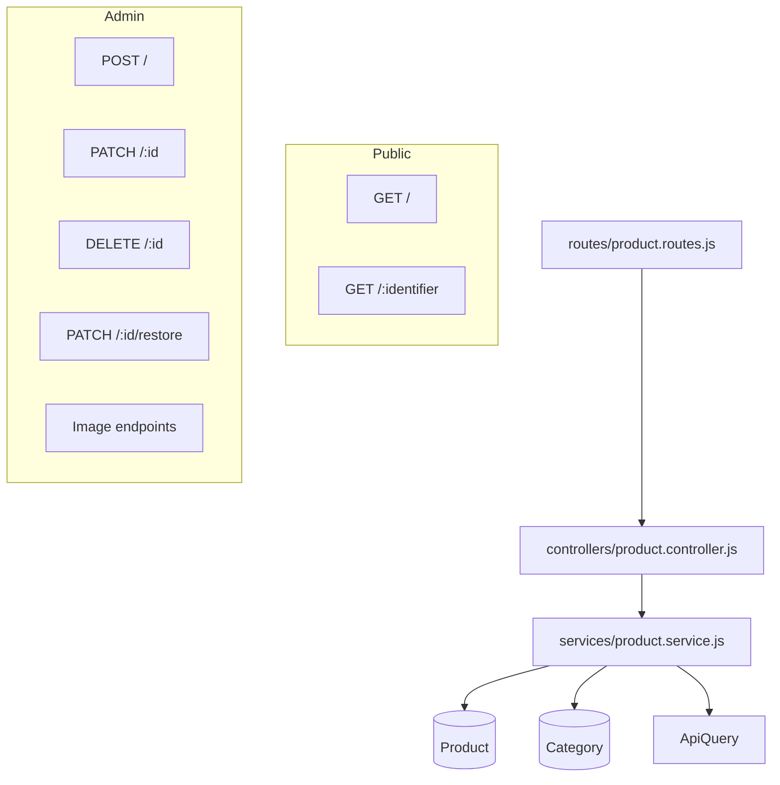
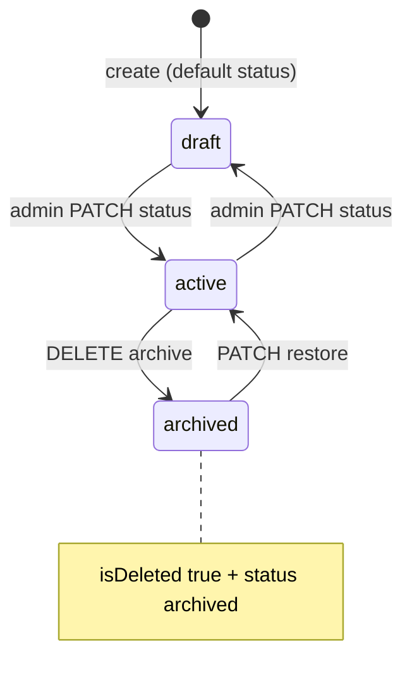
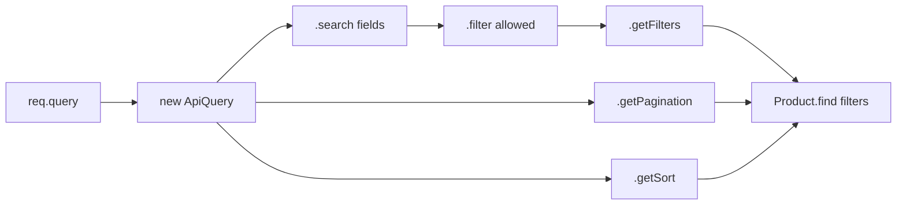
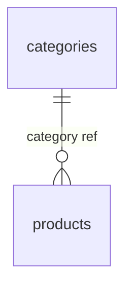

# Product Module

Documentation for the Product catalog feature in `back-end/`. Products are the core sellable entities, linked to categories, with inventory fields, embedded image galleries, and public discovery via search, filter, sort, and pagination.

**Base path:** `/api/v1/products`  
**Mount:** `app.js` → `app.use('/api/v1/products', productRoutes)`

---

# Product Module Overview

The Product module manages the full catalog lifecycle: admin creation and maintenance, public listing and detail pages, soft delete with status transitions, and embedded image management (upload routes live on the same router).



### File Map

| Layer | File |
|-------|------|
| Routes | `routes/product.routes.js` |
| Controller | `controllers/product.controller.js` |
| Service | `services/product.service.js` |
| Model | `models/product.model.js` |
| Validator | `validators/product.validator.js` |
| Constants | `constants/product.constants.js`, `constants/upload.constants.js` |
| Query helper | `utils/api-query.util.js` |

### Access Control

| Operation | Auth | Role |
|-----------|------|------|
| List products, get product | Public | — |
| Create, update, archive, restore, images | Required | `admin` |

### Downstream Consumers

| Module | Uses Product for |
|--------|------------------|
| `cart.service.js` | Active, non-deleted products; `price` for snapshot |
| `wishlist.service.js` | Active, non-deleted products |
| `inventory.service.js` | Stock reads/adjustments on product document |
| `category.service.js` | `getCategoryProducts` listing |

---

# Product Schema

**Model:** `Product`  
**Collection:** `products`  
**Timestamps:** `createdAt`, `updatedAt`  
**JSON serialization:** `toJSON` / `toObject` with `virtuals: true`

## Embedded Image Sub-Schema (`imageSchema`)

| Field | Type | Purpose | Validation | Default |
|-------|------|---------|------------|---------|
| `url` | `String` | Public path to image | Required; `trim` | — |
| `filename` | `String` | Disk filename for delete/reorder | Required; `trim` | — |
| `alt` | `String` | Accessibility text | Optional; `trim` | `''` |
| `isPrimary` | `Boolean` | Gallery primary flag | Max one per product (hook) | `false` |
| `sortOrder` | `Number` | Display order | — | `0` |

Sub-schema uses `{ _id: false }` — no per-image MongoDB `_id`.

## Product Fields

| Field | Type | Purpose | Validation | Default |
|-------|------|---------|------------|---------|
| `_id` | `ObjectId` | Primary key | Auto-generated | — |
| `name` | `String` | Product title; drives slug | Required; `trim`; `maxlength: 200` | — |
| `slug` | `String` | URL-safe identifier | Required; **unique**; `lowercase`; `trim`; auto from name | Generated in hook |
| `shortDescription` | `String` | Brief summary | Optional; `trim`; `maxlength: 300` | — |
| `description` | `String` | Full description | Optional; `trim` | `''` |
| `brand` | `String` | Manufacturer/brand | Optional; `trim`; `maxlength: 100` | — |
| `category` | `ObjectId` → `Category` | Taxonomy link | Required; `ref: 'Category'` | — |
| `sku` | `String` | Stock keeping unit | Required; **unique**; `uppercase`; `trim` | — |
| `price` | `Number` | Selling price | Required; `min: 0` | — |
| `compareAtPrice` | `Number` | Original/compare price | Optional; `min: 0` | — |
| `stockQuantity` | `Number` | On-hand inventory | Required; `min: 0` | `0` |
| `reservedQuantity` | `Number` | Cart-reserved stock | `min: 0` | `0` |
| `images` | `[imageSchema]` | Embedded gallery | Primary image hook | `[]` |
| `featured` | `Boolean` | Highlight on storefront | — | `false` |
| `status` | `String` | Lifecycle state | `enum`: `draft`, `active`, `archived` | `draft` |
| `isDeleted` | `Boolean` | Soft-delete flag | — | `false` |
| `lowStockThreshold` | `Number` | Low-stock alert threshold | — | `5` |
| `createdBy` | `ObjectId` → `User` | Creating admin | Required | Set by service |
| `createdAt` | `Date` | Created timestamp | Mongoose timestamps | Auto |
| `updatedAt` | `Date` | Updated timestamp | Mongoose timestamps | Auto |

---

# Product Virtuals

All virtuals are **getter-only** and included in JSON when `virtuals: true` on schema options.

| Virtual | Returns | Logic | Used By |
|---------|---------|-------|---------|
| `primaryImage` | Image object or `null` | First image with `isPrimary: true`, else `images[0]`, else `null` | API JSON responses |
| `availableStock` | `Number` | `stockQuantity - reservedQuantity` | `inventory.service.js` summary; cart stock checks |
| `inStock` | `Boolean` | `availableStock > 0` | Inventory summary |
| `lowStock` | `Boolean` | `availableStock <= lowStockThreshold` | Inventory summary |
| `inventoryStatus` | `String` | `out_of_stock` if `availableStock <= 0`; `low_stock` if `<= lowStockThreshold`; else `in_stock` | `inventory.service.js`; values from `INVENTORY_STATUS` |

### `inventoryStatus` Values

| Value | Constant | Condition |
|-------|----------|-----------|
| `out_of_stock` | `INVENTORY_STATUS.OUT_OF_STOCK` | `availableStock <= 0` |
| `low_stock` | `INVENTORY_STATUS.LOW_STOCK` | `availableStock <= lowStockThreshold` (and > 0) |
| `in_stock` | `INVENTORY_STATUS.IN_STOCK` | Otherwise |

---

# Product Hooks

## `pre('validate')` — Primary Image Guard

| Trigger | Before validation on save/create |
| Condition | Count images where `isPrimary === true` |
| Action | Throw `Error('A product can only have one primary image')` if count > 1 |

## `pre('validate')` — Slug Generation

| Trigger | Before validation |
| Condition | `this.isModified('name')` |
| Action | `this.slug = slugify(this.name, { lower: true, strict: true, trim: true })` |

Runs on create (name is new) and when name is updated via `product.save()`.

## Other Hooks

| Hook | Implemented? |
|------|--------------|
| `pre('save')` | No |
| `post('save')` | No |
| `pre('find')` | No |
| Middleware on `findOneAndUpdate` | No — updates use `findById` + `save()` |

---

# Product Indexes

Explicit indexes in `product.model.js` (in addition to unique indexes on `slug` and `sku`):

| Index | Keys | Purpose |
|-------|------|---------|
| 1 | `{ slug: 1 }` | Fast lookup by slug on `GET /:identifier` |
| 2 | `{ category: 1 }` | Filter products by category; category product listing |
| 3 | `{ status: 1 }` | Filter by product status |
| 4 | `{ featured: 1 }` | Featured product queries |
| 5 | `{ category: 1, status: 1 }` | Compound filter for category + active listings (e.g. `getCategoryProducts`) |

### Implicit Unique Indexes

| Field | Effect |
|-------|--------|
| `slug` | `unique: true` — prevents duplicate URLs |
| `sku` | `unique: true` — prevents duplicate SKUs |

### Not Indexed

| Field | Notes |
|-------|-------|
| `brand` | Used in regex search — no text index |
| `name` | Used in regex search — no text index |
| `isDeleted` | Always filtered in queries but not indexed |
| `reservedQuantity` | Updated by cart — no dedicated index |

---

# Product Lifecycle



## Create

**Endpoint:** `POST /api/v1/products` (admin)

| Step | Action |
|------|--------|
| 1 | Validate body (`createProductValidation`) |
| 2 | `Product.findOne({ sku })` — duplicate → `409` |
| 3 | `Category.findOne({ _id, isDeleted: false })` — missing → `404` |
| 4 | `Product.create({ ...productData, createdBy })` |
| 5 | Model generates `slug` from `name`; default `status: draft` unless overridden in body |

**Validated on create:** `name`, `category`, `sku`, `price`, `stockQuantity`, optional `compareAtPrice`  
**Not validated but accepted via spread:** `shortDescription`, `description`, `brand`, `featured`, `status`, `lowStockThreshold`

## Read

### List — `getProducts`

- **Endpoint:** `GET /api/v1/products`
- **Filters:** `isDeleted: false`, `status: 'active'` (base; overridable via `?status=`)
- **Populate:** `category` → `name`, `slug`
- **Returns:** `{ products, pagination }`

### Detail — `getProduct`

- **Endpoint:** `GET /api/v1/products/:identifier`
- **Lookup:** ObjectId or `slug`
- **Filters:** `isDeleted: false`, `status: 'active'`
- **Populate:** `category` → `name`, `slug`
- Not found → `404`

> Public reads **never** return `draft` or `archived` products unless list query overrides `status` filter.

## Update

**Endpoint:** `PATCH /api/v1/products/:id` (admin)

**Whitelist** (`updateProduct` service):

`name`, `shortDescription`, `description`, `brand`, `price`, `compareAtPrice`, `stockQuantity`, `featured`, `status`, `images`

**Not updatable via service:**

| Field | Notes |
|-------|-------|
| `category` | Cannot reassign category through update |
| `sku` | Immutable after create |
| `slug` | Regenerated only when `name` changes |
| `isDeleted` | Use archive/restore |
| `reservedQuantity` | Managed by cart/inventory services |

## Archive

**Endpoint:** `DELETE /api/v1/products/:id` (admin)

| Field | Value after archive |
|-------|---------------------|
| `isDeleted` | `true` |
| `status` | `'archived'` (string literal in service) |

Does not delete images from disk or release cart reservations.

## Restore

**Endpoint:** `PATCH /api/v1/products/:id/restore` (admin)

| Field | Value after restore |
|-------|---------------------|
| `isDeleted` | `false` |
| `status` | `'active'` |

---

# Search System

Implemented via `ApiQuery.search()` in `getProducts`.

| Aspect | Detail |
|--------|--------|
| Query param | `?search=<term>` |
| Fields | `name`, `brand` |
| Match | Case-insensitive regex (`$options: 'i'`) |
| MongoDB query | `$or: [{ name: /term/i }, { brand: /term/i }]` |

### Example

```http
GET /api/v1/products?search=nike
```

Matches products where `name` OR `brand` contains "nike" (case-insensitive).

### Limitations

- No full-text index — regex scan at scale
- No fuzzy matching or relevance scoring
- Search combined with filters via object spread (AND logic)

---

# Filtering System

Implemented via `ApiQuery.filter()` in `getProducts`.

| Query Param | Maps to Field | Notes |
|-------------|---------------|-------|
| `brand` | `brand` | Exact match on query string value |
| `status` | `status` | Overrides default `active` when provided |
| `featured` | `featured` | String from query passed to MongoDB (e.g. `true`) |
| `category` | `category` | Category ObjectId |

### Base Filters (Always Applied)

```javascript
{
  isDeleted: false,
  status: 'active',
  ...queryBuilder.getFilters(),  // may override status
}
```

### Filter Whitelist

Only fields in the `filter([...])` array are accepted — arbitrary query params are ignored.

### Example

```http
GET /api/v1/products?category=665f1a2b3c4d5e6f7a8b9c0d&featured=true&brand=SportMax
```

---

# Sorting System

Via `ApiQuery.getSort()`:

| Parameter | Default | Description |
|-----------|---------|-------------|
| `sort` | `-createdAt` | Mongoose sort string |

### Examples

| Query | Behavior |
|-------|----------|
| `?sort=price` | Cheapest first |
| `?sort=-price` | Most expensive first |
| `?sort=name` | Alphabetical |
| (omit) | Newest first (`-createdAt`) |

Passed directly to `Product.find(filters).sort(sort)` — any valid product field name works if client sends it.

---

# Pagination System

Via `ApiQuery.getPagination()`:

| Parameter | Type | Default | Formula |
|-----------|------|---------|---------|
| `page` | number | `1` | — |
| `limit` | number | `10` | — |
| `skip` | computed | — | `(page - 1) * limit` |

### Execution

```javascript
const [products, total] = await Promise.all([
  Product.find(filters).populate(...).sort(sort).skip(skip).limit(limit),
  Product.countDocuments(filters),
]);
```

### Response

```json
{
  "pagination": {
    "page": 1,
    "limit": 10,
    "total": 42,
    "totalPages": 5
  }
}
```

`totalPages` = `Math.ceil(total / limit)`

---

# ApiQuery Utility

**File:** `utils/api-query.util.js`  
**Pattern:** Fluent builder class for list endpoints

## Architecture



## Class API

| Method | Returns | Description |
|--------|---------|-------------|
| `constructor(queryParams)` | `this` | Stores raw `req.query` |
| `.search(fields[])` | `this` | Builds `$or` regex filters if `?search=` present |
| `.filter(allowedFilters[])` | `this` | Copies whitelisted query params to `filters` |
| `.getFilters()` | `object` | MongoDB filter fragment |
| `.getPagination()` | `{ page, limit, skip }` | Parsed pagination |
| `.getSort()` | `string` | Sort string, default `-createdAt` |

## Usage in Product Module

```javascript
// services/product.service.js — getProducts
const queryBuilder = new ApiQuery(queryParams)
  .filter(['brand', 'status', 'featured', 'category'])
  .search(['name', 'brand']);

const filters = {
  isDeleted: false,
  status: 'active',
  ...queryBuilder.getFilters(),
};
```

## Design Properties

| Property | Detail |
|----------|--------|
| **Chainable** | `.search().filter()` order matters only for building same object |
| **Whitelist security** | Unknown filter params cannot inject arbitrary MongoDB fields |
| **Shared** | Also used by `category.service.js` (categories list + category products) |
| **Stateless output** | Each method reads from `this.queryParams`; no DB access |

---

# Category Integration



| Integration Point | Behavior |
|-------------------|----------|
| **Create product** | `category` required; must reference non-deleted category |
| **List/detail** | `.populate('category', 'name slug')` on reads |
| **Filter** | `?category=<ObjectId>` on `GET /products` |
| **Category products** | `GET /categories/:slug/products` queries `Product` by `category._id` |
| **Update product** | `category` **not** in update whitelist — cannot move product between categories via PATCH |

### Create Validation

```javascript
const category = await Category.findOne({
  _id: productData.category,
  isDeleted: false,
});
```

Product in archived category: still exists if created before category archive; create blocked for new products in archived categories.

---

# Product Statuses

From `constants/product.constants.js`:

| Constant | Value | Default | Public visibility |
|----------|-------|---------|-----------------|
| `PRODUCT_STATUS.DRAFT` | `draft` | **Yes** on create | Hidden from public list/detail |
| `PRODUCT_STATUS.ACTIVE` | `active` | Set on restore | Visible on public list/detail |
| `PRODUCT_STATUS.ARCHIVED` | `archived` | Set on archive | Hidden from public list/detail |

### Status Usage Across Codebase

| Location | Status check |
|----------|--------------|
| `getProducts` / `getProduct` | Hardcoded `'active'` (+ query override on list) |
| `cart.service.js` | `PRODUCT_STATUS.ACTIVE` constant |
| `wishlist.service.js` | `PRODUCT_STATUS.ACTIVE` constant |
| `archiveProduct` | Sets `'archived'` string literal |
| `restoreProduct` | Sets `'active'` string literal |

Admin can set `status` via `PATCH` (Mongoose enum validates).

---

# Product Slug Strategy

| Aspect | Implementation |
|--------|----------------|
| **Generation** | `slugify(name, { lower: true, strict: true, trim: true })` |
| **Trigger** | `pre('validate')` when `name` is modified |
| **Uniqueness** | Schema `unique: true` on `slug` |
| **Lookup** | `GET /:identifier` accepts slug or ObjectId |
| **Immutability** | No direct slug update — changes only when `name` changes |
| **Collision handling** | MongoDB duplicate key error on save (no friendly service message) |

### Examples

| Name | Slug |
|------|------|
| `Pro Runner X` | `pro-runner-x` |
| `Nike Air Max 90!` | Special chars stripped by `strict: true` |

---

# Soft Delete Strategy

| Aspect | Product implementation |
|--------|------------------------|
| **Flag** | `isDeleted: Boolean` |
| **Archive trigger** | `DELETE /:id` |
| **Companion status** | `status` set to `'archived'` (unlike Category which only sets `isDeleted`) |
| **Restore** | `isDeleted: false`, `status: 'active'` |
| **Public queries** | Always `isDeleted: false` |
| **Physical delete** | Never — documents retained |
| **SKU after archive** | Unique index prevents duplicate SKU even for archived products |
| **Cart/wishlist** | Active checks use `status` + `isDeleted`; archived products excluded |

---

# Request/Response Examples

## List Products

```http
GET /api/v1/products?page=1&limit=10&search=runner&featured=true&sort=-createdAt HTTP/1.1
```

```json
{
  "success": true,
  "data": {
    "products": [
      {
        "_id": "665f1a2b3c4d5e6f7a8b9c0d",
        "name": "Pro Runner X",
        "slug": "pro-runner-x",
        "sku": "RUN-001",
        "price": 129.99,
        "compareAtPrice": 159.99,
        "stockQuantity": 50,
        "reservedQuantity": 2,
        "featured": true,
        "status": "active",
        "isDeleted": false,
        "images": [],
        "category": {
          "_id": "665f1a2b3c4d5e6f7a8b9c01",
          "name": "Running Shoes",
          "slug": "running-shoes"
        },
        "availableStock": 48,
        "inStock": true,
        "lowStock": false,
        "inventoryStatus": "in_stock",
        "primaryImage": null
      }
    ],
    "pagination": {
      "page": 1,
      "limit": 10,
      "total": 1,
      "totalPages": 1
    }
  }
}
```

## Get Product by Slug

```http
GET /api/v1/products/pro-runner-x HTTP/1.1
```

```json
{
  "success": true,
  "data": {
    "_id": "665f1a2b3c4d5e6f7a8b9c0d",
    "name": "Pro Runner X",
    "slug": "pro-runner-x",
    "description": "Lightweight daily trainer.",
    "price": 129.99,
    "category": {
      "_id": "665f1a2b3c4d5e6f7a8b9c01",
      "name": "Running Shoes",
      "slug": "running-shoes"
    }
  }
}
```

## Create Product (Admin)

```http
POST /api/v1/products HTTP/1.1
Content-Type: application/json
Cookie: accessToken=<admin-jwt>

{
  "name": "Pro Runner X",
  "category": "665f1a2b3c4d5e6f7a8b9c01",
  "sku": "RUN-001",
  "price": 129.99,
  "stockQuantity": 50,
  "brand": "SportMax",
  "status": "active",
  "featured": true
}
```

```json
{
  "success": true,
  "message": "Product created successfully",
  "data": {
    "_id": "665f1a2b3c4d5e6f7a8b9c0d",
    "name": "Pro Runner X",
    "slug": "pro-runner-x",
    "sku": "RUN-001",
    "status": "active",
    "createdBy": "665f1a2b3c4d5e6f7a8b9c02"
  }
}
```

## Update Product (Admin)

```http
PATCH /api/v1/products/665f1a2b3c4d5e6f7a8b9c0d HTTP/1.1
Content-Type: application/json
Cookie: accessToken=<admin-jwt>

{
  "price": 119.99,
  "shortDescription": "Updated summary"
}
```

## Archive Product (Admin)

```http
DELETE /api/v1/products/665f1a2b3c4d5e6f7a8b9c0d HTTP/1.1
Cookie: accessToken=<admin-jwt>
```

```json
{
  "success": true,
  "message": "Product archived successfully"
}
```

## Error Responses

```json
{
  "success": false,
  "status": "error",
  "message": "Product not found",
  "errors": []
}
```

```json
{
  "success": false,
  "status": "error",
  "message": "Product SKU already exists",
  "errors": []
}
```

---

# Performance Considerations

| Topic | Current State | Impact |
|-------|---------------|--------|
| **Parallel find + count** | `Promise.all` in `getProducts` | Lower latency than sequential |
| **Compound index** | `{ category: 1, status: 1 }` | Supports category browsing |
| **Populate** | `category` name/slug on every list item | N+1 avoided via single populate per query |
| **Regex search** | `$regex` on name/brand | Collection scan without text index |
| **Default limit** | 10 | Bounds result set size |
| **Virtuals computed** | Per document on serialize | Cheap arithmetic; no extra queries |
| **SKU duplicate check** | `findOne({ sku })` without `isDeleted` | May match archived SKU |
| **No projection** | Full product documents on list | Larger payloads than field selection |
| **Reserved quantity** | Updated by cart without transactions | Potential consistency under concurrency |

### Recommended Query Patterns (As Implemented)

| Use case | Endpoint / query |
|----------|------------------|
| Storefront browse | `GET /products?status=active` (default) |
| Category page | `GET /categories/:slug/products` |
| Product detail | `GET /products/:slug` |
| Admin draft review | `GET /products?status=draft` (overrides default) |

---

# Future Enhancements

**Not implemented** — gaps and extension points in the current codebase:

| Enhancement | Rationale |
|-------------|-----------|
| **Category reassignment on update** | `category` absent from update whitelist |
| **SKU immutability enforcement** | Validator doesn't block `sku` on PATCH (service ignores it) |
| **Use `PRODUCT_STATUS` constants in service** | `archiveProduct`/`getProducts` use string literals |
| **Text index for search** | Replace regex on `name`/`brand` |
| **Index on `isDeleted`** | Common filter not indexed |
| **Admin list with archived/draft** | Dedicated admin endpoint vs query override |
| **Slug collision handling** | Friendly `409` before MongoDB duplicate error |
| **Variant/options support** | Single SKU per product only |
| **Price history** | Only current `price` stored |
| **Bulk import/export** | No batch APIs |
| **Product reviews relation** | No review model |
| **Denormalized category name** | Relies on populate |
| **Image route fixes** | `/:Id` vs `req.params.id`, literal `/Id/images/reorder` path bugs |
| **Release reservations on archive** | Cart may hold reserved stock for archived products |
| **Validate `status`/`featured` on create** | Passed through spread without express-validator |
| **Compare-at price logic** | No validation that `compareAtPrice > price` |
| **Cloudinary/CDN URLs** | Images use local `/uploads/products/` paths |

---

# Endpoint Summary

| Method | Route | Auth | Role | Service method |
|--------|-------|------|------|----------------|
| `POST` | `/` | Yes | Admin | `createProduct` |
| `GET` | `/` | No | — | `getProducts` |
| `GET` | `/:identifier` | No | — | `getProduct` |
| `PATCH` | `/:id` | Yes | Admin | `updateProduct` |
| `DELETE` | `/:id` | Yes | Admin | `archiveProduct` |
| `PATCH` | `/:id/restore` | Yes | Admin | `restoreProduct` |

Image endpoints (`POST /:id/images`, etc.) are implemented in the same module via `product.service.js` image methods — see `docs/API_REFERENCE.md` Product Images section.

---

# Summary

The Product module provides a **slug-based, category-linked catalog** with inventory fields embedded on the document, computed stock virtuals, and a reusable `ApiQuery` layer for discovery. Public APIs surface only active, non-deleted products by default; admins manage the full lifecycle including draft and archived states. Soft delete sets both `isDeleted` and `status: archived`, unlike the Category module. The schema is optimized for category and status filtering with explicit compound indexes, while search remains regex-based without full-text search infrastructure.
