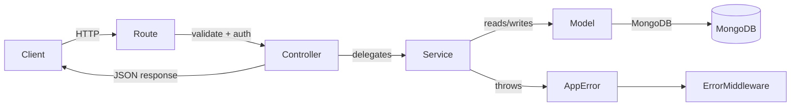

# Project Overview

**MERN Sports E-commerce Platform** is a production-oriented monorepo for an online sports retail store. The project is split into two packages:

| Package | Path | Stack | Status |
|---------|------|-------|--------|
| Backend API | `back-end/` | Node.js, Express 5, MongoDB, Mongoose | **Substantially implemented** |
| Frontend | `front-end/` | React 19, Vite 8, Tailwind CSS 3, React Router 7 | **Stub only** |

The backend exposes a versioned REST API at `/api/v1/*` with layered architecture (Route → Controller → Service → Model), JWT authentication via HTTP-only cookies, and MongoDB persistence. The frontend currently renders a placeholder page and has no API integration, routing, or e-commerce UI.

---

# Vision

The platform aims to become a full-featured sports e-commerce store where customers can browse categorized products, manage carts and wishlists, and complete purchases — while administrators manage catalog, inventory, and fulfillment through secure APIs.

The backend architecture is designed to support that vision: thin controllers, business logic in services, reusable utilities (`ApiQuery`, `AppError`), inventory reservation for cart operations, and a storage provider abstraction that can later migrate from local disk to cloud storage (e.g., Cloudinary).

---

# Current Backend Status

The following modules are **implemented** in the backend:

| Module | Routes | Service | Model | Validators | Notes |
|--------|--------|---------|-------|------------|-------|
| Authentication | ✅ | ✅ | ✅ (User) | ✅ | Register, login, logout, email verify, password reset |
| User Management | ✅ | ✅ | ✅ (User) | ✅ | Profile read/update, change password |
| Categories | ✅ | ✅ | ✅ | ✅ | CRUD, archive/restore, products by category |
| Products | ✅ | ✅ | ✅ | ✅ | CRUD, search, filter, pagination, slug lookup |
| Product Images | ✅ | ✅ | ✅ (embedded) | ✅ | Upload, delete, primary, reorder, alt text |
| Inventory | ✅ | ✅ | ✅ (Product + InventoryHistory) | ✅ | Adjust, history, summary; internal reserve/release |
| Cart | ✅ | ✅ | ✅ | ✅ | Add, update, remove, clear; stock reservation |
| Wishlist | ✅ | ✅ | ✅ | ❌ | Add, list, remove (no request validators) |
| Email | — | ✅ | — | — | Verification and password reset via Nodemailer |
| File Upload | — | — | — | — | Local disk storage via Multer |

The following exist in code but are **not exposed as API modules**:

| Capability | Location | Status |
|------------|----------|--------|
| Phone verification tokens | `user.model.js` | **Partially Implemented** — model methods exist, no routes |
| User addresses | `user.model.js` | **Partially Implemented** — schema + profile read, no address CRUD API |
| Stock commit on purchase | `inventory.service.js` → `commitStock` | **Partially Implemented** — service function exists, unused (no orders) |
| Image reorder / set-primary routes | `product.routes.js` | **Partially Implemented** — route path bugs (see Technical Debt) |

---

# Implemented Features

## Authentication (`/api/v1/auth`)

- [x] Register (creates user, sends verification email)
- [x] Login (JWT in HTTP-only cookie `accessToken`)
- [x] Logout (clears cookie)
- [x] Get current user (`GET /me`, protected)
- [x] Verify email (token in request body)
- [x] Forgot password (sends reset email; generic response to prevent enumeration)
- [x] Reset password (token + new password)
- [ ] Require email verification before login — **not enforced**
- [ ] Phone verification — **not implemented** (model scaffolding only)
- [ ] Refresh tokens — **not implemented** (single access token, 1h default expiry)

## User Management (`/api/v1/users`)

- [x] Get profile (`GET /me`)
- [x] Update profile (firstName, lastName, phone)
- [x] Change password (current + new + confirm)
- [ ] Manage addresses — **not implemented** (address array on User model only)
- [ ] Avatar upload — **not implemented** (avatar field on model only)
- [ ] Admin user management — **not implemented**

## Categories (`/api/v1/categories`)

- [x] List categories (search, filter, pagination, sort)
- [x] Get category by ID or slug
- [x] Get products in category by slug (`GET /:slug/products`)
- [x] Create category (admin)
- [x] Update category (admin)
- [x] Archive category — soft delete via `isDeleted` (admin)
- [x] Restore category (admin)

## Products (`/api/v1/products`)

- [x] Create product (admin)
- [x] List products (public; active, non-deleted only)
- [x] Get product by ID or slug (public)
- [x] Update product (admin; whitelisted fields)
- [x] Archive product (admin; sets `isDeleted` + `status: archived`)
- [x] Restore product (admin)
- [x] Search by name/brand (`?search=`)
- [x] Filter by brand, status, featured, category
- [x] Pagination (`?page=`, `?limit=`)
- [x] Sort (`?sort=`, default `-createdAt`)
- [x] Auto-generated slug from name
- [x] SKU uniqueness enforcement
- [x] Category reference validation on create

## Product Images (`/api/v1/products/:id/images`)

- [x] Upload images (admin; Multer, max 10 per product, JPG/PNG/WEBP, 5MB each)
- [x] Delete image (admin; removes file from disk)
- [x] Set primary image (admin) — **route param bug may block this**
- [x] Reorder gallery (admin) — **route path bug may block this**
- [x] Update image alt text (admin) — **route param bug may block this**
- [x] Serve static files at `/uploads`
- [x] First uploaded image auto-set as primary when gallery is empty

## Inventory (`/api/v1/inventory`)

- [x] Adjust stock (admin; signed integer adjustment + reason enum)
- [x] Inventory history per product (admin)
- [x] Inventory summary per product (admin; virtuals: availableStock, inStock, lowStock, inventoryStatus)
- [x] Reserve stock on cart add/update (internal, via `inventory.service`)
- [x] Release stock on cart remove/clear/decrease (internal)
- [ ] Commit stock on order completion — **service exists, no consumer**
- [ ] Low-stock alerts / notifications — **not implemented**

## Cart (`/api/v1/cart`)

- [x] Add item (protected; reserves inventory)
- [x] Get my cart (protected; populated product details)
- [x] Update item quantity (protected; adjusts reservations)
- [x] Remove item (protected; releases reservation)
- [x] Clear cart (protected; releases all reservations)
- [x] Price snapshot at add time (`priceSnapshot`)
- [x] Virtuals: `totalItems`, `subtotal`
- [ ] Guest cart — **not implemented** (requires authentication)
- [ ] Cart expiration / stale reservation cleanup — **not implemented**

## Wishlist (`/api/v1/wishlist`)

- [x] Get my wishlist (protected)
- [x] Add product (protected)
- [x] Remove product (protected)
- [x] Virtual: `totalItems`
- [ ] Request validation on `productId` — **not implemented**
- [ ] Move wishlist item to cart — **not implemented**

## Infrastructure

- [x] Health check (`GET /health`)
- [x] Helmet security headers
- [x] CORS with credentials (`FRONTEND_URL`)
- [x] Global error handler
- [x] 404 catch-all via `AppError`
- [x] MongoDB connection on startup
- [x] Email provider connection verification on startup
- [ ] Automated tests — **not implemented**
- [ ] `.env.example` — **not present in repository**
- [ ] API documentation (OpenAPI/Swagger) — **not implemented**

## Frontend (`front-end/`)

- [x] Vite + React scaffold
- [x] Tailwind CSS configured
- [ ] Product catalog UI — **not implemented**
- [ ] Auth UI — **not implemented**
- [ ] Cart / wishlist UI — **not implemented**
- [ ] API client layer — **not implemented** (axios installed but unused)

---

# Architecture Overview

## Request Flow



## Layer Responsibilities

| Layer | Directory | Responsibility |
|-------|-----------|----------------|
| **Route** | `routes/` | HTTP method, path, middleware chain (auth, validation, upload) |
| **Controller** | `controllers/` | Parse request, call service, shape HTTP response |
| **Service** | `services/` | Business rules, orchestration, cross-model logic |
| **Model** | `models/` | Schema, indexes, hooks, instance methods |
| **Validator** | `validators/` | `express-validator` rule chains |
| **Middleware** | `middleware/` | Auth, validation aggregation, upload, global errors |
| **Constants** | `constants/` | Enums and shared literal values |
| **Utils** | `utils/` | Cross-cutting helpers (`AppError`, `ApiQuery`, JWT, passwords) |
| **Providers** | `providers/` | External integrations (email, local storage) |

## Why This Architecture

1. **Thin controllers** — Controllers in this codebase only handle try/catch, status codes, and response envelopes. Example: `auth.controller.js` calls `authService.registerUser(req.body)` and returns `{ success, message, data }`. This keeps HTTP concerns separate from domain logic.

2. **Testable services** — Business rules (e.g., cart inventory reservation, product SKU uniqueness) live in services and can be unit-tested without Express.

3. **Consistent errors** — Services throw `AppError` with status codes; `error.middleware.js` formats all operational errors uniformly.

4. **Reusable query building** — `ApiQuery` centralizes search, filter, pagination, and sort for products and categories.

5. **Provider abstraction** — `localStorage.provider.js` isolates file paths; `email.provider.js` wraps Nodemailer — enabling future swaps (S3, Cloudinary, SendGrid) without touching services.

## Application Bootstrap

```
server.js
  ├── dotenv.config()
  ├── connectDB()          → config/db.js
  ├── emailProvider.verifyConnection()
  └── app.listen(PORT)     → app.js
```

`app.js` registers middleware, mounts routes under `/api/v1/*`, serves `/uploads` statically, and attaches the global error handler last.

---

# Core Engineering Standards

## Error Handling Strategy

**Operational errors** use `AppError`:

```javascript
// utils/app-error.util.js
class AppError extends Error {
  constructor(message, statusCode, errors = null) { ... }
}
```

Services throw `AppError` for expected failures (404, 409, 400, 401, 403). Controllers pass errors to `next(error)`. The global handler in `middleware/error.middleware.js`:

- Maps `AppError` → `{ success: false, status: 'error', message, errors }`
- Maps Multer errors → 400 with friendly file-size message
- Maps unexpected errors → 500 with generic message (stack logged server-side)

**Why:** Centralized formatting prevents duplicated error response shapes and keeps controllers free of branching error logic.

## Validation Strategy

1. **Route-level** — `express-validator` chains defined in `validators/*.validator.js`
2. **Aggregation** — `middleware/validate.middleware.js` collects failures into `AppError('Validation failed', 400, formattedErrors)`
3. **Schema-level** — Mongoose validators on models (email format, phone, enums, min/max)

**Why:** Request validation at the edge rejects bad input before service logic runs. Mongoose validation is a second line of defense for data integrity.

## Constants Strategy

Domain enums live in `constants/` and are imported by models, validators, and services:

| File | Exports |
|------|---------|
| `user.constants.js` | `USER_ROLES` (customer, admin), `USER_STATUS` (active, inactive, suspended) |
| `product.constants.js` | `PRODUCT_STATUS` (draft, active, archived) |
| `category.constants.js` | `CATEGORY_STATUS` (active, inactive) |
| `inventory.constants.js` | `INVENTORY_REASONS`, `INVENTORY_STATUS` |
| `upload.constants.js` | `ALLOWED_IMAGE_TYPES`, `MAX_IMAGE_SIZE`, `MAX_PRODUCT_IMAGES` |

**Why:** Single source of truth prevents string drift between validators, schemas, and business logic.

## Service Layer Strategy

- Services own all business rules and database orchestration
- Services may call other services (e.g., `cart.service.js` → `inventory.service.js`)
- Allowed update fields are whitelisted in services (not passed through blindly)
- Services return domain objects or DTOs; they never touch `req`/`res`

## API Response Strategy

Successful responses follow a consistent envelope:

```json
{
  "success": true,
  "message": "Optional human-readable message",
  "data": { }
}
```

Error responses:

```json
{
  "success": false,
  "status": "error",
  "message": "Error description",
  "errors": []
}
```

Paginated list endpoints nest data as:

```json
{
  "success": true,
  "data": {
    "products": [],
    "pagination": { "page": 1, "limit": 10, "total": 0, "totalPages": 0 }
  }
}
```

## Authentication Strategy

- **JWT** signed with `JWT_SECRET`, payload: `{ userId, role }`
- **Cookie-based delivery** — `accessToken` HTTP-only cookie on login (24h `maxAge`; JWT expiry defaults to 1h via `JWT_EXPIRES_IN`)
- **`protect` middleware** — reads cookie, verifies JWT, loads user, checks `USER_STATUS.ACTIVE`
- **`authorize(...roles)`** — role-based access for admin endpoints

**Why cookies over Authorization header:** Enables secure, HTTP-only session tokens for a same-origin or CORS-configured SPA without exposing tokens to JavaScript.

---

# Current Database Collections

MongoDB collections created by Mongoose models:

| Collection | Model | Purpose |
|------------|-------|---------|
| `users` | `User` | Accounts, credentials, profile, addresses (embedded), verification/reset tokens |
| `categories` | `Category` | Product taxonomy with slug, status, soft delete |
| `products` | `Product` | Catalog items with pricing, stock, embedded images, category ref |
| `inventoryhistories` | `InventoryHistory` | Audit log of stock adjustments |
| `carts` | `Cart` | Per-user shopping cart with embedded line items and price snapshots |
| `wishlists` | `Wishlist` | Per-user saved product references |

### Key Schema Details

**User** — email (unique, indexed), password (bcrypt hashed, `select: false`), role, status, `isEmailVerified`, embedded `address[]`, token fields for email/phone/password reset.

**Product** — slug (unique, auto from name), sku (unique), `stockQuantity`, `reservedQuantity`, embedded `images[]`, virtuals (`availableStock`, `inStock`, `lowStock`, `inventoryStatus`, `primaryImage`). Indexes on `slug`, `category`, `status`, `featured`, compound `{ category, status }`.

**Cart** — one document per user (`user` unique), embedded items with `product`, `quantity`, `priceSnapshot`.

**InventoryHistory** — `product`, `previousQuantity`, `newQuantity`, `adjustment`, `reason`, `adjustedBy`, timestamps.

---

# Current API Surface

Base URL: `/api/v1`  
Auth: Cookie `accessToken` for protected routes. Admin routes require `role: admin`.

## Authentication — `/auth`

| Method | Path | Auth | Description |
|--------|------|------|-------------|
| POST | `/register` | Public | Create account |
| POST | `/login` | Public | Login, set cookie |
| GET | `/me` | Protected | Current user (auth module) |
| POST | `/logout` | Public | Clear cookie |
| POST | `/verify-email` | Public | Verify email token |
| POST | `/forgot-password` | Public | Request reset email |
| POST | `/reset-password` | Public | Reset password with token |

## Users — `/users`

| Method | Path | Auth | Description |
|--------|------|------|-------------|
| GET | `/me` | Protected | Get profile |
| PATCH | `/me` | Protected | Update profile |
| PATCH | `/change-password` | Protected | Change password |

## Categories — `/categories`

| Method | Path | Auth | Description |
|--------|------|------|-------------|
| GET | `/` | Public | List categories |
| GET | `/:slug/products` | Public | Products in category |
| GET | `/:identifier` | Public | Get by ID or slug |
| POST | `/` | Admin | Create |
| PATCH | `/:id` | Admin | Update |
| DELETE | `/:id` | Admin | Archive (soft delete) |
| PATCH | `/:id/restore` | Admin | Restore |

## Products — `/products`

| Method | Path | Auth | Description |
|--------|------|------|-------------|
| POST | `/` | Admin | Create |
| GET | `/` | Public | List (search, filter, paginate) |
| GET | `/:identifier` | Public | Get by ID or slug |
| PATCH | `/:id` | Admin | Update |
| DELETE | `/:id` | Admin | Archive |
| PATCH | `/:id/restore` | Admin | Restore |
| POST | `/:id/images` | Admin | Upload images (multipart) |
| DELETE | `/:id/images/:filename` | Admin | Delete image |
| PATCH | `/:Id/images/primary` | Admin | Set primary image ⚠️ |
| PATCH | `/Id/images/reorder` | Admin | Reorder images ⚠️ |
| PATCH | `/:Id/images/alt-text` | Admin | Update alt text ⚠️ |

> ⚠️ Image management routes for primary, reorder, and alt-text have path/parameter inconsistencies documented in Technical Debt.

## Inventory — `/inventory`

| Method | Path | Auth | Description |
|--------|------|------|-------------|
| PATCH | `/:productId/adjust` | Admin | Adjust stock |
| GET | `/:productId/history` | Admin | Adjustment history |
| GET | `/:productId/summary` | Admin | Stock summary |

## Cart — `/cart`

| Method | Path | Auth | Description |
|--------|------|------|-------------|
| POST | `/items` | Protected | Add item |
| GET | `/` | Protected | Get cart |
| PATCH | `/items/:productId` | Protected | Update quantity |
| DELETE | `/items/:productId` | Protected | Remove item |
| DELETE | `/` | Protected | Clear cart |

## Wishlist — `/wishlist`

| Method | Path | Auth | Description |
|--------|------|------|-------------|
| GET | `/` | Protected | Get wishlist |
| POST | `/:productId` | Protected | Add product |
| DELETE | `/:productId` | Protected | Remove product |

## System

| Method | Path | Auth | Description |
|--------|------|------|-------------|
| GET | `/health` | Public | Health check |
| GET | `/uploads/*` | Public | Static product images |

---

# Completed Development Phases

Based on module presence and dependencies in the codebase:

| Phase | Module | Key Deliverables |
|-------|--------|------------------|
| **Phase 1** | Foundation | Express app, MongoDB connection, `AppError`, global error handler, health check, Helmet, CORS |
| **Phase 2** | Authentication | Register, login, logout, JWT cookies, email verification, password reset, Nodemailer integration |
| **Phase 3** | User Management | Profile CRUD (partial), change password, role/status enums |
| **Phase 4** | Categories | Full CRUD with soft delete, slug, search/filter/pagination, category products endpoint |
| **Phase 5** | Products | Full CRUD, slug/SKU, search/filter/pagination, status lifecycle, category linkage |
| **Phase 6** | Product Images | Multer upload, local storage, gallery management (primary, reorder, alt, delete) |
| **Phase 7** | Inventory | Stock adjustment with audit history, summary endpoint, reservation primitives |
| **Phase 8** | Cart | Cart CRUD with inventory reservation/release integration |
| **Phase 9** | Wishlist | Add, list, remove wishlist items |

**Not started:** Orders, checkout, payments, reviews, coupons, admin dashboard, analytics, frontend application.

---

# Technical Debt & Improvement Opportunities

## High Priority

| Issue | Location | Impact |
|-------|----------|--------|
| **Broken product image routes** | `routes/product.routes.js` lines 78–102 | `/:Id/images/primary` and `/:Id/images/alt-text` use capital `Id` while controllers read `req.params.id`. `/Id/images/reorder` is a literal path with no product ID parameter. These endpoints likely return 404 or wrong behavior. |
| **No MongoDB transactions for cart + inventory** | `cart.service.js` | `reserveStock` then `cart.save` are not atomic. A failure between steps can leave reserved stock without a cart item (or vice versa). |
| **No reservation TTL / cleanup** | Cart + inventory | Reserved stock persists indefinitely if user abandons cart. `availableStock` decreases for other shoppers with no expiration mechanism. |
| **JWT vs cookie expiry mismatch** | `auth.controller.js` (24h cookie) vs `jwt.util.js` (1h JWT) | Cookie outlives token; users may appear logged in but get 401 on requests after JWT expiry. |
| **No automated tests** | `package.json` | Zero test coverage; regressions undetected. |
| **Frontend not built** | `front-end/` | No consumer for the API; email links point to `FRONTEND_URL` pages that do not exist. |

## Medium Priority

| Issue | Location | Impact |
|-------|----------|--------|
| **Missing database indexes** | `InventoryHistory`, `Cart`, `Wishlist`, `Category` | No indexes on `InventoryHistory.product`, `Cart.user` (unique constraint helps), `Wishlist.user`, `Category.slug`. Query performance degrades at scale. |
| **`commitStock` unused** | `inventory.service.js` | Order fulfillment path not wired; stock reservation has no completion step. |
| **Email send failure on register is swallowed** | `auth.service.js` | User created even if verification email fails (logged only). User may be stuck unverified with no notification. |
| **Email verification not enforced on login** | `auth.service.js` → `loginUser` | Unverified users can log in. |
| **No `.env.example`** | Repository root | Onboarding friction; required env vars undocumented in repo. |
| **Password minlength mismatch** | `user.model.js` (min 6) vs `auth.validator.js` (min 8 strong) | Schema allows weaker passwords if validation is bypassed. |
| **Debug `console.log` in production path** | `user.controller.js` line 17 | Leaks user object to server logs. |
| **Wishlist lacks input validation** | `wishlist.routes.js` | `productId` URL param not validated as MongoDB ObjectId. |
| **Hardcoded status strings** | `product.service.js` | Uses `'active'` / `'archived'` literals instead of `PRODUCT_STATUS` constants in some places. |
| **Local file storage** | `uploads/products/` | Not suitable for multi-instance deployment without shared storage. |
| **No rate limiting** | `app.js` | Auth and password reset endpoints vulnerable to brute force. |

## Low Priority

| Issue | Location | Impact |
|-------|----------|--------|
| **Typo in middleware filename** | `upload.middlware.js` | Misspelling; cosmetic but reduces discoverability. |
| **Duplicate `/me` endpoints** | `/auth/me` and `/users/me` | Two ways to get user info with different response shapes. |
| **Category archive doesn't update status** | `category.service.js` | Only sets `isDeleted`; `status` field unchanged on archive. |
| **No phone verification API** | User model | Dead code: `generatePhoneVerificationToken` unused. |
| **No address management API** | User model | Address schema exists but no CRUD. |
| **Cart add doesn't rollback on save failure** | `cart.service.js` | If `cart.save()` fails after `reserveStock`, reservation is orphaned. |
| **Sort order bug on image upload** | `product.service.js` | `nextSortOrder + 1` used for all images in batch instead of incrementing per image. |
| **No API versioning strategy beyond `/v1`** | `app.js` | Fine for now; plan needed before breaking changes. |
| **No structured logging** | Throughout | `console.log` / `console.error` only. |

---

# Future Roadmap

The following modules are **not implemented** and are suggested based on existing architecture and e-commerce requirements. They are future work only.

| Module | Rationale | Depends On |
|--------|-----------|------------|
| **Orders** | Completes purchase flow; `commitStock` already exists | Cart, inventory, auth |
| **Checkout** | Address selection, order summary, stock finalization | Orders, user addresses |
| **Payments** | Stripe/PayPal integration for transaction processing | Orders, checkout |
| **Reviews & Ratings** | Product social proof | Products, auth, orders (verified purchase) |
| **Coupons & Promotions** | Discount codes, cart price adjustments | Cart, orders |
| **Admin Dashboard** | UI for catalog, inventory, orders management | Frontend, all admin APIs |
| **Analytics & Reporting** | Sales, inventory, user metrics | Orders, products |
| **Cloudinary Migration** | Replace local `uploads/` with CDN-backed storage | Product images, storage provider pattern |
| **Phone Verification** | Complete existing User model scaffolding | Auth, SMS provider |
| **Address Management** | CRUD for user shipping/billing addresses | User module |
| **Guest Cart** | Session-based cart before registration | Cart refactor |
| **Email Verification Gate** | Block login until verified | Auth policy change |
| **Refresh Tokens** | Seamless session renewal | Auth |
| **Frontend Application** | Full React SPA consuming `/api/v1` | All backend modules |
| **OpenAPI Documentation** | Interactive API docs for developers | Stable API surface |
| **CI/CD Pipeline** | Automated test, lint, deploy | Tests |

---

# Environment Variables

Required based on code references (no `.env.example` file exists in the repository):

| Variable | Used In | Purpose |
|----------|---------|---------|
| `MONGO_URI` | `config/db.js` | MongoDB connection string |
| `JWT_SECRET` | `utils/jwt.util.js` | JWT signing key |
| `JWT_EXPIRES_IN` | `utils/jwt.util.js` | Token expiry (default: `1h`) |
| `FRONTEND_URL` | `app.js`, `auth.service.js` | CORS origin + email link base URL |
| `PORT` | `server.js` | Server port (default: `5000`) |
| `NODE_ENV` | `auth.controller.js` | Cookie `secure` flag in production |
| `EMAIL_HOST` | `providers/email.provider.js` | SMTP host |
| `EMAIL_PORT` | `providers/email.provider.js` | SMTP port |
| `EMAIL_USER` | `providers/email.provider.js` | SMTP username |
| `EMAIL_PASSWORD` | `providers/email.provider.js` | SMTP password |
| `EMAIL_FROM` | `providers/email.provider.js` | Sender address |
| `TOKEN_EXPIRY_MINUTES` | `user.model.js` | Email/reset token TTL (default: `10`) |
| `BCRYPT_ROUNDS` | `utils/password.util.js` | Hash rounds (default: `12`) |

---

# Summary

The **MERN Sports E-commerce Platform** has a **mature, well-structured backend** covering authentication, user profiles, category/product catalog management, local image uploads, inventory tracking with cart-based stock reservation, and wishlists. The architecture consistently follows Route → Controller → Service → Model with centralized error handling, validation, and constants.

**Current state at a glance:**

| Area | Completion |
|------|------------|
| Backend API modules | 8 of 8 core modules implemented |
| Frontend | ~5% (scaffold only) |
| Orders / payments | 0% |
| Test coverage | 0% |
| Production readiness | Backend is functional but needs route fixes, transactions, and tests |

A new developer can onboard by reading this document, exploring `back-end/app.js` for route mounting, and following any module vertically (e.g., `cart.routes.js` → `cart.controller.js` → `cart.service.js` → `cart.model.js`). The highest-impact next steps are fixing the product image route bugs, adding MongoDB transactions around cart/inventory operations, and building the React frontend to consume the existing API.
