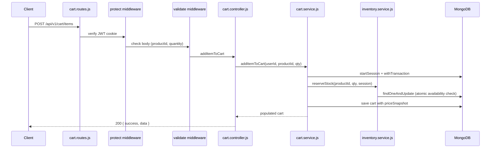

# Project Overview

Last audited against code: 2026-06-21.

The **MERN Sports E-commerce Platform** is a production-oriented online sports retail backend with a React frontend scaffold. The backend exposes a versioned REST API (`/api/v1`) for customer accounts, product catalog management, inventory control, shopping cart, wishlist, and order placement. Business logic lives in service classes; HTTP concerns stay in controllers; persistence is handled through Mongoose models.

The frontend (`front-end/`) is a Vite + React 19 + Tailwind CSS starter with no API integration yet. The backend (`back-end/`) is the primary implemented system and follows a consistent **Route → Controller → Service → Model** architecture.

---

# Vision

The platform aims to become a full-featured sports e-commerce store where:

**Customers** can register, verify their email, browse categories and products, manage a cart with real-time stock reservations, save items to a wishlist, place orders from saved addresses, pay securely, and track fulfillment.

**Administrators** can manage the catalog (categories, products, images), adjust inventory with audit history, oversee orders through their lifecycle, and eventually access analytics, promotions, and user management tools.

The current codebase delivers a strong **catalog + inventory + cart + auth** foundation. Commerce completion (payments, fulfillment, customer UI, admin dashboard) remains future work, but the layered architecture is designed to absorb those modules without structural rewrites.

---

# Current Backend Status

The following modules exist in `back-end/` with routes, controllers, services, and models (where applicable):

| Module | Status | Location |
|--------|--------|----------|
| Application bootstrap | ✅ Completed | `server.js`, `app.js`, `config/db.js` |
| Authentication | ✅ Completed | `routes/auth.routes.js`, `services/auth.service.js` |
| User management | ✅ Completed | `routes/user.routes.js`, `services/user.service.js` |
| Categories | ✅ Completed | `routes/category.routes.js`, `services/category.service.js` |
| Products | ✅ Completed | `routes/product.routes.js`, `services/product.service.js` |
| Product images | ✅ Completed | Multer upload + embedded `images[]` on Product |
| Inventory | ✅ Completed | `routes/inventory.routes.js`, `services/inventory.service.js` |
| Cart | ✅ Completed | `routes/cart.routes.js`, `services/cart.service.js` |
| Wishlist | ✅ Completed | `routes/wishlist.routes.js`, `services/wishlist.service.js` |
| Orders | 🟡 Partially Implemented | Code exists but server fails to boot (see Technical Debt) |
| Email (SMTP) | ✅ Completed | `services/email.service.js`, `providers/email.provider.js` |
| Local file storage | ✅ Completed | `providers/storage/localStorage.provider.js`, `/uploads` |
| Frontend | 🟡 Partially Implemented | Vite/React scaffold only (`front-end/src/App.jsx`) |

**Not implemented:** payments, checkout as a separate orchestration layer, shipping/fulfillment APIs, reviews, coupons, admin dashboard UI, analytics, Cloudinary/S3 storage, automated tests, CI/CD.

---

# Implemented Features

## Authentication

- [x] Register (`POST /api/v1/auth/register`)
- [x] Login with JWT stored in HTTP-only cookie (`POST /api/v1/auth/login`)
- [x] Logout — clears cookie (`POST /api/v1/auth/logout`)
- [x] Get current auth user (`GET /api/v1/auth/me`)
- [x] Email verification via hashed token (`POST /api/v1/auth/verify-email`)
- [x] Forgot password — generic response, sends reset email (`POST /api/v1/auth/forgot-password`)
- [x] Reset password via hashed token (`POST /api/v1/auth/reset-password`)
- [x] Email verification required before login
- [x] Rate limiting on auth routes (10 req / 15 min)
- [ ] Refresh tokens
- [ ] Resend verification email endpoint
- [ ] Phone verification (model scaffolding only)

## User Management

- [x] Get profile with addresses (`GET /api/v1/users/me`)
- [x] Update profile — `firstName`, `lastName`, `phone` (`PATCH /api/v1/users/me`)
- [x] Change password (`PATCH /api/v1/users/change-password`)
- [x] List addresses (`GET /api/v1/users/addresses`)
- [x] Add address with primary promotion logic (`POST /api/v1/users/addresses`)
- [x] Update address (`PATCH /api/v1/users/addresses/:addressId`)
- [x] Delete address with primary reassignment (`DELETE /api/v1/users/addresses/:addressId`)
- [ ] Admin user management (list, suspend, role changes)

## Categories

- [x] List categories with pagination, sort, search, status filter (`GET /api/v1/categories`)
- [x] Get category by ObjectId or slug (`GET /api/v1/categories/:identifier`)
- [x] Get products in category by slug (`GET /api/v1/categories/:slug/products`)
- [x] Create category — admin only (`POST /api/v1/categories`)
- [x] Update category — admin only (`PATCH /api/v1/categories/:id`)
- [x] Soft-delete (archive) category — admin only (`DELETE /api/v1/categories/:id`)
- [x] Restore archived category — admin only (`PATCH /api/v1/categories/:id/restore`)
- [x] Auto-generated slug from name

## Products

- [x] Create product — admin only (`POST /api/v1/products`)
- [x] List active products with pagination, sort, search, filters (`GET /api/v1/products`)
- [x] Get product by ObjectId or slug (`GET /api/v1/products/:identifier`)
- [x] Update product with field whitelist — admin only (`PATCH /api/v1/products/:id`)
- [x] Archive product — admin only (`DELETE /api/v1/products/:id`)
- [x] Restore product — admin only (`PATCH /api/v1/products/:id/restore`)
- [x] SKU uniqueness enforcement
- [x] Category reference validation on create
- [x] Text search on `name` and `brand`
- [x] Virtuals: `primaryImage`, `availableStock`, `inStock`, `lowStock`, `inventoryStatus`

## Product Images

- [x] Upload up to 10 images per product — admin only (`POST /api/v1/products/:id/images`)
- [x] Delete image and file from disk — admin only (`DELETE /api/v1/products/:id/images/:filename`)
- [x] Set primary image — admin only (`PATCH /api/v1/products/:id/images/primary`)
- [x] Reorder gallery — admin only (`PATCH /api/v1/products/:id/images/reorder`)
- [x] Update alt text — admin only (`PATCH /api/v1/products/:id/images/alt-text`)
- [x] Local disk storage under `uploads/products/`
- [x] MIME validation (JPEG, PNG, WEBP) and 5 MB size limit
- [ ] Cloudinary / S3 object storage

## Inventory

- [x] Admin stock adjustment with reason enum (`PATCH /api/v1/inventory/:productId/adjust`)
- [x] Inventory history per product (`GET /api/v1/inventory/:productId/history`)
- [x] Inventory summary with virtual stock state (`GET /api/v1/inventory/:productId/summary`)
- [x] Atomic `reserveStock` — used by cart add/update
- [x] Atomic `releaseStock` — used by cart remove/clear/update decrease
- [x] Atomic `commitStock` — used by order creation
- [x] `InventoryHistory` audit trail on manual adjustments
- [ ] Reservation TTL / abandoned-cart cleanup job
- [ ] Inventory adjustment wrapped in transactions

## Cart

- [x] Add item with price snapshot and stock reservation (`POST /api/v1/cart/items`)
- [x] Get cart with populated products (`GET /api/v1/cart`)
- [x] Update item quantity with reservation delta (`PATCH /api/v1/cart/items/:productId`)
- [x] Remove item and release reservation (`DELETE /api/v1/cart/items/:productId`)
- [x] Clear cart and release all reservations (`DELETE /api/v1/cart`)
- [x] One cart per user (unique index on `user`)
- [x] MongoDB transactions for cart + inventory writes
- [x] Virtuals: `totalItems`, `subtotal`

## Wishlist

- [x] Get wishlist with populated products (`GET /api/v1/wishlist`)
- [x] Add product — idempotent if already present (`POST /api/v1/wishlist/:productId`)
- [x] Remove product (`DELETE /api/v1/wishlist/:productId`)
- [x] One wishlist per user (unique index on `user`)
- [x] Virtual: `totalItems`

## Orders

- [x] Order model with line-item snapshots, shipping address snapshot, status enums
- [x] Create order from cart — commits stock, clears cart, uses transaction (`POST /api/v1/orders`)
- [x] List user's orders (`GET /api/v1/orders`)
- [x] Get order detail (`GET /api/v1/orders/:orderId`)
- [ ] **Routes not mounted** — broken import in `app.js` prevents server startup
- [ ] **Get order by ID has swapped service arguments** in controller
- [ ] Admin order management (list all, update status)
- [ ] Order status transition workflow
- [ ] Payment capture / webhook handling
- [ ] Shipping cost and tax calculation (hardcoded to `0`)
- [ ] Order confirmation email

## Email

- [x] SMTP via Nodemailer (`providers/email.provider.js`)
- [x] Verification email with HTML template
- [x] Password reset email with HTML template
- [x] SMTP connection verified at startup

## Infrastructure & Cross-Cutting

- [x] Health check (`GET /health`)
- [x] Global API rate limit (300 req / 15 min)
- [x] Helmet, HPP, compression, CORS with credentials
- [x] Static serving of uploaded files (`/uploads`)
- [x] Global 404 handler via `AppError`
- [x] Centralized error middleware
- [ ] Automated test suite (`npm test` is a placeholder)
- [ ] CI/CD pipeline
- [ ] Structured logging / observability

## Frontend

- [x] Vite + React 19 + Tailwind CSS project scaffold
- [x] Dependencies: `axios`, `react-router-dom` (installed, unused)
- [ ] Catalog, auth, cart, wishlist, or checkout UI
- [ ] API client layer

---

# Architecture Overview

The backend uses a **layered, domain-sliced** architecture. Each business domain (auth, products, cart, etc.) owns its route file, controller, service, model, and validators.

```text
HTTP Request
    │
    ▼
┌─────────────┐
│   Routes    │  Declare paths, HTTP verbs, middleware chain
└──────┬──────┘
       │
       ▼
┌─────────────┐
│ Middleware  │  auth (protect/authorize), validate, upload, rate limits
└──────┬──────┘
       │
       ▼
┌─────────────┐
│ Controllers │  Extract req data, call services, set status/cookies
└──────┬──────┘
       │
       ▼
┌─────────────┐
│  Services   │  Business rules, DB orchestration, throw AppError
└──────┬──────┘
       │
       ▼
┌─────────────┐
│   Models    │  Mongoose schemas, indexes, hooks, virtuals
└─────────────┘
```

## Why This Architecture

| Decision | Rationale |
|----------|-----------|
| Thin controllers | Keeps HTTP handling separate from business rules; services remain testable and reusable |
| Services own logic | Cross-domain orchestration (cart + inventory + orders) lives in one place without bloating controllers |
| Validators at route layer | Input shape is rejected before any service call; consistent 400 responses via `validate` middleware |
| `AppError` for expected failures | Distinguishes operational errors (404, 409) from unexpected crashes in the global handler |
| Constants for enums | Status values (`PRODUCT_STATUS`, `ORDER_STATUS`, etc.) are centralized to prevent string drift |
| Domain file naming | `product.routes.js`, `product.controller.js`, `product.service.js`, `product.model.js` — predictable navigation |

## Application Bootstrap

```text
server.js
  ├── dotenv
  ├── connectDB()          → config/db.js (MONGO_URI)
  ├── emailProvider.verifyConnection()
  └── app.listen(PORT)

app.js
  ├── Security middleware (helmet, hpp, compression, rate limits, cors)
  ├── Body parsers (json, urlencoded, cookieParser)
  ├── Static /uploads
  ├── Route mounts under /api/v1/*
  ├── 404 → AppError
  └── errorHandler middleware
```

## Request Flow Example — Add to Cart



---

# Core Engineering Standards

## Error Handling Strategy

- **`AppError`** (`utils/app-error.util.js`) — operational errors with `statusCode`, optional `errors[]`, and `isOperational: true`.
- **Services throw `AppError`** for expected failures (not found, conflict, insufficient stock).
- **Global error middleware** (`middleware/error.middleware.js`) catches:
  - `AppError` → returns `{ success: false, status: 'error', message, errors }` with correct HTTP status
  - Multer errors → normalized to 400
  - Unexpected errors → 500 with generic message (details logged to console)
- **404** — unmatched routes forward to `AppError('Route … not found', 404)`.

## Validation Strategy

- **express-validator** chains defined per domain in `validators/*.validator.js`.
- **`validate` middleware** (`middleware/validate.middleware.js`) converts validation failures into `AppError('Validation failed', 400, formattedErrors)`.
- Validators cover request **body**, **params**, and (where used) **query**.
- Mongoose schema validation provides a second layer at persistence (email format, enums, min/max).

## Constants Strategy

Domain enums live in `back-end/constants/`:

| File | Exports |
|------|---------|
| `user.constants.js` | `USER_ROLES`, `USER_STATUS` |
| `category.constants.js` | `CATEGORY_STATUS` |
| `product.constants.js` | `PRODUCT_STATUS` |
| `inventory.constants.js` | `INVENTORY_REASONS`, `INVENTORY_STATUS` |
| `order.constants.js` | `ORDER_STATUS`, `PAYMENT_STATUS` |
| `upload.constants.js` | `ALLOWED_IMAGE_TYPES`, `MAX_IMAGE_SIZE`, `MAX_PRODUCT_IMAGES` |

Validators and models import from constants rather than hardcoding strings.

## Service Layer Strategy

- Controllers never query models directly — they delegate to services.
- Services use **field whitelists** for updates (e.g., `user.service.js`, `product.service.js`, `category.service.js`).
- **Ownership** is derived from `req.user` in controllers, never from request body.
- Cross-service calls are explicit imports (e.g., `cart.service.js` → `inventory.service.js`, `order.service.js` → `inventory.service.js`).
- **MongoDB transactions** (`session.withTransaction`) are used in cart and order flows where inventory and document writes must be atomic.

## API Response Strategy

**Success:**

```json
{
  "success": true,
  "message": "Optional human-readable message",
  "data": {}
}
```

**Error:**

```json
{
  "success": false,
  "status": "error",
  "message": "Error description",
  "errors": []
}
```

Validation errors populate `errors` with `{ field, message }` objects. HTTP status codes follow conventional REST semantics (201 for create, 401/403 for auth, 404 for missing resources, 409 for conflicts).

## Authentication Strategy

- JWT access token generated on login (`utils/jwt.util.js`).
- Token stored in **`accessToken` HTTP-only cookie** (`secure` in production, `sameSite: strict`).
- `protect` middleware reads cookie, verifies JWT, loads user, checks `USER_STATUS.ACTIVE`.
- `authorize(...roles)` gates admin-only routes.

---

# Current Database Collections

Mongoose model names and typical MongoDB collection names:

| Collection | Model | Purpose |
|------------|-------|---------|
| `users` | `User` | Accounts, hashed passwords, roles/status, embedded addresses, verification/reset token hashes |
| `categories` | `Category` | Product taxonomy with slug, status, soft-delete flag |
| `products` | `Product` | Catalog items — pricing, SKU, stock/reserved quantities, embedded image gallery, category ref |
| `inventoryhistories` | `InventoryHistory` | Audit log of admin stock adjustments |
| `carts` | `Cart` | One cart per user; line items with `priceSnapshot` |
| `wishlists` | `Wishlist` | One wishlist per user; array of product ObjectId refs |
| `orders` | `Order` | Placed orders with line-item snapshots, address snapshot, status enums |

### Key Relationships

```text
User ──1:1── Cart
User ──1:1── Wishlist
User ──1:N── Order
User ──1:N── Address (embedded subdocuments)

Category ──1:N── Product
Product ──1:N── InventoryHistory (via product ref)

Cart.items[].product ──N:1── Product
Wishlist.products[] ──N:1── Product
Order.items[].product ──N:1── Product
```

See `docs/DATABASE_SCHEMA.md` for field-level detail.

---

# Current API Surface

Base prefix: **`/api/v1`**

| Module | Base Path | Auth | Notes |
|--------|-----------|------|-------|
| Health | `GET /health` | No | Server liveness |
| Auth | `/api/v1/auth` | Mixed | Register, login, logout, me, verify-email, forgot/reset password |
| Users | `/api/v1/users` | Yes | Profile, password, addresses |
| Categories | `/api/v1/categories` | Mixed | Public reads; admin writes |
| Products | `/api/v1/products` | Mixed | Public reads; admin CRUD + images |
| Inventory | `/api/v1/inventory` | Admin | Adjust, history, summary |
| Cart | `/api/v1/cart` | Yes | Full cart lifecycle |
| Wishlist | `/api/v1/wishlist` | Yes | Get, add, remove |
| Orders | `/api/v1/orders` | Yes | Create, list, detail — **not currently reachable** (boot failure) |

### Endpoint Summary by Module

**Auth** — `POST /register`, `POST /login`, `GET /me`, `POST /logout`, `POST /verify-email`, `POST /forgot-password`, `POST /reset-password`

**Users** — `GET /me`, `PATCH /me`, `PATCH /change-password`, `GET /addresses`, `POST /addresses`, `PATCH /addresses/:addressId`, `DELETE /addresses/:addressId`

**Categories** — `GET /`, `GET /:identifier`, `GET /:slug/products`, `POST /`, `PATCH /:id`, `DELETE /:id`, `PATCH /:id/restore`

**Products** — `GET /`, `GET /:identifier`, `POST /`, `PATCH /:id`, `DELETE /:id`, `PATCH /:id/restore`, `POST /:id/images`, `DELETE /:id/images/:filename`, `PATCH /:id/images/primary`, `PATCH /:id/images/reorder`, `PATCH /:id/images/alt-text`

**Inventory** — `PATCH /:productId/adjust`, `GET /:productId/history`, `GET /:productId/summary`

**Cart** — `POST /items`, `GET /`, `PATCH /items/:productId`, `DELETE /items/:productId`, `DELETE /`

**Wishlist** — `GET /`, `POST /:productId`, `DELETE /:productId`

**Orders** — `POST /`, `GET /`, `GET /:orderId`

Full request/response documentation: `docs/API_REFERENCE.md`.

---

# Completed Development Phases

Based on implemented code and git-visible module structure:

| Phase | Scope | Key Deliverables |
|-------|-------|------------------|
| **Phase 0 — Foundation** | Express app, MongoDB, middleware stack | `app.js`, `server.js`, `config/db.js`, rate limiting, CORS, Helmet, error handler, health check |
| **Phase 1 — Authentication** | Registration, login, JWT cookies, email flows | Auth routes/service, `User` model, email templates, token hashing |
| **Phase 2 — User Management** | Profile, password, addresses | User routes/service, embedded address subdocuments with primary logic |
| **Phase 3 — Categories** | Taxonomy CRUD | Category model with slug generation, soft-delete/restore, public listing |
| **Phase 4 — Product Management** | Catalog CRUD, search, pagination | Product model, `ApiQuery` utility, admin lifecycle, public active catalog |
| **Phase 5 — Product Images** | Gallery management | Multer upload, local storage provider, primary/reorder/alt-text operations |
| **Phase 6 — Inventory** | Stock tracking and reservations | `stockQuantity` / `reservedQuantity`, adjustment history, atomic reserve/release/commit |
| **Phase 7 — Cart** | Shopping cart with reservations | Price snapshots, transactional cart + inventory writes |
| **Phase 8 — Wishlist** | Save-for-later | One wishlist per user, add/remove with product validation |
| **Phase 9 — Orders** | Order placement from cart | Order model, transactional create with `commitStock` — **implementation incomplete at integration layer** |

**Not started as a phase:** frontend UI, payments, admin dashboard, reviews, coupons, analytics, Cloudinary migration.

---

# Technical Debt & Improvement Opportunities

## High Priority

| Issue | Impact | Evidence |
|-------|--------|----------|
| **Broken order routes import** | Server cannot start | `app.js` line 17: `require('./order.routes')` — file is at `./routes/order.routes.js`. Verified: `node -e "require('./back-end/app')"` throws `Cannot find module './order.routes'` |
| **Swapped arguments in get order** | Order detail returns wrong/no result | `order.controller.js` passes `(userId, orderId)` but `order.service.js#getOrderById` expects `(orderId, userId)` |
| **No automated tests** | Regressions undetected in inventory/cart/order flows | `package.json`: `"test": "echo \"Error: no test specified\" && exit 1"` |
| **No reservation TTL** | Abandoned carts hold stock indefinitely | `reserveStock` has no expiration metadata or cleanup job |

## Medium Priority

| Issue | Impact | Evidence |
|-------|--------|----------|
| **Local disk image storage** | Not suitable for multi-instance or cloud deploy | Images stored under `uploads/products/`, served via `express.static` |
| **Orders lack payment integration** | Orders created with `paymentStatus: pending` forever | No payment provider, webhooks, or status update endpoints |
| **Shipping/tax hardcoded to zero** | Incorrect order totals for real commerce | `order.service.js`: `shippingCost = 0`, `tax = 0` |
| **No admin order management** | Admins cannot view or update order lifecycle | Only customer-scoped order routes exist |
| **Manual inventory adjust not transactional** | Product save and history insert are separate writes | `inventory.service.js#adjustInventory` — no session |
| **Outdated internal roadmap docs** | `docs/ROADMAP.md` and `docs/FUTURE_ROADMAP.md` claim orders/transactions/.env.example are missing — code has evolved | Orders module, cart transactions, and `.env.example` now exist |
| **No refresh token / session revocation** | Stolen cookies valid until JWT expiry | Single access token cookie only; password reset does not invalidate sessions |

## Low Priority

| Issue | Impact | Evidence |
|-------|--------|----------|
| **Phone verification scaffolding unused** | Dead code on User model | `generatePhoneVerificationToken` exists; no routes or service |
| **Typo in order error message** | Minor UX | `order.service.js`: `"Product unavailabel"` |
| **Console logging in production path** | No structured observability | `error.middleware.js` uses `console.log` / `console.error` |
| **No CI/CD** | Manual deploy only | No GitHub Actions or similar config in repo |
| **`upload.middlware.js` typo** | Naming inconsistency | Filename misspells "middleware" |
| **Frontend dependencies unused** | Dead weight until UI built | `axios`, `react-router-dom` installed but not imported |

---

# Future Roadmap

The following are **planned future work** — not present in the codebase today.

## Commerce Completion

| Module | Description | Depends On |
|--------|-------------|------------|
| **Orders (integration fix)** | Fix import path and controller bug; add admin order APIs and status transitions | Existing order module |
| **Checkout** | Dedicated checkout orchestration (address selection, totals, idempotency) | Orders, cart, addresses |
| **Payments** | Stripe (or similar) payment intent, webhook verification, `paymentStatus` updates | Orders |
| **Shipping / Fulfillment** | Shipping cost rules, carrier integration, tracking | Orders, payments |
| **Returns / Refunds** | Return requests, refund processing | Orders, payments |

## Customer Experience

| Module | Description |
|--------|-------------|
| **Frontend catalog** | Product listing, detail pages, category navigation |
| **Frontend auth** | Register, login, verify-email, password reset UI |
| **Frontend cart & wishlist** | API-integrated shopping flows |
| **Reviews & ratings** | Product reviews (optionally verified purchase) |
| **Coupons / promotions** | Discount codes applied at cart/checkout |
| **Abandoned cart recovery** | Email reminders after reservation TTL |

## Admin & Operations

| Module | Description |
|--------|-------------|
| **Admin dashboard** | UI for products, categories, inventory, orders |
| **Analytics** | Sales metrics, inventory reports (requires order/payment data) |
| **Admin user management** | Suspend users, role assignment |
| **Cloudinary / S3 migration** | Replace local disk uploads for production |
| **Structured logging & monitoring** | Replace console logs; add metrics/tracing |
| **CI/CD pipeline** | Automated test, lint, build, deploy |
| **Test suite** | Integration tests for auth, cart, inventory, orders |

## Authentication Enhancements

| Item | Description |
|------|-------------|
| Refresh tokens | Long-lived sessions with short-lived access tokens |
| Phone verification | API routes using existing model methods |
| Resend verification email | Endpoint for unverified users |
| Session invalidation | Invalidate JWT on password change/reset |

---

# Summary

The MERN Sports E-commerce Platform has a **mature backend foundation** covering authentication, user profiles, category/product catalog, local image uploads, inventory with atomic reservations, shopping cart, wishlist, and an order module with transactional stock commit. The architecture consistently applies Route → Controller → Service → Model separation with `AppError`-driven error handling, express-validator input checks, and centralized constants.

**Critical blocker:** the server currently **cannot boot** because `app.js` imports order routes from the wrong path (`./order.routes` instead of `./routes/order.routes`). Once fixed, orders also need a controller argument-order bug corrected before order detail works.

The **frontend is a placeholder** — React/Vite/Tailwind are configured but no storefront UI exists. **Payments, fulfillment, admin dashboard, reviews, coupons, and analytics** are not implemented; they belong on the future roadmap.

For a new developer, start with `back-end/server.js` → `app.js`, pick a domain (e.g., `routes/cart.routes.js`), trace through its controller and service, and cross-reference `docs/API_REFERENCE.md` and `docs/DATABASE_SCHEMA.md` for endpoint and schema detail.
